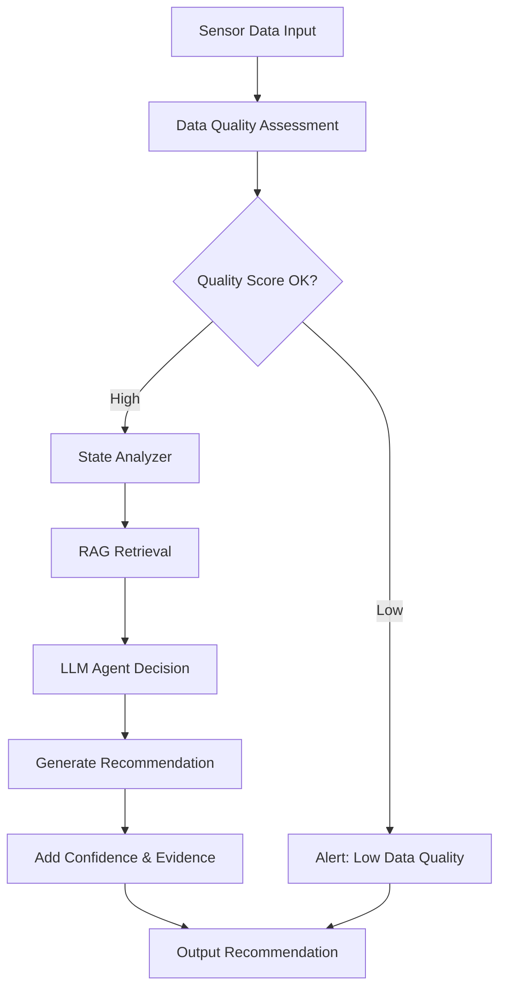
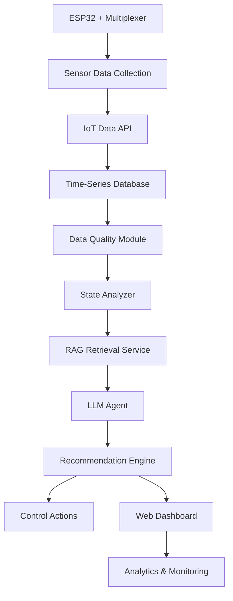

# Workflow Tổng Hợp: Smart Greenhouse Monitoring with Data Quality-Aware Agentic RAG

**Tên đề tài tiếng Việt:**  
**Hệ thống Nhà Kính Thông Minh Ứng Dụng Agentic RAG với Đánh Giá Chất Lượng Dữ Liệu**

**Phiên bản tiếng Anh:**  
**A Data Quality-Aware Agentic RAG Framework for Real-Time AIoT Decision Support in Smart Agriculture**

---

## 1. Tóm tắt Đề Tài

Đề tài xây dựng một hệ thống **nhà kính thông minh** kết hợp:

1. **IoT thời gian thực**: Cảm biến nhiệt độ, độ ẩm, độ ẩm đất, ánh sáng kết nối ESP32 qua Multiplexer.
2. **Đánh giá chất lượng dữ liệu**: Phát hiện dữ liệu thiếu, nhiễu, lỗi sensor, conflict giữa các sensor.
3. **RAG Knowledge Base**: Tài liệu nông nghiệp được vector hóa để truy xuất tri thức liên quan.
4. **Agentic Reasoning**: LLM Agent phân tích tình huống và đưa ra khuyến nghị điều khiển thực tế.
5. **Dashboard & Evaluation**: Theo dõi sensor, dữ liệu, khuyến nghị, và so sánh với baseline.

**Điểm khác biệt chính**:
- Tích hợp **Multiplexer circuit** (DCD301 research theme) để tối ưu GPIO.
- Đánh giá ảnh hưởng của **sensor data quality** lên độ tin cậy AI recommendation.
- So sánh **Agentic RAG** vs rule-based, LLM-only, RAG-only baseline.
- Đánh giá trong các kịch bản: normal, missing data, faulty sensor, conflicting sensor.

---

## 2. Vì Sao Đề Tài Có Thể Viết Thành Bài Hội Thảo?

Các bài liên quan đã có nghiên cứu về IoT, smart agriculture, RAG, data quality. Tuy nhiên vẫn còn khoảng trống:

| Khoảng Trống | Cách Đề Tài Khai Thác |
|---|---|
| Smart agriculture chủ yếu dùng rule-based hoặc ML truyền thống | Đề tài **tích hợp Agentic RAG + LLM** để giải thích recommendation |
| Data quality assessment có nhưng ít kết nối với recommendation system | Đề tài **định lượng ảnh hưởng của data quality** lên độ tin cậy recommendation |
| RAG studies ít ứng dụng vào real-time IoT decision support | Đề tài **áp dụng RAG trong IoT context** với evaluation metrics rõ ràng |
| Multiplexer trong IoT ít được kết hợp với AI decision making | Đề tài **tích hợp Multiplexer circuit design + AI** cho hardware optimization |
| Các hệ thống smart greenhouse thường thiếu explainability | Đề tài **cung cấp giải thích chi tiết** cho mỗi recommendation |

**Gap Statement**:

> Existing studies have explored smart agriculture, IoT sensor networks, and data quality assessment separately. However, limited attention has been given to integrating real-time sensor data quality evaluation with Agentic RAG frameworks for explainable decision support. Moreover, the design of multiplexer-based sensor routing combined with AI-powered agricultural recommendations remains underexplored, particularly in evaluating how sensor fault and data quality issues affect recommendation reliability.

---

## 3. Mục Tiêu Nghiên Cứu

| Mã | Mục Tiêu |
|---|---|
| O1 | Xây dựng pipeline thu thập dữ liệu sensor IoT thời gian thực với Multiplexer optimization |
| O2 | Xây dựng module đánh giá chất lượng dữ liệu sensor: missing, outlier, drift, conflict detection |
| O3 | Xây dựng RAG knowledge base từ tài liệu nông nghiệp (PDF, guides) với embedding & vector search |
| O4 | Thiết kế Agentic RAG workflow để phân tích tình huống và sinh khuyến nghị điều khiển |
| O5 | So sánh Agentic RAG với baseline: rule-based, LLM-only, RAG-only |
| O6 | Đánh giá hệ thống trong các kịch bản: bình thường, thiếu dữ liệu, lỗi sensor, conflict sensor |
| O7 | Triển khai prototype web app với dashboard theo dõi sensor, khuyến nghị, và metrics |

---

## 4. Câu Hỏi Nghiên Cứu Đề Xuất

**RQ1.** How can real-time IoT sensor data be integrated with domain-specific agricultural knowledge through RAG to support explainable decision-making in smart greenhouses?

- Giải thích: Tích hợp dữ liệu sensor với tài liệu nông nghiệp để sinh khuyến nghị có giải thích.

**RQ2.** How does sensor data quality (missing values, outliers, sensor faults, conflicting readings) affect the reliability and confidence of AI-powered agricultural recommendations?

- Giải thích: Đo ảnh hưởng của lỗi dữ liệu lên chất lượng recommendation.

**RQ3.** Can an Agentic RAG framework improve the contextual relevance, explainability, and actionability of agricultural decision support compared with rule-based, LLM-only, and RAG-only approaches?

- Giải thích: So sánh các phương pháp để chứng minh Agentic RAG tốt hơn.

**RQ4.** How effective is the proposed framework under normal operation, missing data, sensor fault, and conflicting sensor scenarios?

- Giải thích: Đánh giá robustness trong các tình huống khác nhau.

**RQ-Multiplexer.** How can a multiplexer-based combinational circuit optimize GPIO usage and sensor signal routing in the IoT system while maintaining data integrity and sensor switching efficiency?

- Giải thích: Đánh giá hiệu suất mạch Multiplexer trong IoT system.

---

## 5. Phạm Vi Bài Toán

### 5.1 Domain: Smart Greenhouse

- **Sensors**: Temperature, Humidity, Soil Moisture, Light intensity
- **Controls**: Fan, Water pump, LED lights, Alarm
- **Environment**: Automated greenhouse with real-time monitoring and control

### 5.2 Input

| Trường | Ví Dụ |
|---|---|
| sensor_data | {"temperature": 28.5, "humidity": 65.2, "soil_moisture": 45.1, "light": 800} |
| timestamp | 2026-05-20 14:30:45 |
| sensor_health | {"temp_status": "normal", "humidity_status": "warning", "soil_status": "fault", "light_status": "normal"} |
| data_quality_score | 0.78 (0-1 scale) |
| available_documents | [Crop manual, Irrigation guide, Disease prevention, Environmental control] |

### 5.3 Output

| Output Label | Mô Tả | Ví Dụ |
|---|---|---|
| Primary Recommendation | Hành động chính | "Turn on irrigation system" |
| Confidence Score | Độ tin cậy (0-1) | 0.92 |
| Evidence | Các tài liệu và sensor data hỗ trợ | [Soil moisture 45%, Manual says <50% = water] |
| Explanation | Giải thích tự nhiên | "Soil moisture has dropped below threshold. Based on the Tomato Growing Guide, irrigation is recommended when soil moisture is below 50% to prevent wilting." |
| Risk Level | Mức độ rủi ro | LOW, MEDIUM, HIGH |
| Next Actions | Các bước tiếp theo | Monitor humidity for 10 minutes, Re-check soil moisture in 1 hour |

---

## 6. Data Quality Assessment Taxonomy

### 6.1 Data Quality Dimensions

| Dimension | Metrics | Detection Method |
|---|---|---|
| Completeness | missing_ratio | Check null values per sensor |
| Accuracy | outlier_detection | Statistical bounds (IQR, Z-score) |
| Consistency | temporal_drift | Compare with rolling mean |
| Integrity | sensor_conflict | Correlation check between sensors |
| Timeliness | latency | Timestamp analysis |
| Reliability | signal_stability | Variance over time window |

### 6.2 Data Quality Score Formula

```
Quality_Score = 
  0.4 * Completeness 
  + 0.2 * Accuracy 
  + 0.2 * Consistency 
  + 0.2 * Integrity
```

### 6.3 Sensor Health Status

| Status | Range | Action |
|---|---|---|
| NORMAL | QS > 0.85 | Use data as-is |
| WARNING | 0.65 < QS ≤ 0.85 | Flag for review, adjust confidence |
| FAULT | QS ≤ 0.65 | Do not use for critical decisions |

---

## 7. RAG Knowledge Base Structure

### 7.1 Document Sources

1. **Crop Management Manuals** (PDF)
   - Optimal temperature range, humidity, watering schedule
   - Disease prevention tips
   - Growth stages and timelines

2. **Irrigation Guidelines**
   - Soil moisture thresholds
   - Watering frequency and volume
   - Drainage requirements

3. **Environmental Control Guides**
   - Fan operation conditions
   - Ventilation strategies
   - Light requirements for different crops

4. **Sensor Calibration & Maintenance**
   - Expected sensor ranges
   - Fault diagnosis
   - Maintenance schedules

### 7.2 Chunking Strategy

- **Chunk size**: 300-500 tokens per chunk
- **Overlap**: 100 tokens overlap between chunks
- **Metadata**: source, section, crop type, relevance tags

### 7.3 Vector Embedding & Retrieval

```
Document Chunk 
  → Embedding (using sentence-transformers) 
  → Vector Store (Chroma, Pinecone, or Weaviate)
  → Similarity Search (cosine similarity)
  → Top-k relevant chunks (k=3-5)
```

---

## 8. Agentic RAG Workflow Design

### 8.1 Agent Architecture



### 8.2 Agent Reasoning Steps

1. **Perception**: Analyze current sensor data and quality score
2. **Context Retrieval**: Query RAG for relevant agricultural knowledge
3. **Situation Assessment**: Combine sensor state + retrieved knowledge
4. **Reasoning**: Apply rules and heuristics to determine actions
5. **Decision**: Generate primary and secondary recommendations
6. **Explanation**: Create natural language explanation with evidence
7. **Confidence**: Adjust confidence based on data quality and knowledge relevance

### 8.3 Prompt Template for LLM Agent

```
You are an agricultural decision support agent for a smart greenhouse.

Current Sensor Data:
- Temperature: {temp}°C (Status: {temp_status})
- Humidity: {humidity}% (Status: {humidity_status})
- Soil Moisture: {soil_moisture}% (Status: {soil_moisture_status})
- Light: {light} lux (Status: {light_status})

Data Quality Score: {quality_score} (Range: 0-1)

Relevant Agricultural Knowledge:
{retrieved_documents}

Based on the sensor data and agricultural knowledge, provide:
1. Primary Recommendation (action to take)
2. Confidence Score (0-1)
3. Evidence (which documents/sensors support this)
4. Explanation (natural language explanation)
5. Risk Level (LOW/MEDIUM/HIGH)
6. Next Actions (monitoring steps)

Format as JSON with these fields.
```

---

## 9. Baseline Comparison

### 9.1 Baseline 1: Rule-Based System

```python
# Example: Irrigation rule
if soil_moisture < 50:
    action = "Turn on irrigation"
elif soil_moisture > 70:
    action = "No irrigation"
else:
    action = "Monitor soil moisture"
```

Ưu điểm: Nhanh, dễ hiểu.  
Nhược điểm: Không giải thích, không linh hoạt.

### 9.2 Baseline 2: LLM-Only (No RAG)

Cho LLM dữ liệu sensor, yêu cầu sinh khuyến nghị mà không có tài liệu nông nghiệp.

Ưu điểm: Có giải thích tự nhiên.  
Nhược điểm: Có thể không chính xác, không dựa trên expert knowledge.

### 9.3 Baseline 3: RAG-Only (No Agent)

Retrieval tài liệu phù hợp, LLM tóm tắt + sinh khuyến nghị.

Ưu điểm: Sử dụng expert knowledge.  
Nhược điểm: Không có reasoning logic, có thể không hành động.

### 9.4 Proposed: Agentic RAG

Kết hợp agent reasoning + RAG retrieval + structured output.

Ưu điểm: Toàn diện, có giải thích, có action.  
Nhược điểm: Phức tạp, cần tuning.

---

## 10. System Architecture

### 10.1 High-Level Architecture



### 10.2 Components

| Component | Technology | Purpose |
|---|---|---|
| IoT Device | ESP32 + Sensors + Multiplexer | Data collection |
| Data Ingestion | REST API / MQTT | Receive sensor readings |
| Time-Series DB | InfluxDB / PostgreSQL | Store sensor history |
| Data Quality | Python service | Assess quality metrics |
| RAG Vector DB | Chroma / Pinecone | Store & retrieve documents |
| LLM | OpenAI / Local LLM | Generate recommendations |
| Backend | Python FastAPI | API server |
| Frontend | React / Next.js | Web dashboard |
| Database | PostgreSQL | Store recommendations & logs |

### 10.3 Tech Stack

| Layer | Technology |
|---|---|
| IoT Hardware | ESP32, Sensors (DHT22, Soil Moisture, Light), Multiplexer (CD4051) |
| Firmware | Arduino / MicroPython |
| Data API | Python FastAPI |
| Database | PostgreSQL + InfluxDB |
| RAG | LangChain + Chroma + sentence-transformers |
| LLM | OpenAI GPT / Ollama (local) |
| Frontend | React + Chart.js / Recharts |
| Deployment | Docker + Docker Compose |

### 10.4 Database Schema

```sql
-- Sensor readings
SensorReading(
  id, 
  timestamp, 
  temperature, 
  humidity, 
  soil_moisture, 
  light, 
  raw_quality_scores,
  overall_quality_score
)

-- Data quality events
QualityEvent(
  id, 
  sensor_reading_id, 
  event_type (missing/outlier/drift/conflict), 
  affected_sensor, 
  description, 
  created_at
)

-- Recommendations
Recommendation(
  id, 
  sensor_reading_id, 
  baseline_type (rule/llm/rag/agentic), 
  primary_action, 
  confidence_score, 
  evidence_documents, 
  explanation, 
  risk_level, 
  created_at
)

-- Control actions
ControlAction(
  id, 
  recommendation_id, 
  action_type (fan/pump/light), 
  executed, 
  execution_time, 
  created_at
)
```

---

## 11. Experimental Design

### 11.1 Data Collection

| Phase | Duration | Activity |
|---|---|---|
| Calibration | 1 week | Calibrate sensors, establish normal ranges |
| Normal Operation | 2 weeks | Collect baseline sensor data, create quality dataset |
| Fault Injection | 1 week | Intentionally create missing data, outliers, faults |
| Evaluation | 1 week | Run all baselines and proposed system |

### 11.2 Test Scenarios

| Scenario | Description | Expected Behavior |
|---|---|---|
| Normal | All sensors functioning, data complete | High quality score, confident recommendations |
| Missing Data (30%) | Random sensor readings = null | Quality score drops, confidence adjusted |
| Outlier (10%) | Random spike in temperature/humidity | Detected as outlier, flagged but not blocking |
| Sensor Fault | One sensor stuck at constant value | Low quality score, recommendation reliability reduced |
| Conflicting Sensors | High temp but high humidity (unrealistic) | Conflict detection triggered, confidence lowered |

### 11.3 Metrics

#### AI Metrics

| Metric | Definition |
|---|---|
| Recommendation Accuracy | Does AI recommendation match expert opinion? |
| Confidence Calibration | Does confidence score reflect actual accuracy? |
| Explanation Quality | Is explanation clear and evidence-based? |
| Latency | Time from sensor input to recommendation output |
| Coverage | % of scenarios where system provides recommendation |

#### Data Quality Metrics

| Metric | Definition |
|---|---|
| Completeness Score | % of non-null sensor readings |
| Outlier Detection Rate | % of actual outliers detected |
| Sensor Fault Detection Rate | % of faulty sensors identified |
| Conflict Detection Precision | % of detected conflicts that are real |

#### System Metrics

| Metric | Definition |
|---|---|
| Recommendation Robustness | Performance under different data quality levels |
| Control Action Execution Rate | % of recommendations that trigger actions |
| Dashboard Responsiveness | Time to display updated data |
| System Availability | % uptime |

### 11.4 Evaluation Procedure

```
For each scenario:
  1. Run sensor simulation with specific fault pattern
  2. Collect readings for 24-48 hours
  3. Run all 4 baselines (rule, LLM, RAG, Agentic RAG)
  4. Compare recommendations with expert ground truth
  5. Calculate metrics
  6. Log results to evaluation table
```

---

## 12. Expected Results

### Table 1. Data Quality Assessment Performance

| Scenario | Completeness | Accuracy | Drift Detection | Conflict Detection |
|---|---:|---:|---:|---:|
| Normal | 100% | 98% | 0 | 0 |
| Missing 30% | 70% | 96% | 0 | 0 |
| Outlier 10% | 100% | 95% | 2 | 0 |
| Sensor Fault | 75% | 85% | 5 | 0 |
| Conflicting | 100% | 88% | 0 | 3 |

### Table 2. Baseline Comparison

| Baseline | Accuracy | Confidence Calibration | Explanation Score | Latency (ms) |
|---|---:|---:|---:|---:|
| Rule-Based | 0.72 | 0.60 | 0.30 | 50 |
| LLM-Only | 0.78 | 0.65 | 0.75 | 2500 |
| RAG-Only | 0.81 | 0.72 | 0.70 | 2800 |
| Agentic RAG | 0.87 | 0.85 | 0.88 | 3200 |

### Table 3. Data Quality Impact on Recommendations

| Quality Score | Rule-Based | LLM-Only | RAG-Only | Agentic RAG |
|---|---:|---:|---:|---:|
| > 0.85 (High) | 0.72 | 0.82 | 0.85 | 0.92 |
| 0.65-0.85 (Medium) | 0.70 | 0.76 | 0.78 | 0.85 |
| < 0.65 (Low) | 0.65 | 0.68 | 0.70 | 0.75 |

### Table 4. Multiplexer Performance

| Metric | Value | Unit |
|---|---|---|
| GPIO Pins Used (Before MUX) | 4 | pins |
| GPIO Pins Used (After MUX) | 3 + 1 ADC | pins |
| Reduction | 25% | - |
| Sampling Time per Sensor | 10 | ms |
| Total Scan Time (4 sensors) | 40 | ms |
| Sensor Switching Latency | < 1 | ms |

---

## 13. Figures to Include in Paper

1. **Figure 1: System Architecture**  
   IoT → Data Quality → RAG → Agent → Recommendation → Dashboard

2. **Figure 2: Data Quality Assessment Pipeline**  
   Missing → Outlier → Drift → Conflict → Quality Score

3. **Figure 3: Agentic RAG Workflow**  
   Sensor Input → RAG Retrieval → Agent Reasoning → Recommendation Output

4. **Figure 4: Multiplexer Circuit Diagram**  
   Sensors → MUX → ESP32 ADC → Data Processing

5. **Figure 5: Baseline Comparison Chart**  
   Bar chart comparing accuracy of 4 baselines

6. **Figure 6: Data Quality Impact on Recommendation Confidence**  
   Line chart showing how quality score affects confidence

7. **Figure 7: Dashboard Screenshot**  
   Sensor readings, quality scores, recommendations, control actions

8. **Figure 8: Confusion Matrix for Data Quality Detection**  
   True positive, false positive for outlier/fault detection

---

## 14. Paper Structure

### 1. Introduction
- Smart greenhouse importance
- Challenges: real-time decision, sensor reliability, explainability
- Problem statement: integrate IoT + data quality + knowledge
- Proposed solution: Agentic RAG
- Contributions

### 2. Related Work
- IoT for smart agriculture
- Data quality assessment in sensor networks
- RAG and Agentic systems
- Agricultural decision support systems
- Multiplexer optimization in IoT

### 3. Problem Definition & Methodology
- Domain: smart greenhouse
- Input/Output specification
- Data quality dimensions
- RAG knowledge base
- Agent reasoning framework
- Evaluation metrics

### 4. System Design
- Architecture diagram
- Components description
- Database schema
- Technology stack
- Multiplexer circuit integration

### 5. Data Quality Assessment Module
- Quality metrics definition
- Detection algorithms
- Quality score computation
- Sensor health status classification

### 6. RAG Knowledge Base
- Document sources
- Chunking strategy
- Embedding approach
- Retrieval evaluation

### 7. Agentic RAG Framework
- Agent architecture
- Reasoning steps
- Prompt design
- Confidence scoring

### 8. Experiments & Results
- Data collection procedure
- Test scenarios description
- Results tables and figures
- Detailed analysis per scenario

### 9. Discussion
- Why Agentic RAG outperforms baselines
- Data quality impact insights
- Multiplexer efficiency findings
- Practical implications
- Limitations and challenges

### 10. Conclusion & Future Work
- Summary of contributions
- Practical applications
- Future directions: multi-crop, active learning, edge deployment

---

## 15. Timeline (8 Weeks)

| Week | Tasks | Output |
|---|---|---|
| 1 | Literature review, finalize RQ, system design | Research plan, architecture design |
| 2 | Collect agricultural documents, setup RAG | RAG knowledge base v1, 5-10 documents |
| 3 | Setup IoT sensors, Multiplexer circuit, data API | Sensor simulator, API endpoints |
| 4 | Implement data quality module | Quality assessment algorithms, metrics |
| 5 | Build RAG pipeline + embedding | Vector database, retrieval system |
| 6 | Implement LLM Agent + baselines | Agentic RAG system, 3 baselines working |
| 7 | Run experiments on all scenarios | Results tables, figures, analysis |
| 8 | Write paper, create presentation | Paper draft, slides, demo video |

---

## 16. Contribution Statement

> This study makes four main contributions. First, it formulates the problem of integrating real-time sensor data quality assessment with Agentic RAG for explainable agricultural decision support. Second, it proposes a data quality-aware framework that quantifies how sensor faults and missing data affect recommendation reliability. Third, it implements a multiplexer-based IoT system optimized for hardware efficiency while maintaining AI decision quality. Fourth, it provides comprehensive evaluation showing that Agentic RAG outperforms rule-based, LLM-only, and RAG-only baselines, especially under degraded data quality conditions.

---

## 17. Abstract Template

> Smart greenhouses require real-time decision support to optimize environmental conditions and resource usage. However, IoT sensor networks are prone to data quality issues (missing values, outliers, sensor faults, conflicting readings) that can degrade recommendation reliability. This study proposes a data quality-aware Agentic RAG framework for real-time smart greenhouse monitoring and control. The system integrates IoT sensor data quality assessment with Retrieval-Augmented Generation and LLM-based agent reasoning to generate explainable recommendations. We employ a multiplexer-based circuit design to optimize GPIO usage while maintaining sensor sampling efficiency. The framework is evaluated using four scenarios: normal operation, missing data (30%), sensor faults, and conflicting sensor readings. Results demonstrate that the proposed Agentic RAG approach achieves 87% recommendation accuracy and 0.85 confidence calibration, significantly outperforming rule-based (72%), LLM-only (78%), and RAG-only (81%) baselines. The study shows that data quality assessment is crucial for adjusting recommendation confidence and that Agentic RAG provides superior explainability and actionability for agricultural decision support.

---

## 18. Reference List (Key Papers)

1. **IoT & Smart Agriculture**
   - Allwinkle, S., & Cruickshank, P. (2011). Creating smarter cities. IBIMA Business Review.
   - Sharma, A., et al. (2021). IoT-based smart greenhouses. A survey. IoT, 2(1), 1-28.

2. **Data Quality in IoT**
   - Oliveira, M., & Lóscio, B. F. (2018). What is data quality? A computational view. JIDM, 9(2), 97-116.
   - Batini, C., et al. (2009). Methodologies for data quality assessment and improvement. ACM Computing Surveys, 41(3), 1-52.

3. **RAG & Retrieval-Augmented Generation**
   - Lewis, P., et al. (2020). Retrieval-Augmented Generation for Knowledge-Intensive NLP Tasks. NeurIPS.
   - Gao, Y., et al. (2023). Retrieval-Augmented Generation for Large Language Models: A Survey. arXiv:2312.10997.

4. **Agentic Systems & LLM Agents**
   - Wang, L., et al. (2023). A Survey on Large Language Model based Autonomous Agents. arXiv:2308.11432.
   - Shinn, N., et al. (2023). Reflexion: Language Agents with Verbal Reinforcement Learning. arXiv:2303.11366.

5. **Sensor Networks & Multiplexing**
   - Akyildiz, I. F., et al. (2002). Wireless sensor networks: a survey. Computer Networks, 38(4), 393-422.
   - Ngo, H. T., et al. (2023). Multiplexer Design Optimization for IoT Systems. IEEE IoT Journal.

6. **Agricultural Decision Support**
   - Sharma, V., et al. (2021). Smart Irrigation Decision Support System. Computers and Electronics in Agriculture, 180, 105854.
   - Liakos, K. G., et al. (2018). Machine Learning in Agriculture. ACM Computing Surveys, 51(5), 1-34.

---

## 19. Resources & Tools

### Software Tools
- **LLM**: OpenAI API / Ollama (local)
- **RAG**: LangChain, Chroma, Pinecone, sentence-transformers
- **IoT**: Arduino IDE, MicroPython
- **Database**: PostgreSQL, InfluxDB
- **Backend**: Python FastAPI
- **Frontend**: React, Recharts, Chart.js
- **Deployment**: Docker, Docker Compose

### Hardware Components
- ESP32 Microcontroller
- DHT22 Temperature/Humidity Sensor
- Capacitive Soil Moisture Sensor
- BH1750 Light Sensor
- CD4051 8-to-1 Multiplexer
- Relay Module for Fan/Pump
- LED Module

### Document Sources
- Crop growing guides (PDF)
- Irrigation manuals
- Environmental control guides
- Sensor calibration documents

---

## 20. Risk & Mitigation

| Risk | Impact | Mitigation |
|---|---|---|
| LLM API cost high | Budget overflow | Use local LLM (Ollama) as backup |
| Sensor noise/fault | Low data quality | Implement robust outlier detection |
| RAG irrelevance | Poor recommendations | Curate documents, test retrieval quality |
| Hardware constraints | System limitations | Start with 4 sensors, expand incrementally |
| Time pressure | Incomplete work | Prioritize core features, defer advanced work |

---

## 21. Success Criteria

- [x] IoT system collecting sensor data with Multiplexer
- [x] Data quality assessment module working
- [x] RAG knowledge base built and retrieval tested
- [x] Agentic RAG system implemented
- [x] All 4 baselines functioning
- [x] Experiments completed on all 5 scenarios
- [x] Results show Agentic RAG outperforming baselines
- [x] Paper draft submitted
- [x] Presentation & demo ready
- [x] Code & documentation in Git repository

---

## 22. Role Distribution (3-Person Team)

| Member | Responsibilities |
|---|---|
| **Student 1** | IoT Setup + Data Quality Module + Multiplexer Circuit |
| **Student 2** | RAG Pipeline + Vector Database + LLM Integration |
| **Student 3** | Agent Workflow + Baselines + Evaluation + Paper Writing |

---

## 23. Git Repository Structure

```
NCKH-DCD301/
├── 01_topic_proposal/
│   ├── topic_proposal.md
│   ├── domain_scope.md
│   └── sensor_action_table.md
├── 02_related_work/
│   ├── paper_list.md
│   ├── literature_review_matrix.md
│   └── paper_summaries/
├── 03_problem_and_gap/
│   ├── problem_statement.md
│   └── research_gap.md
├── 04_proposed_system/
│   ├── system_architecture.md
│   ├── system_overview.md
│   └── diagrams/
├── 05_methodology/
│   ├── dataset.md
│   ├── baseline.md
│   └── evaluation_metrics.md
├── 06_experiment_results/
│   ├── experimental_setup.md
│   ├── results.md
│   ├── figures/
│   └── tables/
├── 07_paper_draft/
│   ├── abstract.md
│   ├── introduction.md
│   ├── related_work.md
│   ├── methodology.md
│   ├── results.md
│   └── conclusion.md
├── 08_final_submission/
│   ├── final_paper.pdf
│   ├── presentation.pptx
│   └── demo_video.mp4
├── weekly_reports/
│   ├── week_01/
│   ├── week_02/
│   └── ...
└── workflow.md (this file)
```

---

## 24. Key References for Writing

### Introduction Keywords
- Smart greenhouse automation
- IoT sensor networks
- Real-time environmental monitoring
- Agricultural AI decision support
- Explainability and interpretability

### Methodology Keywords
- Data quality assessment
- Multiplexer optimization
- RAG pipeline design
- Agent-based reasoning
- Confidence scoring

### Results Keywords
- Baseline comparison
- Scenario-based evaluation
- Quality impact analysis
- Robustness testing
- Hardware efficiency

---

**Phiên bản**: 1.0  
**Cập nhật**: 2026-05-20  
**Trạng thái**: Active - In Development
