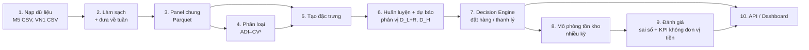

# Data Flow

`[DP]` = số liệu trong `code/outputs/data_profile.md`.

## 1. Luồng xử lý tổng quát

Bản nguồn sơ đồ: `diagrams/workflow.mmd`. Dataset giày dép Việt Nam (phụ lục) chỉ đi qua bước 1–4 để mô tả.

## 2. Schema panel chung (mỗi dòng = 1 chuỗi × 1 tuần)

| Cột | Ý nghĩa | M5 | VN1 |
|---|---|---|---|
| `dataset` | Nguồn | "M5" | "VN1" |
| `series_id` | Mã chuỗi | `item_id` + `store_id` | `Client` + `Warehouse` + `Product` |
| `week_start` | Ngày đầu tuần | Ngày đầu của `wm_yr_wk` (`calendar.csv`) | Tên cột ngày trong file Sales (thứ Hai) |
| `qty` | Doanh số quan sát (≥ 0) | Tổng 7 ngày | Giá trị tuần trong `Phase 0/1/2 - Sales.csv` |
| `price` | Giá tuần | `sell_price` | `Phase 0/1 - Price.csv` (thiếu khi không có bán → giữ giá gần nhất trước đó) |
| `event_*` | Sự kiện trong tuần | Số sự kiện, số ngày SNAP | — (không có) |
| Thuộc tính tĩnh | Mô tả | `dept_id`, `cat_id`, `store_id`, `state_id` | `Client`, `Warehouse` (mã ẩn danh) |
| `split` | Vai trò | train / valid / test | train / valid / test (Phase 2 = test chính thức) |

## 3. Quy tắc làm sạch

**M5**

- Gộp ngày → tuần Walmart (`wm_yr_wk`): 1.941 ngày → 278 tuần [DP], trong đó tuần cuối (11618) chỉ có 2 ngày (d_1940–d_1941) nên bị bỏ → **277 tuần đủ 7 ngày** dùng trong benchmark.
- `sell_prices.csv` có giá cho cả 28 ngày ẩn sau d_1941; các tuần này bị loại khi ghép giá.
- Bỏ các tuần trước khi sản phẩm bắt đầu bán ở mỗi cửa hàng (trước tuần đầu tiên có giá trong `sell_prices.csv`), để không thổi phồng tỷ lệ số 0.

**VN1**

- Ghép Phase 0 (170 tuần) + Phase 1 (13 tuần) + Phase 2 (13 tuần đáp án) theo `Client`, `Warehouse`, `Product` → 196 tuần [DP]. Không có ô thiếu doanh số, không có giá trị âm [DP].
- Mỗi chuỗi bắt đầu từ **tuần có bán đầu tiên** (độ dài hoạt động trung vị 124 tuần [DP]).
- Giá thiếu (70,7% số ô [DP]) được điền bằng giá gần nhất trước đó trong cùng chuỗi. **Không** dùng cờ `price_observed`: VN1 chỉ có giá ở tuần có bán, nên cờ này trùng với `lag_1 > 0` khi huấn luyện, còn Phase 2 không có giá nên cờ luôn bằng 0 ở khối test 2 (lệch train/test).

**Phụ lục — giày dép Việt Nam** (chỉ dùng cho thống kê mô tả): giữ kênh "Bán lẻ"; bỏ tuần bất thường 202352 (2.583 dòng); không trừ 26.432 dòng trả hàng (số lượng âm) vào nhu cầu; gộp SKU lên mẫu–màu (`mold_code` + `color`) × toàn chuỗi → 1.006 chuỗi, 84 tuần [DP].

## 4. Phân loại nhu cầu

- Tính trên **giai đoạn huấn luyện**, từ tuần ra mắt hoặc tuần có bán đầu tiên:
  - ADI = số tuần / số tuần có bán;
  - CV² = (độ lệch chuẩn / trung bình)² của các tuần có bán.
- Ngưỡng **ADI = 4/3, CV² = 0,5** (bài 01, tr. 7–8) → smooth / erratic / intermittent / lumpy.
- Chuỗi được đánh giá: bắt đầu ít nhất 13 tuần trước giai đoạn kiểm thử và có ít nhất một tuần có bán trong giai đoạn huấn luyện → M5 30.381 chuỗi, VN1 13.844 chuỗi. Phân bố nhóm của các chuỗi này: `05_methodology/dataset.md` mục 4.

## 5. Đặc trưng (input của mô hình ML)

| Nhóm | Đặc trưng | M5 | VN1 |
|---|---|---|---|
| Lag | qty tuần t−1…t−4, t−8, t−13, t−26, t−52 | 8 | 8 |
| Thống kê trượt | Trung bình, độ lệch 4/13/26 tuần; tỷ lệ tuần bằng 0 trong 13 tuần; số tuần từ lần bán gần nhất | 8 | 8 |
| Lịch | Tuần trong năm, tháng (M5 thêm số sự kiện, số ngày SNAP) | 4 | 2 |
| Giá | Giá tuần, thay đổi giá so với 4 tuần trước | 2 | 2 |
| Tĩnh | Mã phân loại (category) | 4 | 0 (*) |
| Quy mô | Mức bán trung bình 52 tuần gần nhất `scale` (sàn 0,1) | 1 | 1 |
| **Tổng** | | **27** | **21** |

Chuẩn hóa: lag, trung bình và độ lệch trượt được chia cho `scale`; mô hình quantile học D_h / `scale` rồi nhân lại (pinball loss bất biến theo tỷ lệ), để một mô hình toàn cục xử lý được chuỗi có quy mô rất khác nhau. Sự kiện và SNAP (M5) được cộng trên đúng cửa sổ mục tiêu h tuần (biết trước). Cài đặt: `code/f2d/features.py`.

(*) `Client` (46 mức) và `Warehouse` (328 mức) của VN1 là mã ẩn danh. Khi dùng làm biến categorical trong LightGBM, chúng gây overfit và làm dự báo phân vị "nổ" ở một số chuỗi lớn (thử trên khối test 1, q = 0,9: pinball 8,0 khi giữ, 7,2 khi regularize mạnh, 7,0 khi bỏ). Vì vậy VN1 không dùng thuộc tính tĩnh. Target chuẩn hóa D_h / `scale` của mô hình quantile được cắt ở phân vị 99,9 của tập huấn luyện (chuỗi hồi sinh sau thời gian dài bằng 0 có `scale` = 0,1 tạo đuôi cực dày: pinball 21,8 → 8,0).

**19 đặc trưng chung** (lag, thống kê trượt, tuần, tháng, giá, thay đổi giá, `scale`). Có thể chạy thêm một thí nghiệm phụ chỉ dùng 19 đặc trưng này cho cả hai dataset, để so sánh công bằng tuyệt đối.

## 6. Chia dữ liệu và rolling origin

| | M5 (277 tuần) | VN1 (196 tuần) |
|---|---|---|
| Kiểm thử | 26 tuần cuối | 26 tuần cuối = Phase 1 + **Phase 2 (đáp án chính thức)** |
| Validation (ML) | 13 origin cuối có mục tiêu kết thúc trước mỗi mốc cắt | Như M5 |
| Huấn luyện (ML) | Tối đa 104 origin trước validation (≤ 3 triệu dòng) | Như M5 |
| Huấn luyện lại | Mỗi 13 tuần (2 khối test) | Mỗi 13 tuần (2 khối, trùng ranh giới Phase 1/Phase 2) |
| Dự báo | Mỗi tuần, dùng dữ liệu mới nhất | Mỗi tuần |

Huấn luyện lại mỗi 13 tuần thay vì mỗi tuần: theo bài 08, giảm tần suất huấn luyện lại tiết kiệm nhiều chi phí mà ít mất độ chính xác (abstract).

**Cửa sổ kiểm thử thứ hai** (độ vững): bỏ 26 tuần cuối của panel rồi chạy lại toàn bộ trên 26 tuần liền trước (`run_pipeline.py --offset 26`). M5: 2015-05-23 → 2015-11-14; VN1: 2023-04-10 → 2023-10-02 (nằm trong Phase 0). Chi tiết: `06_experiment_results/results.md` mục 10.

## 7. Mô phỏng tồn kho (mỗi tuần, mỗi chuỗi)

1. Nhận hàng đã đặt từ L tuần trước.
2. Đầu tuần (mỗi R tuần), gọi Decision Engine với dự báo lập từ dữ liệu trước tuần này → thanh lý ngay từ tồn hiện có, hoặc đặt hàng (không đặt hàng trong tuần có thanh lý).
3. Nhu cầu `qty` xảy ra; bán min(tồn, nhu cầu); phần thiếu là **mất doanh số**.
4. Ghi nhận: tồn cuối kỳ, lượng bán, lượng thiếu, lượng đặt, lượng thanh lý.
5. Tồn ban đầu = S của lần xem xét đầu tiên, chưa có hàng đang về; **4 tuần đầu là khởi động**, không tính KPI.

**Kịch bản (không phải giả định về thực tế):**

| Tham số | Mặc định | Lưới kịch bản (RQ4) |
|---|---|---|
| R (chu kỳ xem xét) | 1 tuần | — |
| L (lead time) | 2 tuần | 1, 2, 4 |
| τ (mức phục vụ mục tiêu) | 0,9 | 0,5; 0,8; 0,9; 0,95; 0,99 (0,8 / 0,9 / 0,95 ≈ c_o = 1, c_u ∈ {4, 9, 19}, như bài 11, tr. 16) |
| H (tầm nhìn thanh lý) | 13 tuần | 8, 13, 26 |
| q_L (phân vị thanh lý) | 0,95 | 0,9; 0,95; 0,99 |
| k (ngưỡng baseline thanh lý cố định) | 26 tuần bán trung bình | 13, 26, 52 |
| N (quy tắc dead-stock) | 13 và 26 tuần không bán | — |

Lưới thay đổi **từng tham số một** quanh kịch bản mặc định. Đã chạy: lưới τ cho M5 và VN1; lưới L, H, q_L, k chỉ cho VN1 (`06_experiment_results/experimental_setup.md` mục 3).

## 8. KPI (không có đơn vị tiền)

| KPI | Định nghĩa |
|---|---|
| Fill rate | Tổng lượng bán / tổng nhu cầu |
| Mức phục vụ đạt được (CSL) | Tỷ lệ tuần không hết hàng; so với τ mục tiêu |
| Tỷ lệ tuần hết hàng | Số tuần có thiếu hàng / số tuần có nhu cầu > 0 |
| Tồn kho (tuần nhu cầu) | Tồn trung bình / nhu cầu trung bình mỗi tuần |
| Tồn dư (hậu nghiệm) | Phần tồn cuối tuần vượt **nhu cầu thực tế** của H tuần tiếp theo, tính bằng tuần nhu cầu |
| Thanh lý | Số đơn vị thanh lý / tổng nhu cầu; tỷ lệ chuỗi có thanh lý; thay đổi fill rate so với không thanh lý |
| Ngưỡng hòa vốn thanh lý | Tỷ lệ giá thu hồi / giá vốn tối thiểu để thanh lý có lợi, trên lưới chi phí lưu kho {10, 25, 40}%/năm × biên lợi nhuận {30, 50, 100}%, có cận trên và cận dưới |

Tổng hợp theo dataset × phương pháp × nhóm ADI–CV² (cộng gộp theo đơn vị, nên chuỗi bán nhiều có trọng số lớn hơn); kèm khoảng tin cậy bootstrap 95% theo chuỗi (200 lần). Kiểm định Friedman–Nemenyi và Wilcoxon–Holm theo chuỗi đã chạy (`06_experiment_results/results.md` mục 2). **Chưa làm:** KPI theo giá trị (số lượng × giá) và kiểm định ở **cùng fill rate** (`results.md` mục 11). Định nghĩa chính xác: `05_methodology/evaluation_metrics.md`.

## 9. Output lưu trữ

**Đã cài đặt** (`code/`):

| File | Nội dung |
|---|---|
| `data/cache/panel_m5.npz` | Panel tuần M5 đã chuẩn hóa |
| `data/cache/forecasts/<D>/<model>_h<h>.npz` | Phân vị dự báo [chuỗi × origin × phân vị] |
| `code/outputs/<D>/classes.csv` | ADI, CV², nhóm nhu cầu |
| `code/outputs/<D>/forecast_metrics.csv` | SQL, RMSSE, độ phủ theo mô hình × horizon × nhóm |
| `code/outputs/<D>/kpi.csv` | KPI theo mô hình × chính sách × kịch bản × nhóm |
| `code/outputs/<D>/breakeven.csv`, `series_inventory.csv` | Ngưỡng hòa vốn thanh lý; phân bố số tuần tồn kho theo chuỗi |
| `code/outputs/<D>/stat_tests.csv`, `code/outputs/stat_tests.md` | Kiểm định theo chuỗi (Friedman–Nemenyi, Wilcoxon–Holm) |
| `code/outputs/per_quantile_loss.csv` | Loss theo từng phân vị, theo nhóm (LightGBM quantile so với TSB-NB) |
| `code/outputs/<D>_w26/` | Toàn bộ kết quả của cửa sổ kiểm thử thứ hai |

**Thiết kế cho prototype** (chưa cài đặt; bảng log quyết định theo tuần hiện chỉ nằm trong bộ nhớ khi mô phỏng):

| Bảng | Khóa | Nội dung |
|---|---|---|
| `panel` | dataset, series_id, week_start | Dữ liệu đã chuẩn hóa |
| `classes` | dataset, series_id | ADI, CV², nhóm nhu cầu |
| `forecasts` | dataset, model, series_id, origin_week | Phân vị D_{L+R}, D_H |
| `decisions` | dataset, model, policy, scenario, series_id, week | Hành động, lượng đặt, lượng thanh lý, rủi ro hết hàng |
| `sim_log` | dataset, model, policy, scenario, series_id, week | Tồn, bán, thiếu |
| `kpi` | dataset, model, policy, scenario, demand_class | Sai số và KPI tổng hợp |
