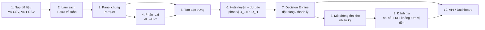

# Data Flow

`[DP]` = số liệu trong `code/outputs/data_profile.md`.

## 1. Luồng xử lý tổng quát

Bản nguồn sơ đồ: `diagrams/workflow.mmd`. Dataset giày dép Việt Nam (phụ lục) chỉ đi qua bước 1–4 để mô tả.

## 2. Schema panel chung (mỗi dòng = 1 chuỗi × 1 tuần)

| Cột | Ý nghĩa | M5 | VN1 |
|---|---|---|---|
| `dataset` | Nguồn | "M5" | "VN1" |
| `series_id` | Mã chuỗi | `item_id` + `store_id` | `Client` + `Warehouse` + `Product` |
| `week_start` | Ngày đầu tuần | Ngày đầu của `wm_yr_wk` (`calendar.csv`) | Tên cột ngày trong file Sales (thứ Hai) |
| `qty` | Doanh số quan sát (≥ 0) | Tổng 7 ngày | Giá trị tuần trong `Phase 0/1/2 - Sales.csv` |
| `price` | Giá tuần | `sell_price` | `Phase 0/1 - Price.csv` (thiếu khi không có bán → giữ giá gần nhất trước đó) |
| `event_*` | Sự kiện trong tuần | Số sự kiện, số ngày SNAP | — (không có) |
| Thuộc tính tĩnh | Mô tả | `dept_id`, `cat_id`, `store_id`, `state_id` | `Client`, `Warehouse` (mã ẩn danh) |
| `split` | Vai trò | train / valid / test | train / valid / test (Phase 2 = test chính thức) |

## 3. Quy tắc làm sạch

**M5**

- Gộp ngày → tuần Walmart (`wm_yr_wk`): 1.941 ngày → 278 tuần [DP].
- Bỏ các tuần trước khi sản phẩm bắt đầu bán ở mỗi cửa hàng (trước tuần đầu tiên có giá trong `sell_prices.csv`), để không thổi phồng tỷ lệ số 0.

**VN1**

- Ghép Phase 0 (170 tuần) + Phase 1 (13 tuần) + Phase 2 (13 tuần đáp án) theo `Client`, `Warehouse`, `Product` → 196 tuần [DP]. Không có ô thiếu doanh số, không có giá trị âm [DP].
- Mỗi chuỗi bắt đầu từ **tuần có bán đầu tiên** (độ dài hoạt động trung vị 124 tuần [DP]).
- Giá thiếu (70,7% số ô [DP]) được điền bằng giá gần nhất trước đó trong cùng chuỗi; thêm cờ `price_observed` để mô hình biết đâu là giá thật.

**Phụ lục — giày dép Việt Nam** (chỉ dùng cho thống kê mô tả): giữ kênh "Bán lẻ"; bỏ tuần bất thường 202352 (2.583 dòng); không trừ 26.432 dòng trả hàng (số lượng âm) vào nhu cầu; gộp SKU lên mẫu–màu (`mold_code` + `color`) × toàn chuỗi → 1.006 chuỗi, 84 tuần [DP].

## 4. Phân loại nhu cầu

- Tính trên **giai đoạn huấn luyện**, từ tuần ra mắt hoặc tuần có bán đầu tiên:
  - ADI = số tuần / số tuần có bán;
  - CV² = (độ lệch chuẩn / trung bình)² của các tuần có bán.
- Ngưỡng **ADI = 4/3, CV² = 0,5** (bài 01, tr. 7–8) → smooth / erratic / intermittent / lumpy.

## 5. Đặc trưng (input của mô hình ML)

| Nhóm | Đặc trưng | M5 | VN1 |
|---|---|---|---|
| Lag | qty tuần t−1…t−4, t−8, t−13, t−26, t−52 | 8 | 8 |
| Thống kê trượt | Trung bình, độ lệch 4/13/26 tuần; tỷ lệ tuần bằng 0 trong 13 tuần; số tuần từ lần bán gần nhất | 8 | 8 |
| Lịch | Tuần trong năm, tháng (M5 thêm số sự kiện, số ngày SNAP) | 4 | 2 |
| Giá | Giá tuần, thay đổi giá so với 4 tuần trước (VN1 thêm cờ `price_observed`) | 2 | 3 |
| Tĩnh | Mã phân loại (category) | 4 | 2 |
| **Tổng** | | **26** | **23** |

**18 đặc trưng chung** (lag, thống kê trượt, tuần, tháng, giá, thay đổi giá). Có thể chạy thêm một thí nghiệm phụ chỉ dùng 18 đặc trưng này cho cả hai dataset, để so sánh công bằng tuyệt đối.

## 6. Chia dữ liệu và rolling origin

| | M5 (278 tuần) | VN1 (196 tuần) |
|---|---|---|
| Kiểm thử | 26 tuần cuối | 26 tuần cuối = Phase 1 + **Phase 2 (đáp án chính thức)** |
| Kiểm định | 13 tuần ngay trước test | 13 tuần ngay trước test |
| Huấn luyện | Phần còn lại | Phần còn lại |
| Huấn luyện lại | Mỗi 13 tuần (2 khối test) | Mỗi 13 tuần (2 khối, trùng ranh giới Phase 1/Phase 2) |
| Dự báo | Mỗi tuần, dùng dữ liệu mới nhất | Mỗi tuần |

Huấn luyện lại mỗi 13 tuần thay vì mỗi tuần: theo bài 08, giảm tần suất huấn luyện lại tiết kiệm nhiều chi phí mà ít mất độ chính xác (abstract).

## 7. Mô phỏng tồn kho (mỗi tuần, mỗi chuỗi)

1. Nhận hàng đã đặt từ L tuần trước.
2. Nhu cầu `qty` xảy ra; bán min(tồn, nhu cầu); phần thiếu là **mất doanh số**.
3. Ghi nhận: tồn cuối kỳ, lượng bán, lượng thiếu.
4. Mỗi R tuần, gọi Decision Engine → đặt hàng, hoặc thanh lý ngay từ tồn hiện có.
5. Tồn ban đầu = S của lần xem xét đầu tiên; **4 tuần đầu là khởi động**, không tính KPI.

**Kịch bản (không phải giả định về thực tế):**

| Tham số | Mặc định | Lưới kịch bản (RQ4) |
|---|---|---|
| R (chu kỳ xem xét) | 1 tuần | — |
| L (lead time) | 2 tuần | 1, 2, 4 |
| τ (mức phục vụ mục tiêu) | 0,9 | 0,8; 0,9; 0,95 (≈ c_o = 1, c_u ∈ {4, 9, 19}, như bài 11, tr. 16) |
| H (tầm nhìn thanh lý) | 13 tuần | 8, 13, 26 |
| q_L (phân vị thanh lý) | 0,95 | 0,9; 0,95; 0,99 |
| k (ngưỡng baseline thanh lý cố định) | 26 tuần bán trung bình | 13, 26, 52 |

## 8. KPI (không có đơn vị tiền)

| KPI | Định nghĩa |
|---|---|
| Fill rate | Tổng lượng bán / tổng nhu cầu |
| Mức phục vụ đạt được (CSL) | Tỷ lệ tuần không hết hàng; so với τ mục tiêu |
| Tỷ lệ tuần hết hàng | Số tuần có thiếu hàng / số tuần |
| Tồn kho (tuần nhu cầu) | Tồn trung bình / nhu cầu trung bình mỗi tuần |
| Tồn dư | Lượng tồn vượt Q_{q_L}(D_H), tính bằng tuần nhu cầu |
| Thanh lý | Số đơn vị thanh lý / tổng nhu cầu; số tuần hết hàng tăng thêm so với không thanh lý |
| Ngưỡng hòa vốn thanh lý | Tỷ lệ giá thu hồi tối thiểu để thanh lý có lợi, vẽ theo chi phí lưu kho từ 10% đến 40%/năm |
| Bản theo giá trị | Các KPI trên tính theo giá trị (số lượng × giá) khi có giá |

Tổng hợp theo dataset × phương pháp × nhóm ADI–CV²; kèm khoảng tin cậy bootstrap và kiểm định Friedman–Nemenyi.

## 9. Output lưu trữ

| Bảng | Khóa | Nội dung |
|---|---|---|
| `panel` | dataset, series_id, week_start | Dữ liệu đã chuẩn hóa |
| `classes` | dataset, series_id | ADI, CV², nhóm nhu cầu |
| `forecasts` | dataset, model, series_id, origin_week | Phân vị D_{L+R}, D_H |
| `decisions` | dataset, model, policy, scenario, series_id, week | Hành động, lượng đặt, lượng thanh lý, rủi ro hết hàng |
| `sim_log` | dataset, model, policy, scenario, series_id, week | Tồn, bán, thiếu |
| `kpi` | dataset, model, policy, scenario, demand_class | Sai số và KPI tổng hợp |
