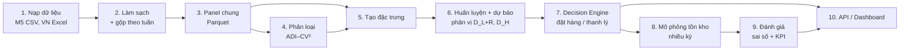

# Data Flow

`[DP]` = số liệu trong `code/outputs/data_profile.md`.

## 1. Luồng xử lý tổng quát

Bản nguồn sơ đồ: `diagrams/workflow.mmd`.

## 2. Schema panel chung (mỗi dòng = 1 chuỗi × 1 tuần)

| Cột | Ý nghĩa | M5 | Việt Nam |
|---|---|---|---|
| `dataset` | Nguồn | "M5" | "VN" |
| `series_id` | Mã chuỗi | `item_id` + `store_id` | `mold_code` + `color` (mẫu–màu) |
| `week_start` | Ngày đầu tuần | Ngày đầu của `wm_yr_wk` trong `calendar.csv` | `Start Date` của `YearWeek` trong `Master_Calendar.xlsx` |
| `qty` | Nhu cầu quan sát (≥ 0) | Tổng 7 ngày | Tổng số lượng bán dương trong tuần, kênh bán lẻ |
| `price` | Giá bán tuần | `sell_price` | Giá bán thực trung bình = `net_price` / `sold_quantity`, có trọng số theo số lượng |
| `list_price` | Giá niêm yết | — | `listing_price` (Productmaster) |
| `unit_cost` | Giá vốn đơn vị | — (giả định) | `cost_price` / `sold_quantity` (trọng số theo số lượng) |
| `event_*` | Sự kiện trong tuần | Số sự kiện, số ngày SNAP | Cờ Tết (`CNY`) |
| Thuộc tính tĩnh | Mô tả sản phẩm | `dept_id`, `cat_id`, `store_id`, `state_id` | `product_group`, `gender`, `lifestyle_group`, `shoe_product`, `price_group`, `launch_season` |

## 3. Quy tắc làm sạch

**M5**

- Gộp ngày → tuần Walmart (`wm_yr_wk`): 1.941 ngày → 278 tuần [DP].
- **Bỏ các tuần trước khi sản phẩm bắt đầu bán** ở mỗi cửa hàng (trước tuần đầu tiên có giá trong `sell_prices.csv`). Không bỏ thì tỷ lệ số 0 và ADI bị thổi phồng.

**Việt Nam**

- Chỉ giữ kênh **"Bán lẻ"** (khoảng 75% số dòng [DP]). Các kênh hợp đồng, bán sỉ, siêu thị, online có cơ chế đặt hàng khác.
- Bỏ tuần bất thường **202352** (2.583 dòng, nằm ngoài khoảng 01/2022–07/2023) [DP].
- **Trả hàng** (26.432 dòng số lượng âm [DP]): không trừ vào nhu cầu; `qty` = tổng số lượng bán dương. Lượng trả hàng được báo cáo riêng để mô tả.
- Gộp SKU (mẫu–màu–size) lên **mẫu–màu × toàn chuỗi**: cấp SKU × cửa hàng có 98,5% số 0, không dự báo được [DP].
- Bỏ chuỗi không có tuần bán dương nào trong giai đoạn huấn luyện.
- Tồn kho thực (12 ảnh chụp 2022) được nạp vào bảng riêng, **chỉ dùng để mô tả**. Lý do: nghi ngờ dữ liệu doanh số chưa đầy đủ (`problem_statement.md`, mục 5).

## 4. Phân loại nhu cầu

- Tính trên **giai đoạn huấn luyện** của từng chuỗi, bắt đầu từ tuần ra mắt:
  - ADI = số tuần / số tuần có bán;
  - CV² = (độ lệch chuẩn / trung bình)² của các tuần có bán.
- Ngưỡng **ADI = 4/3, CV² = 0,5** (bài 01, tr. 7–8) → smooth / erratic / intermittent / lumpy.

## 5. Đặc trưng (input của mô hình ML)

| Nhóm | Đặc trưng | M5 | VN |
|---|---|---|---|
| Lag | qty tuần t−1…t−4, t−8, t−13, t−26 (M5 thêm t−52) | 8 | 7 |
| Thống kê trượt | Trung bình, độ lệch 4/13/26 tuần; tỷ lệ tuần bằng 0 trong 13 tuần; số tuần từ lần bán gần nhất | 8 | 8 |
| Lịch | Tuần trong năm, tháng, sự kiện (SNAP / Tết) | 4 | 3 |
| Giá | Giá tuần, thay đổi giá so với 4 tuần trước, mức giảm so với giá niêm yết (VN) | 2 | 3 |
| Tĩnh | Mã phân loại (category) | 4 | 6 + tuổi sản phẩm từ mùa ra mắt |
| **Tổng** | | **≈ 26** | **≈ 28** |

Khoảng 20 đặc trưng chung (lag, thống kê trượt, tuần, tháng, giá) giữa hai dataset. VN chỉ dùng lag tới 26 tuần vì dữ liệu chỉ có 84 tuần.

## 6. Chia dữ liệu và rolling origin

| | M5 (278 tuần) | VN (84 tuần) |
|---|---|---|
| Kiểm thử (test) | 26 tuần cuối | 26 tuần cuối (khoảng 02–07/2023) |
| Kiểm định (validation) | 13 tuần ngay trước test | 13 tuần ngay trước test |
| Huấn luyện | Phần còn lại | Phần còn lại (khoảng 45 tuần) |
| Huấn luyện lại | Mỗi 13 tuần (2 khối test) | Mỗi 13 tuần (2 khối test) |
| Dự báo | Mỗi tuần, dùng dữ liệu mới nhất | Mỗi tuần |

Huấn luyện lại mỗi 13 tuần thay vì mỗi tuần, dựa trên kết quả của bài 08: giảm tần suất huấn luyện lại tiết kiệm nhiều chi phí mà ít mất độ chính xác (abstract).

## 7. Mô phỏng tồn kho (mỗi tuần, mỗi chuỗi)

1. Nhận hàng đã đặt từ L tuần trước.
2. Nhu cầu thực `qty` xảy ra; bán min(tồn, nhu cầu); phần thiếu là **mất doanh số** (lost sales).
3. Ghi nhận: tồn cuối kỳ, lượng thiếu, chi phí lưu kho, chi phí mất bán.
4. Nếu là tuần xem xét (mỗi R tuần), gọi Decision Engine → đặt hàng hoặc thanh lý (thanh lý lấy ngay từ tồn hiện có, ghi nhận lỗ thanh lý).
5. Tồn ban đầu = S của lần xem xét đầu tiên; **4 tuần đầu là giai đoạn khởi động**, không tính vào KPI.

| Tham số | Mặc định | Lưới độ nhạy (RQ4) |
|---|---|---|
| R (chu kỳ xem xét) | 1 tuần | — |
| L (lead time) | 2 tuần | 1, 2, 4 |
| τ (mức phục vụ mục tiêu) | 0,9 | 0,8; 0,9; 0,95 |
| H (tầm nhìn thanh lý) | 13 tuần | 8, 13, 26 |
| q_L (phân vị thanh lý) | 0,95 | — |
| Giá thu hồi s | 50% giá vốn | 30%, 50%, 70% |
| Chi phí lưu kho h | 25%/năm × giá vốn / 52 mỗi tuần | — |
| Chi phí mất bán | Biên lợi nhuận = giá bán − giá vốn | — |
| Giá vốn M5 | **Giả định** = 0,69 × giá bán (lấy theo trung vị tỷ lệ giá vốn/giá niêm yết của dữ liệu VN [DP]) | 0,5; 0,69; 0,8 |

Các giá trị mặc định (L, h, s, giá vốn M5) là **giả định của nhóm**, cần nêu rõ trong bài và kiểm tra bằng phân tích độ nhạy.

## 8. Output lưu trữ

| Bảng | Khóa | Nội dung |
|---|---|---|
| `panel` | dataset, series_id, week_start | Dữ liệu đã chuẩn hóa |
| `classes` | dataset, series_id | ADI, CV², nhóm nhu cầu |
| `forecasts` | dataset, model, series_id, origin_week | Phân vị D_{L+R}, D_H |
| `decisions` | dataset, model, policy, series_id, week | Hành động, lượng đặt, lượng thanh lý, rủi ro hết hàng |
| `sim_log` | dataset, model, policy, series_id, week | Tồn, bán, thiếu, chi phí |
| `kpi` | dataset, model, policy, demand_class | Sai số và KPI tổng hợp |
