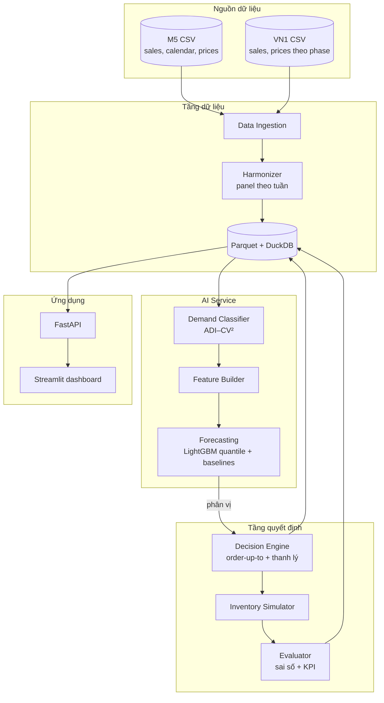

# System Architecture

## 1. Tổng quan

Hệ thống chạy theo **lô hằng tuần (weekly batch)**: mỗi tuần nạp dữ liệu mới, cập nhật dự báo, tính khuyến nghị và KPI. Phần nghiên cứu (benchmark) dùng cùng các thành phần, nhưng chạy lặp qua nhiều mốc thời gian trong quá khứ (rolling origin).

## 2. Thành phần chính

| Thành phần | Vai trò | Công nghệ dự kiến |
|---|---|---|
| **Data Ingestion** | Đọc M5 và VN1 (CSV); dữ liệu Việt Nam ở phụ lục (Excel); cache sang Parquet | Python, pandas, `python-calamine`, `pyarrow` |
| **Harmonizer** | Làm sạch, gộp theo tuần, đưa về **schema panel chung** (xem `data_flow.md`) | pandas |
| **Database / Storage** | Lưu panel, đặc trưng, dự báo, khuyến nghị, KPI | Parquet + **DuckDB** (truy vấn SQL trên file, không cần server) |
| **Demand Classifier** | Tính ADI, CV², gán nhóm nhu cầu cho mỗi chuỗi | Python (numpy) |
| **Feature Builder** | Lag, thống kê trượt, lịch, giá, thuộc tính tĩnh | pandas |
| **AI Forecasting Service** | Huấn luyện và dự báo phân vị bằng nhiều mô hình | LightGBM; `statsforecast` (ETS, TSB, Seasonal Naive); `neuralforecast` (TiDE/DeepAR, GPU RTX 3050) |
| **Decision Engine** | Order-up-to + thanh lý từ phân vị; tính xác suất hết hàng | Python |
| **Inventory Simulator** | Mô phỏng nhiều kỳ (lost sales, lead time) để backtest chính sách | Python (numpy, vector hóa theo chuỗi) |
| **Evaluator** | Sai số dự báo, KPI tồn kho không đơn vị tiền, đường đánh đổi, ngưỡng hòa vốn thanh lý, kiểm định thống kê | numpy, scipy, matplotlib |
| **Backend API** | Trả khuyến nghị và KPI dạng JSON | FastAPI |
| **Frontend Dashboard** | Danh sách đặt hàng/thanh lý, KPI, bảng benchmark | Streamlit |
| **Experiment tracking** | Lưu cấu hình, tham số, kết quả mỗi lần chạy | File YAML + log (MLflow nếu cần) |

## 3. Sơ đồ kiến trúc



Bản nguồn sơ đồ: `diagrams/architecture.mmd`.

## 4. Lớp quyết định (Decision Engine)

Ở mỗi lần xem xét (mỗi R tuần), với mỗi chuỗi:

- **Vị trí tồn kho:** IP = tồn hiện có + hàng đang về.
- **Nhập hàng:** S = Q_τ(D_{L+R}), với τ = c_u / (c_u + c_o). Lượng đặt = max(0, S − IP).
- **Thanh lý:** nếu IP > Q_{q_L}(D_H), thanh lý phần dư = IP − Q_{q_L}(D_H), chỉ lấy từ tồn hiện có (on-hand). Khi đã thanh lý thì không đặt hàng trong kỳ đó. Giá thu hồi **không cố định**; Evaluator tính ngưỡng giá thu hồi hòa vốn.
- **Nhãn hành động:** THANH LÝ nếu lượng thanh lý > 0; ĐẶT HÀNG nếu lượng đặt > 0; ngược lại GIỮ.
- **Rủi ro hết hàng:** P(D_{L+R} > IP), nội suy từ các phân vị dự báo.

## 5. Output JSON (một khuyến nghị)

```json
{
  "$schema": "http://json-schema.org/draft-07/schema#",
  "title": "ReplenishmentRecommendation",
  "type": "object",
  "properties": {
    "dataset":        { "type": "string", "enum": ["M5", "VN1"] },
    "series_id":      { "type": "string" },
    "week_start":     { "type": "string", "format": "date" },
    "demand_class":   { "type": "string", "enum": ["smooth", "erratic", "intermittent", "lumpy"] },
    "model":          { "type": "string" },
    "quantiles_LR":   { "type": "object", "description": "Phân vị tổng nhu cầu trong L+R tuần, ví dụ {\"0.5\": 3, \"0.9\": 7}" },
    "quantiles_H":    { "type": "object", "description": "Phân vị tổng nhu cầu trong H tuần" },
    "inventory_position": { "type": "number" },
    "action":         { "type": "string", "enum": ["ORDER", "HOLD", "LIQUIDATE"] },
    "order_qty":      { "type": "number", "minimum": 0 },
    "liquidation_qty":{ "type": "number", "minimum": 0 },
    "stockout_risk":  { "type": "number", "minimum": 0, "maximum": 1 },
    "params":         { "type": "object", "description": "Kịch bản: L, R, tau, H, q_L" },
    "explanation":    { "type": "string" }
  },
  "required": ["dataset", "series_id", "week_start", "action", "order_qty", "liquidation_qty", "stockout_risk"]
}
```

## 6. Ràng buộc phần cứng

Máy nhóm: CPU i5-12450H (12 luồng), RAM 16 GB, GPU RTX 3050 Laptop, ổ C còn khoảng 8 GB.

- Làm việc ở **tần suất tuần** để giữ bộ nhớ trong giới hạn: M5 theo tuần có 30.490 × 278 ≈ 8,5 triệu ô; VN1 có 15.053 × 196 ≈ 3 triệu ô.
- Dữ liệu, cache và môi trường Python đặt trên **ổ D**.
- Thư mục `data/` không đưa lên git (đã có trong `.gitignore`).
