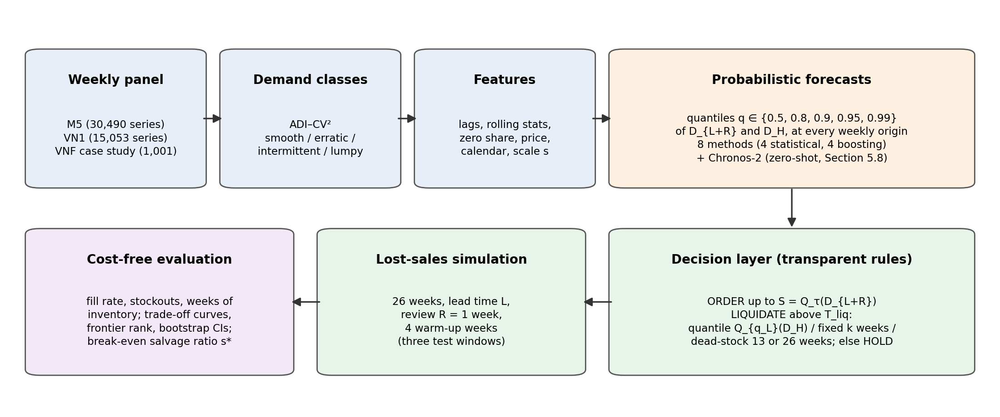

# From Forecasts to Decisions: Benchmarking Probabilistic Demand Forecasts for Replenishment and Liquidation on Public Retail Data

> Assembled by `code/assemble_paper.py` from the section files. Internal source tags are kept for verification and must be removed before submission (`paper_outline.md`).

## Abstract

Public retail forecasting benchmarks rank methods by forecast error, yet forecasts are used to make inventory decisions. We benchmark eight probabilistic forecasting methods—four statistical and four gradient-boosting models—inside one transparent multi-period order-up-to policy with optional liquidation. The benchmark covers M5 (brick-and-mortar, 30,381 series) and VN1 (multi-vendor e-commerce, 13,844 series) at weekly frequency, keeps all series, and reports results by ADI–CV² demand class. Without cost data, methods are compared at equal fill rate along inventory–fill-rate trade-off curves, with bootstrap confidence intervals, and liquidation is assessed with a break-even salvage ratio. The whole benchmark is repeated on three test windows, and is extended with a zero-shot foundation model (Chronos-2) and a Vietnamese footwear case study with actual costs. On M5, LightGBM quantile regression is the most accurate method and needs 3–11% less inventory than strong baselines at a 0.94 fill rate in every window. On VN1 it has the lowest mean error, but TSB with negative-binomial demand is as accurate per series, and the most inventory-efficient method changes between windows. Its advantage on intermittent series comes from avoiding rare large errors rather than from better typical forecasts. Chronos-2 is never the best method and is 8–42 times slower. A quantile-based liquidation rule costs almost no fill rate, whereas fixed and dead-stock rules raise stockouts. Within 26 weeks, however, liquidation pays off only at salvage prices near unit cost, which the case study confirms. Forecasts should be evaluated at equal service level, by demand class, series by series and over several periods.

**Keywords:** probabilistic forecasting; inventory management; intermittent demand; quantile regression; LightGBM; foundation models; liquidation; M5; VN1

# 1. Introduction

Retailers face two opposite risks every week. With too little stock they lose sales and customers; with too much they tie up capital, pay holding costs and eventually have to discount or liquidate products. Deciding how much to order, and when to clear excess stock, requires knowing not only the expected demand but also its uncertainty. High quantiles of the demand distribution are commonly used to set safety stock [P03 p. 2]. Probabilistic forecasts are therefore the natural input to inventory decisions.

Public retail benchmarks have driven much of the recent progress in probabilistic demand forecasting, but they evaluate forecasts rather than decisions:

- The M5 competition measured accuracy with the weighted RMSSE and the weighted scaled pinball loss [P01 p. 3]. Its organisers state that it did not target a specific decision-making problem, so any quantile could be useful [P03 p. 2–3].
- LightGBM was used by all of the top 50 teams in the accuracy track [P02 p. 1], and the winner of the uncertainty track trained a separate gradient-boosting model for each quantile [P03 p. 14].
- Studies on the more recent VN1 e-commerce dataset also compare methods by accuracy and computational cost (Zanotti, 2025) [P08 p. 13–14].

Yet, in inventory settings, higher forecast accuracy does not necessarily lead to better decisions (Wang et al., 2026) [P11 (abstract)]. A structured review notes that much forecasting research treats the forecast as an end in itself rather than as an input to replenishment (Goltsos et al., 2022) [G22 (abstract)]. Theodorou et al. (2025) examined the relationship between forecast accuracy and inventory performance on the M5 data [P20 (title only)]. Meanwhile, pretrained time-series foundation models are entering demand forecasting (e.g. Yang et al., 2025) [P06 p. 4], but evidence on whether they improve inventory decisions on intermittent retail data is scarce [Nhận định nhóm].

Three features of retail data make the step from forecast to decision difficult.

1. **Most retail series are intermittent or lumpy.** In M5, 73% of the product–store series are intermittent and 17% lumpy at daily frequency [P01 p. 8]. Even at weekly frequency, 39.7% of M5 weeks and 69.9% of VN1 weeks have zero sales [DP]. Yet studies that link forecasts to inventory decisions on M5 often restrict themselves to selected series:
   - 8,000 high-volume series, which the authors call the main weakness of their study (Mohammed et al., 2026) [P22 p. 4, 18];
   - a subset of highly volatile food items (Zabraoui et al., 2025) [P21 p. 8].
2. **Excess stock must be handled, not only avoided.** Products reach the end of their life, and stock above any plausible future demand has to be cleared. To our knowledge, the forecast-to-inventory studies we reviewed in full text do not include a liquidation decision [Nhận định nhóm, based on a keyword search of papers 11 and 21–25; `03_problem_and_gap/research_gap.md` §2.3]. The TSB method links intermittent-demand forecasting to obsolescence, but was evaluated by simulation (Teunter et al., 2011) [P16 (abstract)].
3. **Conclusions from one dataset or one period may not transfer.**
   - The M5 organisers acknowledge limits to generalising beyond the data it represents [P01 p. 11].
   - The decision-oriented M5 studies cited above use only Walmart data; Mohammed et al. (2026) name testing on a single US retail setting as a limitation [P22 p. 17].
   - The closest study evaluates probabilistic forecast combinations in a single-period, single-product newsvendor setting, which its authors list as a limitation [P11 p. 26].
   - These studies evaluate a single test period [P11 p. 16], [P22 p. 4], [P21 p. 8] **[Chưa kiểm chứng: check that none of the three uses rolling or multiple test windows]**.

Limited attention has therefore been given to benchmarking probabilistic forecasting methods under a common, transparent replenishment-and-liquidation policy across different retail settings and periods, while retaining intermittent and lumpy demand and reporting inventory KPIs by demand class (`research_gap.md` §5). A further practical obstacle is that public datasets contain neither inventory positions nor unit costs, so cost-based evaluations depend on assumed cost parameters.

This study addresses this gap with a forecast-to-decision benchmark on two public retail datasets of different settings, both at weekly frequency:

- **M5:** one brick-and-mortar retailer, 30,490 product–store series;
- **VN1:** multi-vendor e-commerce, 15,053 client–warehouse–product series.

Eight probabilistic forecasting methods feed the same multi-period order-up-to policy with an optional liquidation rule. Four are statistical (empirical quantiles, ETS, and TSB with Poisson or negative-binomial demand). Four use gradient boosting (LightGBM quantile regression, LightGBM-Tweedie with normal safety stock or with conformal intervals, and HistGradientBoosting quantile regression).

We evaluate the methods without monetary units:

- KPIs: fill rate, stockout rate and inventory in weeks of demand;
- comparisons at equal fill rate along each method's inventory–fill-rate trade-off curve, with bootstrap confidence intervals;
- a break-even salvage ratio to summarise the economics of liquidation.

All analyses are reported by ADI–CV² demand class and repeated on three 26-week test windows. Two extensions complete the benchmark:

- a pretrained foundation model (Chronos-2) as a ninth method;
- a case study on a Vietnamese footwear retail chain, whose actual costs and prices allow liquidation to be valued in money.

This study does not propose a new forecasting model. It benchmarks existing probabilistic forecasting models inside a common, transparent replenishment-and-liquidation decision layer across retail settings, and evaluates them with inventory KPIs by demand class.

We address the following research questions:

- **RQ1.** Under a common multi-period quantile-based replenishment policy, how do the methods compare in forecast accuracy and in cost-free inventory KPIs on M5 and VN1, and do their rankings hold across datasets and test periods?
- **RQ2.** How does their relative performance vary across ADI–CV² demand classes, and are the class-level patterns consistent between M5 and VN1?
- **RQ3.** How much excess inventory does a quantile-based liquidation rule remove compared with no liquidation, a fixed weeks-of-supply rule and a dead-stock rule, at what cost in stockouts, and above which salvage-value ratio does liquidation pay off?
- **RQ4.** How sensitive are the rankings and recommendations to the target service level, the lead time and the liquidation horizon?

The contributions are as follows:

1. **A reproducible forecast-to-decision benchmark** on two public retail datasets from different settings, with one transparent decision layer for replenishment and liquidation. It runs on a laptop CPU and the code is open.
2. **A cost-free evaluation protocol with uncertainty quantification.** It combines trade-off curves, the inventory needed at a target fill rate, a frontier rank, bootstrap confidence intervals, and a break-even salvage ratio for liquidation.
3. **Robustness evidence.** All series are retained, results are reported by demand class with per-series statistical tests, and the whole benchmark is repeated on three test windows. This separates robust findings from period-dependent ones.
4. **Two extensions.**
   - A zero-shot foundation model (Chronos-2) in the same decision layer.
   - A case study on a Vietnamese footwear chain with actual unit costs, which values liquidation in money and illustrates the benchmark in an emerging-market retail setting.

The main findings are as follows:

- **M5:** LightGBM quantile regression is both the most accurate method and the one that needs the least inventory at equal fill rate, in all three windows. At a fill rate of 0.94 it needs 3–11% less inventory than the other strong baselines, and all bootstrap intervals exclude zero.
- **VN1, accuracy:** the same model has the lowest mean error, but TSB with negative-binomial demand is as accurate per series at a 3-week horizon and more accurate at 13 weeks, in every window. The ML advantage is robustness to rare large errors, not better forecasts for a typical series.
- **VN1, inventory:** the most inventory-efficient method depends on the period (LightGBM quantile in two of three windows); only lumpy series favour LightGBM quantile in every window.
- **Foundation model:** zero-shot Chronos-2 is never the most accurate or the most inventory-efficient method, and is 8–42 times slower on CPU.
- **Liquidation:** a quantile-based rule costs almost no service, whereas fixed and dead-stock rules raise stockouts. Within 26 weeks, however, no rule shows an economic benefit unless stock is salvaged near unit cost, which the case study confirms with actual costs.

The paper is organised as follows. Section 2 reviews related work. Section 3 describes the data, methods, decision layer and evaluation measures, and Section 4 the experimental setup. Section 5 reports the results, Section 6 discusses implications and limitations, and Section 7 concludes.

# 2. Related Work

## 2.1 Probabilistic forecasting on public retail benchmarks

**M5.** The M5 competition released 42,840 hierarchical Walmart sales series, with 30,490 series at the product–store level [P01 p. 6]. It had an accuracy track scored by WRMSSE and an uncertainty track scored by WSPL [P01 p. 3].

- *Accuracy track:* LightGBM was used by all of the top 50 teams [P02 p. 1]. The winner averaged 220 LightGBM models trained with a Tweedie loss [P02 p. 9] and beat the best benchmark by 22.4% [P02 p. 5–6]. Simple exponential smoothing remained competitive at the product and product–store levels [P02 p. 2].
- *Uncertainty track:* participants forecast nine quantiles [P03 (abstract)]. The winning team trained a separate LightGBM model for each quantile and aggregation level, 126 models in total [P03 p. 14].

These results motivate our choice of LightGBM quantile regression as the main model and of LightGBM-Tweedie as a baseline.

**Later work** on M5 continued to optimise forecast accuracy:

- hierarchical and architectural ensembles of LightGBM, deep and foundation models (Yang et al., 2025) [P06 p. 3–4];
- temporal-hierarchy encoders (Salatiello et al., 2025) [P09 p. 4];
- end-to-end probabilistic top-down reconciliation with ETS on a few aggregate series (Zambon et al., 2026). This method would have ranked 11th of 892 teams in the uncertainty track and runs in under five minutes on a laptop [P13 p. 25].

**VN1.** VN1 is a weekly e-commerce dataset of 15,053 products [P08 p. 7]. Zanotti (2025) used M5 and VN1 to study the cost of ensembling ten global models with point and quantile losses. Small ensembles of two or three models were often near-optimal, and less frequent retraining cut cost with little loss of accuracy [P08 (abstract)]. That study evaluates accuracy (RMSSE, scaled quantile loss) and computational cost, not inventory outcomes [P08 p. 13–14].

**Foundation models.** Pretrained time-series models are now used in demand forecasting. Yang et al. (2025) include Chronos and TEMPO among the backbones of their ensembles on M5 and three other retail datasets [P06 p. 4]. They note that the interpretability of ensemble results remains an open challenge for decision making [P06 p. 7]. Damato et al. (2026) leave the comparison with pretrained models on intermittent data to future work [P12 p. 2]. Chronos-2 is a recent pretrained model with quantile outputs and native covariate support (Ansari et al., 2025; model card) **[Chưa kiểm chứng: technical report not read]**. To our knowledge, such models have not been evaluated inside an inventory decision layer on intermittent retail data [Nhận định nhóm].

In short, the main public retail benchmarks rank methods by forecast error. The M5 organisers note that the competition did not target a specific decision problem [P03 p. 2–3], and that its conclusions are limited in how far they generalise beyond the data it represents [P01 p. 11].

## 2.2 Intermittent demand and demand classification

**Classical methods.** Croston's method forecasts demand size and inter-demand interval separately (Croston, 1972) [P15 via P23 p. 1–2]. It is positively biased, which motivated the SBA correction [P16 (abstract)]. TSB (Teunter et al., 2011) replaces the interval with a demand probability that is updated every period. This makes it unbiased and lets it react to obsolescence [P16 (abstract)], [P23 p. 2].

**Demand classes.** Syntetos et al. (2005) derived a classification by the average inter-demand interval (ADI) and the squared coefficient of variation of demand sizes (CV²) to guide method selection [P18 (abstract)]. Makridakis et al. (2022a) report the thresholds ADI = 4/3 and CV² = 0.5 and use them to describe M5 [P01 p. 7–8]. They also note that the thresholds were originally meant to compare specific methods [P01 p. 8]. Damato et al. (2026) likewise stress that the thresholds are not a definition of intermittency [P12 p. 10]. Inventory studies on M5 report class shares [P22 p. 4] but evaluate inventory only in aggregate [P22 p. 15].

**Global models.** Damato et al. (2026) compared local and global probabilistic models on five intermittent datasets with more than 40,000 series [P12 (abstract)].

- TiDE was the most accurate global model, and a Tweedie output gave the best high quantiles [P12 p. 19].
- Gradient-boosted trees used in a *distributional* form, predicting distribution parameters rather than quantiles [P12 p. 6], were not competitive and were dropped from the analysis [P12 p. 13, 19].
- The authors conclude that no global architecture is established for intermittent series [P12 p. 2].

Our main model differs from theirs: it uses LightGBM *quantile regression*, as the M5 uncertainty winner did [P03 p. 14]. Their finding is nevertheless a reason to check the main model against TSB and against a second gradient-boosting implementation.

**Metrics.** For intermittent data, MAPE is undefined when demand is zero [P24 p. 4]. El-Meehy et al. (2026) further show that forecasting zero periods well is associated with lower inventory but more shortages [P24 p. 21]. This is a first sign that accuracy and inventory outcomes can pull in different directions.

## 2.3 From forecasts to inventory decisions

**Reviews and integrated approaches.**

- *Review.* A structured review of the inventory–forecasting interface proposes four levels of integration and observes that most forecasting studies ignore the step from forecast to replenishment decision (Goltsos et al., 2022) [G22 (abstract)].
- *Inventory-based parameter tuning.* Kourentzes et al. (2020) optimise the parameters of forecasting models with inventory metrics instead of statistical error measures [P19 (repository description)].
- *End-to-end learning.* van der Haar et al. (2024) learn order quantities directly with a supervised, end-to-end loss, for settings including lost sales [W1 (abstract)].

In contrast, we keep forecast and decision separate and use a transparent quantile-based policy. This lets one decision layer be fed by any probabilistic forecast.

**Studies on M5.**

- *Wang et al. (2026)* is the closest study. It combines four probabilistic models (two bootstrap, Poisson and negative binomial) with multi-objective optimisation [P11 p. 9–10, 14]. It sets the order-up-to level at the critical-ratio quantile of a newsvendor problem [P11 p. 11], with cost ratios equivalent to service levels of 80%, 90% and 95% [P11 p. 16]. It evaluates on 28,903 M5 series after removing 1,587 series without history [P11 p. 17]. No single method dominated in every scenario [P11 p. 18]. The authors list the single-period, single-product setting as a limitation [P11 p. 26].
- *Zabraoui et al. (2025)* simulate 365 days of inventory on a selected subset of volatile M5 food items. They compare reinforcement learning, genetic algorithms, deep learning and heuristics, and their GA–DQN hybrid raises the service level to 94% [P21 p. 8, 16]. The authors note the training cost and the low interpretability of deep reinforcement learning, and assume fixed lead times [P21 p. 19].
- *Mohammed et al. (2026)* build a stacked ensemble with GARCH-based intervals on 8,000 high-volume M5 series [P22 p. 4]. Their inventory evaluation is one illustrative calculation: a 11.8% lower expected cost than a fixed-quantile policy [P22 p. 15]. They name the omission of intermittent, slow-moving items as the main weakness and suggest quantile regression on intermittent series as future work [P22 p. 18–19].

**Related benchmarks we could not read.** Theodorou et al. (2025) studied the relationship between forecast accuracy and inventory performance on the M5 data [P20 (title only)]. Li (2026) proposed a decision-regret benchmark for perishability-aware multi-echelon replenishment on M5 [W3 (title only)]. Because we could not read either paper, we do not make claims about their methods or findings. We also do not pose the general accuracy–inventory relationship as a research question.

**Other domains.**

- Sfiris and Koulouriotis (2025) link intermittent-demand forecasts to an (R, Q) policy for 2,050 automotive spare parts. They report lower safety stock at the same service level [P23 p. 14, 26], with a fixed lead time as a stated limitation [P23 p. 25].
- de Sousa (2026) simulates replenishment from LightGBM/XGBoost forecasts for one fashion retailer [W2 (abstract)].

## 2.4 Excess inventory and liquidation

Excess stock is a recurring practical problem. For example, Putra and Purnomo (2026) report average end-of-period stock far above safety stock for many power-plant spare parts [P25 p. 7]. TSB was motivated partly by obsolescence [P16 (abstract)]. However, we searched the full texts of papers 11 and 21–25 for "liquidation", "markdown", "clearance", "salvage", "disposal", "write-off" and "obsolete". The terms appear only in reference lists or overview tables; none of these studies includes a liquidation decision (`research_gap.md` §2.3). The abstracts of W1 and W2 do not mention one either. Within the literature we reviewed, the reverse decision of clearing stock has thus received little attention alongside replenishment [Nhận định nhóm].

## 2.5 Positioning

**Table A.** Positioning against the closest studies. ✓ = yes, ✗ = no, "—" = not applicable. Entries for papers 11, 21 and 22 are based on full texts. Papers 20 and W3 are omitted because they were not read.

| | Wang et al. (2026) [P11] | Zabraoui et al. (2025) [P21] | Mohammed et al. (2026) [P22] | Zanotti (2025) [P08] | This study |
|---|---|---|---|---|---|
| Datasets | M5 + RAF spare parts | M5 subset | M5, 8,000 high-volume series | M5 + VN1 | M5 + VN1 |
| Intermittent series retained | ✓ (excl. 1,587 without history) | ✗ (selected volatile items) | ✗ | ✓ | ✓ (all classes) |
| Inventory evaluation | newsvendor, single period | 365-day simulation | one illustrative calculation | ✗ (accuracy only) | multi-period simulation with lead time |
| Liquidation decision | ✗ | ✗ | ✗ | — | ✓ (quantile, fixed, dead-stock) |
| Results by ADI–CV² class | ✗ | ✗ | ✗ (shares only) | — | ✓ |
| Cost-free KPIs / trade-off | cost ratios ↔ τ | costs | costs | — | ✓ (frontier, break-even salvage) |
| Policy transparency | quantile policy | RL (low interpretability, p. 19) | quantile + GARCH | — | quantile policy |
| Test periods | one evaluation period (28 days) | 365-day simulation | one 75/25 split | — (accuracy only) | three 26-week windows, rolling weekly origins |
| Foundation model in the comparison | ✗ | ✗ | ✗ | ✗ | ✓ (Chronos-2, zero-shot) |
| Actual unit costs from data | ✗ (cost ratios) | ✗ (assumed cost parameters) | ✗ (assumed cost parameters) | — | ✓ in the case study (VNF) |

Sources: [P11 p. 11, 16, 17, 26], [P21 p. 5, 8, 19], [P22 p. 4, 15, 18], [P08 p. 4, 13–14]. Test periods: P11 p. 16 (evaluation on the last 28 days), P22 p. 4 (75:25 split), P21 p. 8 (365-day simulation). Cost parameters: P21 p. 5 (cost function), P22 p. 15 (holding 0.50, shortage 5.00), P11 p. 16 (c₂ ∈ {4, 9, 19}).

Multi-period simulation alone is not new (Zabraoui et al., 2025; van der Haar et al., 2024), nor is decision-level evaluation (Wang et al., 2026). Our contribution lies in combining the following elements [Nhận định nhóm]:

- two public retail settings;
- all demand classes, reported by class;
- a two-sided decision layer (replenishment and liquidation);
- a cost-free evaluation with bootstrap uncertainty;
- three test windows;
- a foundation-model check;
- a case study with actual unit costs.

# 3. Methodology and 4. Experimental Setup

## 3. Methodology

### 3.1 Design of the benchmark

This study does not propose a new forecasting model. It is a forecast-to-decision benchmark: eight probabilistic forecasting methods supply quantile forecasts to one common decision layer (replenishment plus liquidation), which is run in a multi-period inventory simulation. The benchmark uses two public retail datasets and is repeated on three test windows. All methods share the same weekly panel, forecast origins, retraining cut-offs, decision rules and scenarios, so differences in inventory outcomes can be attributed to the forecasts alone. Two extensions are reported separately: a time-series foundation model (Chronos-2) as a ninth method, and a case study on a Vietnamese footwear retail chain.

The pipeline has six steps (Figure 1):

1. Build a weekly panel from the raw data.
2. Assign each series to an ADI–CV² demand class.
3. Build features.
4. Forecast quantiles of cumulative demand over the replenishment horizon and the liquidation horizon.
5. Turn the quantiles into order and liquidation decisions.
6. Simulate inventory under lost sales and compute key performance indicators (KPIs) by demand class.

**Figure 1.** Benchmark pipeline. All methods share the same panel, origins, decision rules and simulation; only the forecasts differ.

The public datasets contain no inventory positions, lead times or unit costs. We therefore treat the lead time, target service level and liquidation parameters as **scenarios**, not as assumptions about reality. The main evaluation uses inventory KPIs without monetary units, comparisons at equal fill rate, and a break-even salvage ratio that does not require choosing a single cost value (Section 3.6). The case study, which has actual costs and prices, adds a money-based evaluation of liquidation.

### 3.2 Data and demand classes

**M5** (Makridakis et al., 2022a) contains daily unit sales of 3,049 Walmart products in 10 stores in three US states, at 30,490 product–store series [P01 p. 6].

- We aggregate daily sales to Walmart weeks and drop the last, incomplete week, which leaves 277 full weeks (2011-01-29 to 2016-05-14).
- Weekly prices come from the competition price file; missing prices are carried forward.
- A series starts in the first week in which the product has a price, i.e. is on the shelf. Weeks before that are treated as missing, not as zero demand.
- Calendar features are the number of events and the number of SNAP days of the store's state in each week.

**VN1** (Vandeput, 2024) is a weekly e-commerce dataset with 15,053 client × warehouse × product series, used in prior work for accuracy benchmarking (Zanotti, 2025) [P08 p. 7]. It covers 46 vendors and 328 warehouses [DP].

- We concatenate Phase 0, Phase 1 and the official Phase 2 answers into 196 weeks (2020-07-06 to 2024-04-01).
- Prices exist only in Phase 0–1 and only in weeks with sales (29.3% of cells) [DP]; they are carried forward.
- A series starts at its first sale.
- Despite its name, VN1 is **not** Vietnamese data.

**Case study — Vietnamese footwear chain (VNF).** We use the retail-channel sales of a Vietnamese footwear chain released for the Vietnam Datathon 2023 (Kaggle dataset `tienanh2003/sales-and-inventory-snapshot-data`) **[Chưa kiểm chứng: exact citation and licence; the Kaggle page lists the licence as "Unknown"]**.

- *Series:* style–colour (mold code × colour) over the whole chain, at weekly frequency. Returns (negative quantities) are excluded from demand.
- *Week codes:* the data label weeks by the calendar year of the transaction plus the ISO week number. This mislabels days at the year boundary. Code 202153 contains 1–2 January 2022, a two-day remnant of ISO week 2021-W52, and is dropped. Code 202352 contains 1 January 2023, which belongs to ISO week 2022-W52, and is merged into 202252. The last week (202331) contains only 31 July 2023 and is dropped.
- *Panel:* 1,001 series × 82 weeks (2022-01-03 to 2023-07-24).
- *Prices and costs:* each series has an actual unit cost and unit net price (medians over its sales); the median gross margin is 45.5% [R §10.4].
- *Caveats:*
  1. Chain-level sales fall from roughly 8–17 thousand units per week in 2022 to about 5 thousand from the Lunar New Year week of 2023 onwards, i.e. just before the test window. We could not determine whether this is a real change or missing data.
  2. Inventory snapshots equal 216–485 weeks of sales in the ten stores with complete data, which suggests that the published sales files (`*_split_1`) may contain only part of the transactions [DP].
  3. The licence is listed as "Unknown".

  We therefore use VNF as an illustration and for the money-based evaluation, not for general method rankings.

A series is evaluated if it starts at least 13 weeks before the test period and has at least one sale in the training period. Demand classes are computed on the pre-test history of each series, from its start week, using the thresholds ADI = 4/3 and CV² = 0.5 (Syntetos et al., 2005; thresholds as reported in Makridakis et al., 2022a [P01 p. 7–8]). Following Damato et al. (2026) [P12 p. 10], we use these thresholds as a conventional way to group series, not as a definition of intermittency.

**Table 1.** Datasets. Class counts refer to the main test window.

| | M5 | VN1 | VNF (case study) |
|---|---|---|---|
| Setting | One retailer, 10 physical stores (US) | Multi-vendor e-commerce, 46 vendors, 328 warehouses | One footwear chain, physical stores (Vietnam) |
| Series level | product × store | client × warehouse × product | style–colour × chain |
| Series in panel / evaluated | 30,490 / 30,381 | 15,053 / 13,844 | 1,001 / 909 |
| Weeks | 277 | 196 | 82 |
| Share of zero weeks | 39.7% | 69.9% | 35.4% |
| Exogenous information | price, events, SNAP, product hierarchy | price (partial) | price |
| Unit cost | no | no | yes |
| Test window, main | 2015-11-21 → 2016-05-14 | 2023-10-09 → 2024-04-01 | 2023-01-30 → 2023-07-24 |
| Test window, second | 2015-05-23 → 2015-11-14 | 2023-04-10 → 2023-10-02 | — |
| Test window, third | 2014-11-22 → 2015-05-16 | 2022-10-10 → 2023-04-03 | — |
| Smooth / erratic / intermittent / lumpy | 16,102 / 1,777 / 10,285 / 2,217 | 2,596 / 1,901 / 6,539 / 2,808 | 187 / 285 / 272 / 165 |
| Same, % | 53.0 / 5.8 / 33.9 / 7.3 | 18.8 / 13.7 / 47.2 / 20.3 | 20.6 / 31.4 / 29.9 / 18.2 |

Sources: `05_methodology/dataset.md` §1, §4; [ES §2]; [DP]; [R §10, §10.1, §10.4]. VNF percentages computed from the counts.

The datasets differ clearly in class composition: M5 is mostly smooth, VN1 mostly intermittent and lumpy. This difference lets us check whether class-level conclusions transfer between retail settings (RQ2). In the main window, 109 M5 series and 1,209 VN1 series were excluded by the start-date and history conditions.

### 3.3 Forecasting target

Let y_{i,t} be the sales of series i in week t, used as demand. Censoring caused by real stockouts cannot be detected (Section 4.7). At each origin o (the decision week), a forecast may use only weeks before o. The target is the cumulative demand over h weeks,

  D_h(i, o) = y_{i,o} + … + y_{i,o+h−1},

and every method forecasts the quantiles Q_q(D_h) for q ∈ {0.5, 0.8, 0.9, 0.95, 0.99} **directly**. We do not sum weekly quantiles, because the quantile of a sum is not the sum of quantiles. Two horizons are needed:

- h = L + R for replenishment (default L = 2, R = 1, so h = 3);
- h = H for liquidation (default H = 13).

Common post-processing for all methods clips negative values to zero and sorts the quantiles so that they do not cross.

### 3.4 Forecasting methods

**Table 2.** Forecasting methods. s = scale of the series (mean weekly demand over its last 52 active weeks, floor 0.1).

| Label | Family | How the quantiles of D_h are produced | Role |
|---|---|---|---|
| EMP | Statistical | Empirical quantiles of rolling h-week sums over the last 104 weeks | Model-free floor |
| ETS | Statistical | ETS(A,N,N) (Hyndman et al., 2008): normal with mean h·ℓ and variance σ²·Σ_{j=0}^{h−1}(1 + jα)² | Exponential smoothing remains competitive at product–store level [P02 p. 2] |
| TSB-P | Statistical | TSB (Teunter et al., 2011); Poisson(h·p·z) | Standard method for intermittent demand and obsolescence [P16 (abstract)] |
| TSB-NB | Statistical | TSB; negative binomial matched to mean h·p·z and variance h·(p(var_z + z²) − (pz)²); Poisson if not over-dispersed | Wider intervals for lumpy demand |
| LGB-T | ML | LightGBM-Tweedie point forecast μ + normal safety stock: μ + z_q·σ_i | Approach of the M5 Accuracy winner [P02 p. 9] + classical safety stock; main ablation |
| LGB-C | ML | Same Tweedie model + split conformal (Lei et al., 2018): μ + s·F⁻¹_g(q), residuals pooled by demand class g | Intervals from a point model without a normal assumption |
| HGB-Q | ML | scikit-learn HistGradientBoosting, quantile loss, one model per q | Checks that results do not depend on one library |
| **LGB-Q** | ML (main) | LightGBM quantile regression (Koenker & Bassett, 1978), one global model per q | The M5 Uncertainty winner trained LightGBM per quantile [P03 p. 14] |
| Chronos-2 | Foundation model (Section 5.8 only) | Zero-shot, one-step forecast of the sequence of non-overlapping h-week totals | Checks whether a pretrained model changes the conclusions |

*Statistical models.* Parameters are chosen per series at each cut-off by the in-sample sum of squared one-step errors, computed from the 14th week of the series:

- TSB: α_d, α_p ∈ {0.05, 0.1, 0.2, 0.3};
- SES: α ∈ {0.02, 0.05, 0.1, 0.2, 0.3, 0.5}.

States are updated every week up to the origin. For ETS, σ is the root of the in-sample one-step MSE. For TSB-NB, var_z is the variance of non-zero demand sizes before the cut-off.

*ML models.* All four ML models are **global** models trained on the target D_h / s, clipped at the 99.9th percentile of the training set. Predictions are multiplied back by s; because the pinball loss is scale-equivariant, scaling does not bias the quantile objective.

- LightGBM models (Ke et al., 2017) use fixed hyper-parameters with no tuning: learning rate 0.05, 63 leaves, at least 200 samples per leaf, feature and bagging fraction 0.8, λ₂ = 1, up to 1,000 rounds, early stopping after 50 rounds on the validation origins, seed 2026.
- The Tweedie models use power 1.1. For LGB-T, σ_i is the root mean squared validation residual of series i, or √μ if the series has no validation rows.
- For LGB-C, scaled validation residuals (D_h − μ)/s are pooled by demand class; classes with fewer than 200 residuals use the pooled distribution.

LGB-T, LGB-C and LGB-Q share features, target and training data and differ **only in how quantiles are produced**. LGB-T vs. LGB-Q is therefore a clean ablation of "point forecast + safety stock" against "direct quantiles". In an earlier run, the Tweedie model was trained on unscaled D_h and produced very large forecasts for near-zero VN1 series. Training it on D_h / s reduced these errors (VN1 RMSSE at h = 13 from 1.131 to 0.896); the remaining gap to EMP (0.64) comes mainly from bulk-order spikes that all models miss [R §1.1].

HGB-Q (Pedregosa et al., 2011) differs from LGB-Q in four respects:

- it is trained on a random sample of at most 300,000 rows (LGB models: at most 3 million);
- it uses learning rate 0.1 and at most 300 rounds;
- it stops early on 10% of the training data;
- it was run only for h = 3 and 13.

It is therefore a **robustness check**, not a like-for-like comparison.

*Features* (M5 27, VN1 and VNF 21, 19 shared):

- lags 1, 2, 3, 4, 8, 13, 26, 52;
- rolling mean and standard deviation over 4, 13 and 26 weeks;
- share of zero weeks in the last 13 weeks, and weeks since the last sale;
- week of year and month;
- last week's price and the price change over 4 weeks;
- the scale s.

M5 adds the number of events and SNAP days inside the h-week target window (known in advance) and the categorical attributes dept, cat, store and state. Level features are divided by s. VN1 client and warehouse codes are not used.

*Chronos-2.* Chronos-2 is a 120-million-parameter pretrained time-series model that produces quantile forecasts (Ansari et al., 2025; model card `amazon/chronos-2`) **[Chưa kiểm chứng: technical report not read; claims limited to the model card]**. We use it zero-shot on CPU, without covariates, cross-series learning or fine-tuning (`code/f2d/models.py`, `chronos2`).

- To forecast D_h directly, as all other methods do, the context of series i at origin o is the sequence of non-overlapping h-week totals ending at o, over at most 104 weeks. The model predicts one step ahead.
- All requested quantiles (0.5–0.99) are among the model's training quantile levels (0.01–0.99, model configuration), so no interpolation or extrapolation of quantiles is involved.
- According to the model card, the training data include subsets of `autogluon/chronos_datasets` and `Salesforce/GiftEvalPretrain`. The file listings of both corpora on Hugging Face contain M5; neither lists VN1. The M5 result is therefore not a clean zero-shot test, whereas VN1 and VNF are.
- Because of its runtime on CPU (Section 4.4), Chronos-2 was run on the main M5 window, the three VN1 windows and VNF. Its results are stored separately (`code/outputs/*_c2/`), so the ranks of the eight-method benchmark are not affected.

*Excluded.* Deep global models trained from scratch (e.g. DeepAR, Salinas et al., 2020; TiDE) are outside the scope. Damato et al. (2026) found TiDE with a Tweedie output to be the best global model on intermittent data [P12 p. 19], so this is a limitation (Section 6.4). Croston's method (Croston, 1972) is represented by its obsolescence-aware variant TSB.

### 3.5 Decision layer

At the start of each test week o, with review period R = 1 week, the following steps are applied to every series (`code/f2d/policy.py`):

1. Receive the order placed L weeks earlier.
2. Compute the inventory position IP = on-hand + on-order.
3. **Liquidate** x = min(max(IP − T_liq, 0), on-hand).
4. **Order** q = max(S − IP, 0) with S = Q_τ(D_{L+R}); no order is placed in a week with x > 0.
5. Demand occurs: sales = min(on-hand, demand). Unmet demand is lost.

S and T_liq are rounded up to integers. Initial on-hand equals S of the first test week, with nothing on order. Each series–week receives one of three transparent recommendations: LIQUIDATE if x > 0, ORDER if q > 0, otherwise HOLD.

Five liquidation policies are run on the same replenishment forecasts:

| Policy | Threshold T_liq | Note |
|---|---|---|
| none | ∞ | Replenishment only |
| quantile (proposed) | Q_{q_L}(D_H) from the same forecasting method | Default q_L = 0.95, H = 13 |
| fixed | k × mean weekly sales of the previous 26 weeks | Weeks-of-supply rule, default k = 26 |
| dead13 / dead26 | 0 if the series had no sale in the previous 13 / 26 weeks, else ∞ | When "dead": liquidate all on-hand **and** set S = 0 until the next sale |

The quantile rule uses the forecast distribution itself; the fixed and dead-stock rules need no forecast and act as practitioner-style baselines [Nhận định nhóm].

### 3.6 Evaluation measures

**Forecast accuracy** is computed per series over all test origins and averaged without weights within a group:

- *Scaled quantile loss* SQL = mean_{o,q} ρ_q(D_h − Q_q) / (h · mean|Δy|), where ρ_q is the pinball loss and the denominator is h times the in-sample mean absolute one-step naive error.
- *RMSSE* of the median, scaled by the naive error.
- *Coverage* cov_q = share of origins with D_h ≤ Q_q (ideal value q).
- *Per-quantile loss:* the same scaled pinball loss for each q separately (`code/per_quantile_loss.py`).

MAPE is not used because it is undefined when demand is zero [P24 p. 4].

**Inventory KPIs** are computed over the 22 test weeks that follow 4 warm-up weeks. Units are summed over all series of a group before ratios are formed, so high-volume series carry more weight.

- Fill rate = Σ sales / Σ demand.
- Cycle service level (CSL) = 1 − (stockout weeks / weeks).
- Stockout rate = stockout weeks / weeks with positive demand.
- Inventory in **weeks of demand** = mean end-of-week on-hand / mean weekly demand.
- Liquidated share = liquidated units / demand.
- *Value-weighted* fill rate and inventory: the same ratios with units weighted by the weekly selling price (carried forward; series without any price are excluded).

**Cost-free comparison.** At a fixed τ the methods reach different fill rates, so inventory levels are not directly comparable. We therefore:

- run τ ∈ {0.5, 0.8, 0.9, 0.95, 0.99} and draw the inventory–fill-rate **trade-off curve** of each method;
- compute the **inventory needed to reach a target fill rate** (0.90, 0.92, 0.94, 0.96, 0.98) by linear interpolation along each curve, without extrapolation;
- summarise each method by its **frontier rank**: the mean rank of required inventory over the targets that at least two methods reach, where a method that misses a target shares the last ranks.

The levels τ = 0.8, 0.9 and 0.95 correspond to a normalised overage cost of 1 and underage costs of 4, 9 and 19, as in Wang et al. (2026) [P11 p. 16]. A curve that lies above and to the left of another is better for every cost ratio in this range [Nhận định nhóm].

**Uncertainty of equal-fill-rate comparisons.** Per-series fill rates are discrete, so inventory at equal fill rate cannot be tested series by series. Instead, we resample series with replacement (200 resamples, seed 2026), rebuild every method's trade-off curve from the resampled totals, and recompute the inventory needed at each target and the frontier rank (`code/equal_fill_ci.py`). We report:

- percentile 95% confidence intervals of the relative difference Δ = I_method / I_LGB-Q − 1, only when the target is reached in at least 95% of resamples;
- the share of resamples in which each method has the best frontier rank, P(best).

**Break-even salvage ratio of liquidation.** For each policy, we simulate the 26 weeks with and without liquidation from the same initial state. All quantities are counted in units and valued at unit cost c = 1. Let:

- Δ = (with liquidation) − (without liquidation);
- X = units liquidated;
- h_w = weekly holding cost rate (annual rate / 52);
- m = gross margin, so the selling price is (1 + m)·c.

The break-even salvage ratio s\* is the minimum salvage price / unit cost at which liquidating beats keeping the stock. We report two bounds:

- (a) upper bound, ending position valued at cost: s\* = [ΔOrders − ΔEndPosition + h_w·ΔInventory(unit-weeks) − (1 + m)·ΔSales] / X;
- (b) lower bound, ending position eventually salvaged at the same ratio: s\* = [ΔOrders + h_w·ΔInventory − (1 + m)·ΔSales] / (X + ΔEndPosition).

For M5 and VN1, s\* is computed on a grid of holding cost {10, 25, 40}% per year × margin {30, 50, 100}%. We also decompose each liquidated unit into three parts:

- the part re-ordered later (ΔOrders / X);
- the part that becomes lost sales (−ΔSales / X);
- the part that would still have been in stock at the end (−ΔEndPosition / X).

For VNF, the upper bound is computed with each series' actual unit cost c_i and price p_i:

s\*_actual = [Σ c_i·ΔOrders_i − Σ c_i·ΔEndPosition_i + h_w·Σ c_i·ΔInventory_i − Σ p_i·ΔSales_i] / Σ c_i·X_i.

**Per-series statistical tests.** For SQL and for per-series KPIs at τ = 0.9 we report:

- a Friedman test over the methods;
- mean ranks compared with the Nemenyi critical difference (CD, α = 0.05; Demšar, 2006);
- pairwise Wilcoxon signed-rank tests against LGB-Q with Holm correction (Holm, 1979);
- the share of series on which each method wins.

With thousands of series almost every difference has p < 0.001, so conclusions rest on effect sizes: rank differences relative to the CD and win shares.

**Cross-dataset consistency.** The Spearman correlation between the rankings of the eight methods on M5 and on VN1 is computed by demand class, both for the fill rate at τ = 0.9 and for the frontier rank.

## 4. Experimental Setup

### 4.1 Rolling-origin design

The last 26 weeks of each panel form the test period. It is split into two blocks of 13 weeks; for VN1 in the main window, the blocks coincide with Phase 1 and Phase 2. Models are retrained at the first week of each block (cut-off c). Every test week is a forecast origin (26 origins). Between cut-offs:

- statistical models update their states each week;
- ML models keep their parameters and are applied to the latest features;
- Chronos-2 is not trained; its context is updated at every origin.

Infrequent retraining follows the finding that reducing retraining frequency cuts computational cost with little loss of accuracy [P08 (abstract)].

- ML validation uses the 13 last origins whose target ends before c.
- Training uses at most 104 earlier origins (at most 3 million rows, randomly sampled if exceeded).
- Only origins whose target D_h is fully observed before c (last origin c − h) are used, so no future information leaks into training.

### 4.2 Scenarios

| Parameter | Default | Grid (one parameter varied at a time) | Run on |
|---|---|---|---|
| τ | 0.9 | 0.5, 0.8, 0.9, 0.95, 0.99 | M5, VN1 (all windows), VNF |
| L (weeks) | 2 | 1, 2, 4 | VN1 main window only, 7 methods (no HGB-Q) |
| H (weeks) | 13 | 8, 13, 26 | VN1 main window only, 7 methods |
| q_L | 0.95 | 0.9, 0.95, 0.99 | VN1 main window, 8 methods |
| k (weeks) | 26 | 13, 26, 52 | VN1 main window, 8 methods |

The L and H grids were not run on M5 because LGB-Q would have to be retrained for each extra horizon (about 21 minutes for h = 3 on M5) [ES §3].

### 4.3 Robustness windows

To test robustness, we drop the last 26 and the last 52 weeks of each panel and rerun everything, including all forecasting models from scratch, on the preceding 26 weeks (dates in Table 1).

- Second window: 29,917 M5 and 11,442 VN1 series.
- Third window: 28,824 M5 and 9,383 VN1 series.
- Both earlier VN1 windows lie in Phase 0, so the official answers are not used.

The default scenario, the τ grid and the five liquidation policies were run in every window. The L/H grid and the break-even analysis were run in the main window only [R §10, §10.1].

### 4.4 Environment and runtime

Experiments ran on a laptop CPU (Intel Core i5-12450H, 12 threads, 16 GB RAM, Windows 11); the GPU was not used. Software: Python 3.12.10, lightgbm 4.7.0, scikit-learn 1.8.0, pandas 2.3.3, numpy 2.2.6, scipy 1.17.1, and for Chronos-2 chronos-forecasting 2.3.2 with torch 2.12.0 (CPU); seed 2026 [ES §1], `code/requirements.txt`.

**Table 2b.** Training + forecasting time for one horizon (2 blocks, 26 origins), main window [ES §4], [R §10.5].

| Method | M5 h = 3 | M5 h = 13 | VN1 h = 3 | VN1 h = 13 |
|---|---|---|---|---|
| TSB-NB | 68 s | 55 s | 30 s | 27 s |
| LGB-T | 133 s | 50 s | 10 s | 7 s |
| LGB-C | 98 s | 35 s | 9 s | 8 s |
| HGB-Q (≤ 300k rows) | 105 s | 126 s | 85 s | 99 s |
| LGB-Q (5 quantiles) | 1,251 s | 686 s | 146 s | 314 s |
| Chronos-2 (zero-shot) (\*) | 19,324 s | 28,618 s | 2,692 s | 2,360 s |

(\*) Measured while other jobs sometimes shared the CPU.

EMP, TSB-P and ETS were read from cache in the main-window run; at the other VN1 horizons they took 1–38 s. Simulation and KPIs for the full τ grid with 5 policies and 200 bootstrap resamples took about 2 minutes (M5) and 3 minutes (VN1).

### 4.5 Reproducibility

Code, configuration and the scripts that rerun all results are released with the paper **[link to be added]**:

- main window: `rerun_v24.sh`;
- earlier windows: `rerun_w26.sh`, `rerun_w52.sh`;
- Chronos-2: `rerun_c2.sh`;
- analyses: `equal_fill_ci.py`, `per_quantile_loss.py`, `liquidation_breakeven.py`.

Data and model weights are not redistributed; download instructions are in `code/README.md`.

### 4.6 Changes made during the study

The following changes were made during the study and are reported for transparency [ES §5], [R §1.1, §10.1–10.5]:

- the Tweedie and conformal models were moved to the scaled target;
- the τ grid was extended to five levels;
- dead-stock rules were added;
- the second and third test windows were added;
- the equal-fill-rate bootstrap and the value-weighted KPIs were added;
- Chronos-2 and the VNF case study were added after the main benchmark had been completed.

### 4.7 Assumptions

- Observed sales are used as demand. Censoring by historical stockouts cannot be detected.
- Liquidation does not change demand (no price response).
- Unmet demand is lost (no backorders); there are no capacity or minimum-order constraints.
- Hyper-parameters are fixed for every ML model; Chronos-2 is used without fine-tuning.
- KPIs are unit-weighted, with value-weighted versions as a check.

# 5. Results

Unless stated otherwise, results refer to the main test window and the default scenario (τ = 0.9, L = 2, R = 1, H = 13, q_L = 0.95, k = 26), with the eight methods of the main benchmark. Inventory is expressed in weeks of demand. Section 5.7 summarises which findings hold in all three test windows; only those are used in the conclusions.

## 5.1 Forecast accuracy (RQ1)

**Table 3.** Mean scaled quantile loss (SQL), RMSSE of the median and coverage of the 0.9 quantile, all evaluated series, main window. Lower is better, except coverage (ideal 0.9). Bold = best per column. Source: [R §1 T1].

| Method | M5 SQL h=3 | M5 SQL h=13 | M5 RMSSE h=3 | M5 cov₀.₉ h=3 | VN1 SQL h=3 | VN1 SQL h=13 | VN1 RMSSE h=3 | VN1 cov₀.₉ h=3 |
|---|---|---|---|---|---|---|---|---|
| EMP | 0.340 | 0.347 | 0.765 | 0.855 | 0.522 | 0.557 | 0.799 | 0.909 |
| TSB-P | 0.283 | 0.361 | 0.596 | 0.793 | 0.454 | 0.506 | 0.645 | 0.849 |
| TSB-NB | 0.251 | 0.317 | 0.610 | 0.881 | 0.411 | 0.458 | 0.650 | 0.903 |
| ETS | 0.246 | 0.254 | 0.601 | 0.890 | 0.431 | 0.445 | 0.654 | 0.912 |
| LGB-T | 0.229 | 0.223 | **0.565** | 0.858 | 0.439 | 0.575 | 0.651 | 0.913 |
| LGB-C | 0.232 | 0.241 | 0.572 | 0.901 | 0.405 | 0.507 | 0.633 | 0.906 |
| HGB-Q | 0.211 | 0.201 | 0.572 | 0.872 | 0.338 | 0.423 | **0.593** | 0.917 |
| **LGB-Q** | **0.208** | **0.198** | 0.570 | 0.883 | **0.336** | **0.410** | 0.594 | 0.921 |

LGB-Q has the lowest mean SQL in all four SQL columns, and also in the second and third windows (M5 h = 3: 0.208 / 0.215 / 0.222; VN1: 0.336 / 0.539 / 2.008) [R §10, §10.1]. HGB-Q is within 0.002–0.013 in the main window even though it is trained on at most 300,000 rows, so the result does not depend on the LightGBM library alone. The ranking by mean SQL also holds in every demand class of both datasets [R §5 T6]. For point accuracy (RMSSE), the four ML models are close on M5 (0.565–0.572), with LGB-T best.

**Mean SQL is unstable on VN1.** The mean SQL of LGB-Q on VN1 ranges from 0.336 to 2.008 across the three windows, whereas its median per-series SQL stays between 0.140 and 0.184. In the third window the ten worst series account for 29% of the summed SQL (maximum 895), and dropping the worst 1% of series lowers the mean to 0.550 [R §10.1]. A few series with a very small naive scale and occasional bulk orders dominate the mean [Nhận định nhóm]. On M5 the median per-series SQL of LGB-Q is stable (0.142–0.145) (`data/cache/series_metrics_M5*.parquet`). We therefore base accuracy comparisons on per-series ranks (Section 5.2).

Calibration of the 0.9 quantile differs between methods and datasets:

- On M5, most methods under-cover (0.79–0.89); only LGB-C reaches 0.901.
- On VN1, most methods cover 0.90–0.92, but TSB-P covers only 0.849 because Poisson intervals are too narrow.

These calibration differences are why inventory efficiency is compared at equal fill rate (Section 5.3) rather than at equal τ.

## 5.2 Per-series comparison

The Friedman test rejects equal performance (p < 0.001) for every dataset, window, class and metric [R §2], `stat_tests*.md`. Conclusions therefore rest on effect sizes: mean ranks relative to the Nemenyi critical difference (CD) and win shares.

**Table 4.** Mean rank by per-series SQL (1 = best among 8 methods) in the three test windows (main / second / third). Sources: `code/outputs/<D>[_wN]/stat_tests.csv`.

| | M5 h = 3 | M5 h = 13 | VN1 h = 3 | VN1 h = 13 |
|---|---|---|---|---|
| CD (α = 0.05) | 0.060 / 0.061 / 0.062 | 0.060 / 0.061 / 0.062 | 0.089 / 0.098 / 0.108 | 0.089 / 0.098 / 0.108 |
| LGB-Q | **3.40 / 3.50 / 3.48** | 3.81 / **3.80** / 3.89 | 3.68 / **3.62 / 3.60** | 4.67 / 4.06 / 4.39 |
| HGB-Q | 3.66 / 3.72 / 3.62 | **3.72** / 3.82 / **3.88** | 3.73 / 3.68 / 3.66 | 4.50 / 4.04 / 4.10 |
| TSB-NB | 4.54 / 4.33 / 4.47 | 4.48 / 4.39 / 4.42 | **3.62** / 3.72 / 3.65 | **3.36 / 3.45 / 3.75** |
| LGB-T | 4.23 / 4.30 / 4.28 | 3.99 / 4.14 / 4.05 | — | — |

Median per-series SQL, VN1, h = 3, LGB-Q / TSB-NB: 0.152 / 0.152 (main), 0.140 / 0.150 (second), 0.184 / 0.186 (third) [R §10.1].

On **M5**, the per-series results agree with the means in all windows:

- At h = 3, LGB-Q has the best mean rank, ahead of HGB-Q by more than the CD; it beats HGB-Q on 57.3% of the series in the main window.
- At h = 13, LGB-Q and HGB-Q are within 0.1 rank of each other in every window. In the main window the Wilcoxon test gives p = 0.055 and HGB-Q wins on 53% of the series, so the two are practically tied.

On **VN1**, the picture differs:

- At h = 3, LGB-Q and TSB-NB differ by 0.06, 0.10 and 0.05 mean ranks in the three windows (CD 0.089, 0.098, 0.108). They are practically tied; the gap exceeds the CD only marginally in the second window, where LGB-Q is ahead. HGB-Q is within 0.06 rank of LGB-Q in every window.
- At h = 13, TSB-NB ranks first in all three windows and is better than LGB-Q on 59–69% of the series (`stat_tests*.csv`).
- In the main window, by class (h = 3), LGB-Q ranks best on erratic and lumpy series, TSB-NB on intermittent series (3.11 vs. 4.02), and HGB-Q on smooth series [R §2].

Thus, on VN1 the global ML models are **not** more accurate than TSB for a typical series. Their lower mean SQL comes from robustness: they rarely make very large errors (Section 5.4) [Nhận định nhóm]. This agrees with the observation of Damato et al. (2026) that no global architecture is established for intermittent series [P12 p. 2].

## 5.3 Inventory efficiency at equal fill rate (RQ1)

At τ = 0.9 the methods do not reach the same fill rate. For example, on M5 the fill rate ranges from 0.891 (TSB-P) to 0.967 (LGB-C) [R §3 T3]. Per-series KPI tests at τ = 0.9 are significant but mostly reflect these different service levels; for instance, TSB-P holds less inventory than LGB-Q on 97% of the series but has the lowest fill rate [R §2]. The default-scenario KPIs are therefore given in Appendix A1, and the comparison below uses the trade-off curves.

**Figure 2.** Inventory (weeks of demand) vs. fill rate as τ varies from 0.5 to 0.99, main test window. (a) M5, (b) VN1. Curves further up and to the left are better.

**Table 5.** Inventory needed to reach a fill rate of 0.94 (all series, units), with 95% bootstrap confidence intervals over series (200 resamples). Column 3: inventory needed by LGB-Q (weeks of demand). Columns 4–5: frontier rank of LGB-Q over fill targets 0.90–0.98 and the share of resamples in which LGB-Q has the best frontier rank, P(best). Columns 6–10: Δ = I_method / I_LGB-Q − 1 in % (positive = LGB-Q needs less); "—" = the method does not reach 0.94; no CI when the target is reached in fewer than 95% of resamples. Source: [R §10.2], `equal_fill_ci*.csv`. Full interpolated tables: Appendix A4.

| Dataset | Window | LGB-Q inventory | Frontier rank | P(best) | HGB-Q | LGB-T | LGB-C | TSB-NB | ETS |
|---|---|---|---|---|---|---|---|---|---|
| M5 | Main | 1.38 [1.34, 1.41] | 1.0 | 1.00 | +1.2 [+0.9, +1.6] | +5.1 [+4.4, +5.9] | +4.5 [+3.2, +5.8] | +10.0 [+9.1, +11.0] | +10.6 [+9.8, +11.5] |
| M5 | Second | 1.49 [1.45, 1.53] | 1.2 | 1.00 | +1.4 [+1.2, +1.7] | +6.8 [+6.2, +7.6] | +8.2 [+6.8, +9.3] | +7.5 [+6.7, +8.3] | +8.0 [+7.1, +8.9] |
| M5 | Third | 1.74 [1.69, 1.78] | 1.0 | 1.00 | +0.2 [−0.2, +0.5] | +3.3 [+2.7, +4.0] | +7.5 [+6.3, +8.4] | +4.9 [+4.2, +5.7] | +5.9 [+5.0, +6.6] |
| VN1 | Main | 3.17 [2.78, 3.57] | 1.4 | 0.93 | +4.5 [+2.9, +6.7] | +0.9 [−7.5, +9.9] | +1.7 [−6.3, +8.7] | +10.5 [−0.5, +19.8] | +12.0 [+3.8, +19.7] |
| VN1 | Second | 1.79 [1.52, 2.05] | 3.8 | 0.00 | −1.2 [−2.5, +0.2] | −7.7 [−11.8, −3.8] | −4.1 [−7.3, −0.9] | −8.8 [−12.8, −4.9] | −0.4 [−5.7, +4.2] |
| VN1 | Third | 3.31 [2.72, 3.85] | 1.2 | 0.95 | +1.3 [−0.7, +3.5] | — | +11.5 [+1.6, +116.5] | — | — |

**M5.** LGB-Q has the best frontier rank in every resample of every window (P(best) = 1.00). At fill rate 0.94 it needs 3.3–10.6% less inventory than LGB-T, LGB-C, TSB-NB and ETS across the three windows, and every confidence interval excludes zero. HGB-Q is close: within 0–1.5%, and not significantly different in the third window. The direct-quantile model therefore dominates the point-forecast-plus-safety-stock ablation (LGB-T) on M5, which supports hypothesis H2 for this dataset [R §9].

**VN1.** The results depend on the test window.

- *Main window:* LGB-Q has the best frontier rank (1.4, P(best) = 0.93). Its advantage over LGB-T, LGB-C and TSB-NB at fill rate 0.94 is not statistically significant (the intervals contain zero), but it is significant against HGB-Q and ETS. LGB-T needs slightly less inventory at fill rates 0.90–0.92 (2.05 vs. 2.07; 2.48 vs. 2.54) and cannot exceed a fill rate of 0.952 even at τ = 0.99 [R §4]. We attribute this to the thin tail of the normal safety-stock distribution on intermittent data [Nhận định nhóm].
- *Second window:* TSB-NB has the best frontier rank (1.8); TSB-NB, LGB-T and LGB-C need 4–9% less inventory than LGB-Q at fill rate 0.94, with intervals excluding zero.
- *Third window:* LGB-Q again has the best frontier rank (1.25, P(best) = 0.95); TSB-NB, ETS and LGB-T do not reach a fill rate of 0.94 [R §10.1].

Hence, on VN1 LGB-Q is the most inventory-efficient method in two of three windows, but not in all, and the lowest mean SQL (LGB-Q in every window) does not reliably translate into the lowest inventory [Nhận định nhóm].

**Value-weighted KPIs.** Weighting units by the weekly selling price gives the same conclusions [R §10.3]: on M5, LGB-Q has P(best) = 1.00 in all three windows; on VN1, LGB-Q leads in the main (P(best) = 0.98) and third windows (0.59) and TSB-NB in the second.

## 5.4 Results by demand class (RQ2)

**Table 6.** Frontier rank (mean rank of required inventory over fill targets 0.90–0.98; 1 = least inventory) in the main / second / third window. "n/a" = no method reaches fill rate 0.90 in that class and window. Source: `equal_fill_ci*.csv` (point estimates; identical to `comparison*.md`).

| Method | M5 all | VN1 all | VN1 smooth | VN1 erratic | VN1 intermittent | VN1 lumpy |
|---|---|---|---|---|---|---|
| EMP | 7.2 / 7.2 / 7.2 | 6.7 / 6.9 / 6.2 | 6.8 / 7.2 / 6.9 | 6.1 / 6.9 / 5.0 | 6.7 / 6.6 / n/a | 5.9 / 6.9 / 6.0 |
| TSB-P | 6.7 / 6.5 / 7.1 | 7.3 / 7.7 / 6.9 | 7.6 / 6.6 / 7.5 | 6.9 / 7.7 / 6.8 | 7.1 / 7.2 / n/a | 6.3 / 7.7 / 6.0 |
| TSB-NB | 5.0 / 4.0 / 4.4 | 4.8 / **1.8** / 5.5 | **2.4 / 2.0** / 2.6 | 5.3 / 2.8 / 5.4 | 3.2 / 4.4 / n/a | 5.2 / 2.4 / 6.0 |
| ETS | 5.4 / 5.2 / 4.8 | 6.1 / 5.9 / 6.4 | 4.0 / 2.6 / 4.2 | 5.9 / 5.7 / 5.9 | 5.2 / 5.2 / n/a | 6.3 / 6.1 / 6.0 |
| LGB-T | 4.1 / 4.5 / 4.3 | 3.3 / 3.5 / 5.0 | 3.4 / 3.6 / 4.6 | 4.3 / 2.5 / 6.8 | 4.4 / 3.6 / n/a | 6.3 / 3.3 / 6.0 |
| LGB-C | 4.6 / 5.6 / 5.2 | 3.0 / 2.0 / 2.25 | 3.0 / 4.0 / **1.8** | 3.7 / **2.2** / 3.0 | 4.8 / 4.8 / n/a | 2.8 / 4.4 / 3.0 |
| HGB-Q | 2.0 / 1.8 / 2.0 | 3.4 / 4.4 / 2.5 | 5.4 / 4.8 / 4.8 | 2.6 / 4.2 / 2.25 | 3.2 / 2.2 / n/a | 2.2 / 3.2 / 1.67 |
| LGB-Q | **1.0 / 1.2 / 1.0** | **1.4** / 3.8 / **1.25** | 3.4 / 5.2 / 3.6 | **1.2** / 4.0 / **1.0** | **1.4 / 2.0** / n/a | **1.0 / 2.0 / 1.33** |

**M5.** The direct quantile models have the lowest SQL in all four classes [R §5 T6] and the best frontier ranks in all classes of the main window, except erratic, where LGB-C ranks first (1.6) [R §4 T5].

**VN1.** Only some class-level results hold across windows:

- *Lumpy:* LGB-Q ranks first in all three windows (1.0 / 2.0 / 1.33). In the main window only five methods reach fill rate 0.90 on lumpy series, and LGB-Q needs 6.06 weeks against 8.99 for TSB-NB and 12.8 for EMP [R §5].
- *Intermittent:* LGB-Q ranks first in the two windows where the class can be ranked (1.4 / 2.0). In the third window no method reaches fill rate 0.90 on this class (LGB-Q reaches 0.84 at τ = 0.9) [R §10.1].
- *Smooth:* TSB-NB ranks first in the main and second windows, but LGB-C ranks first in the third (1.8, TSB-NB 2.6). The finding "TSB-NB is best on smooth series" is therefore not robust.
- *Erratic:* the leader changes between windows (LGB-Q, LGB-C, LGB-Q).

This contradicts our initial hypothesis H3, which expected ML to help most on smooth and erratic series and TSB to suffice for intermittent ones [R §9]. On VN1, LGB-Q is most inventory-efficient on lumpy and intermittent series, although per-series SQL favours TSB-NB on intermittent series (Section 5.2).

**Where does the advantage of LGB-Q on intermittent series come from?** We computed the scaled pinball loss separately for each quantile (h = 3) [R §2.1, §10.1], `per_quantile_loss.csv`. On VN1 intermittent series:

- LGB-Q beats TSB-NB on only 24–33% (main), 29–34% (second) and 30–34% (third window) of the series, at every quantile.
- TSB-NB's per-series advantage is **largest** at the highest quantile. At q = 0.99 the median loss of TSB-NB vs. LGB-Q is 0.025 vs. 0.064 (main), 0.027 vs. 0.052 (second) and 0.028 vs. 0.055 (third).
- By the mean, LGB-Q is better at every quantile (q = 0.99: 0.206 vs. 0.321 main; 0.678 vs. 1.241 second; 3.068 vs. 6.899 third), because TSB-NB occasionally makes very large errors.

The frontier advantage of LGB-Q on intermittent series therefore does not come from a better upper tail on a typical series. It matches the pattern of a smaller *mean* loss, i.e. fewer very large errors [Nhận định nhóm]. One possible mechanism is that unit-weighted KPIs are dominated by the series on which TSB-NB fails badly; this link was not tested **[Chưa kiểm chứng]**.

**Cross-dataset consistency.** The Spearman correlation between the rankings of the 8 methods on M5 and on VN1 is unstable across windows:

- by frontier rank (all series) it is 0.88, 0.50 and 0.67;
- by fill rate at τ = 0.9 (all series) it is 0.69, 0.93 and 0.60 [R §6 T7, §10 T11], `comparison_w52.md`;
- only the **intermittent** class is consistent in every window by fill rate (ρ = 0.83, 0.93, 0.83).

Whether a method ranking transfers from M5 to VN1 thus depends on the class and the period.

## 5.5 Liquidation (RQ3)

**Table 7.** Liquidation policies with LGB-Q forecasts, default scenario, all series, main window. Inventory in weeks of demand; % liq. = liquidated units / demand; stockout = stockout weeks / weeks with demand. s\* = break-even salvage ratio (upper bound), range over holding cost 10–40%/year × margin 30–100%, four ML models. Sources: [CF], [R §7 T8, §7.1, §7.2].

| Dataset | Policy | Inventory | % liq. | Fill rate | Stockout rate | s\* range |
|---|---|---|---|---|---|---|
| M5 | none | 1.581 | 0 | 0.956 | 0.072 | — |
| M5 | quantile | 1.579 | 0.02 | 0.956 | 0.072 | unstable (\*) |
| M5 | fixed (k = 26) | 1.545 | 0.79 | 0.953 | 0.077 | 1.06–1.32 |
| M5 | dead13 | 1.542 | 0.67 | 0.949 | 0.081 | 1.35–2.08 |
| VN1 | none | 3.405 | 0 | 0.948 | 0.066 | — |
| VN1 | quantile | 3.261 | 1.18 | 0.948 | 0.066 | 0.91–1.04 |
| VN1 | fixed (k = 26) | 3.198 | 2.76 | 0.941 | 0.079 | 1.00–1.22 |
| VN1 | dead13 | 3.269 | 1.21 | 0.947 | 0.081 | 1.03–1.37 |

(\*) Fewer than 1,200 units are liquidated on the whole of M5, so s\* is not stable.

**Quantile rule.**

- On M5 it almost never triggers for the ML models, ETS and EMP (≤ 0.02% of demand). It triggers only for TSB-P and TSB-NB (about 1.1% of demand) and then costs about 0.5 percentage points (pp) of fill rate [R §7].
- On VN1, with the ML models, it reduces inventory by 0.6–12%, costs at most 0.1 pp of fill rate and touches 2–12% of the series [R §7].
- With LGB-Q on VN1 it reduces inventory by 4.3%, 1.7% and 7.4% in the three windows, each time at a cost of 0.02 pp of fill rate [R §10.1].

**Fixed rule.** On VN1, with the four ML forecasts, the fixed rule costs 0.2–0.7 pp of fill rate and touches 42–51% of the series [R §7]. On lumpy VN1 series (LGB-Q) it cuts inventory more than the quantile rule (−14.9% vs. −10.5%) but lowers the fill rate from 0.928 to 0.877, whereas the quantile rule keeps it at 0.926 [R §7].

**Dead-stock rule.** We added the dead-stock rule because 28.2% of VN1 series have no demand in the 22 KPI weeks, while the quantile rule touches only 5.4% of the series [R §7.1].

- On VN1 intermittent series, dead13 cuts inventory more than the quantile rule in the main window (−19.4% vs. −5.9%), but raises the stockout rate in every window: by 68%, 61% and 43% [R §7.1, §10.1].
- On M5, products that have not sold for 13 weeks usually sell again, so dead13 costs fill rate in every window (−0.66, −0.46 and −0.54 pp) [R §10.1].

**Break-even salvage ratio.** For every rule and both datasets, s\* is close to or above 1. Within the 26-week window, liquidation pays off only if stock is sold at roughly unit cost or more [R §7.2]. The decomposition per liquidated unit explains why [R §7.2 T10]:

- *Fixed rule:* 0.35–0.63 (VN1) and 0.57–0.63 (M5) of each liquidated unit is ordered again later, and 0.12–0.32 becomes lost sales.
- *Dead13 on VN1* targets truly unsold stock: 0.93–1.05 of each liquidated unit would still be on hand at the end. Yet 8–13 units of sales are lost per 100 liquidated, and within 26 weeks the holding cost saved does not cover this loss.
- *Dead13 on M5* is wrong most of the time: 0.86–0.97 of each liquidated unit becomes a lost sale.
- *Quantile rule:* has the lowest s\*, but still needs a salvage price close to cost.

The case study with actual unit costs (Section 5.9) confirms this. Benefits such as avoiding obsolescence or freeing space would require a horizon longer than 26 weeks, or data on discontinued products, to be assessed [Nhận định nhóm].

## 5.6 Sensitivity (RQ4)

**Target service level** (LGB-Q, fill rate / inventory, main window) [R §8]:

| τ | 0.5 | 0.8 | 0.9 | 0.95 | 0.99 |
|---|---|---|---|---|---|
| M5 | 0.816 / 0.59 | 0.921 / 1.13 | 0.956 / 1.58 | 0.974 / 2.05 | 0.992 / 3.32 |
| VN1 | 0.797 / 0.97 | 0.907 / 2.16 | 0.948 / 3.41 | 0.971 / 4.77 | 0.992 / 10.37 |

On VN1, raising the fill rate from 0.971 to 0.992 more than doubles inventory (4.77 → 10.37 weeks). TSB-P hardly reacts to τ on VN1 (fill rate 0.793 → 0.843 for τ from 0.5 to 0.99) [R §8].

**Lead time** (VN1 only) [R §8]:

- Fill-rate rankings are stable across L: the Spearman correlation between L = 2 and L = 1 is 0.96, and between L = 2 and L = 4 it is 1.00 (7 methods).
- Inventory grows roughly in proportion to L + R; for LGB-Q it is 2.07, 3.41 and 6.01 weeks at L = 1, 2 and 4.
- TSB-NB loses fill rate fastest as L grows (−2.2 pp from L = 2 to L = 4).

**Liquidation parameters** (VN1, LGB-Q) [R §8]:

- H = 8 / 13 / 26 gives a liquidated share of 3.1 / 1.2 / 0.2% with fill rate 0.946 / 0.948 / 0.948.
- q_L = 0.9 / 0.95 / 0.99 gives 2.8 / 1.2 / 0.2%.
- The fixed rule with k = 13 / 26 / 52 liquidates 7.1 / 2.8 / 1.2% with fill rate 0.929 / 0.941 / 0.946.
- At L = 4, the quantile rule liquidates 5.0% and loses 0.1 pp of fill rate, whereas the fixed rule liquidates 8.6% and loses 1.9 pp.

Across the grid, the quantile rule is the safer liquidation rule in terms of fill rate [Nhận định nhóm].

## 5.7 Robustness across three test windows

The whole benchmark was rerun from scratch on two earlier 26-week windows (Section 4.3). Figure 3 shows the trade-off curves of the second and third windows.

**Figure 3.** Inventory–fill-rate trade-off curves in the second (a: M5, b: VN1) and third (c: M5, d: VN1) test windows.

**Table 8.** Findings across the three windows. Sources: [R §10 T11, §10.1 T12, §10.2].

| Finding | Main | Second | Third | Robust? |
|---|---|---|---|---|
| M5: lowest mean SQL (h = 3) | LGB-Q | LGB-Q | LGB-Q | ✓ |
| M5: best per-series rank (h = 3) | LGB-Q | LGB-Q | LGB-Q | ✓ |
| M5: best frontier rank, P(best) | LGB-Q, 1.00 | LGB-Q, 1.00 | LGB-Q, 1.00 | ✓ |
| VN1: lowest mean SQL (h = 3) | LGB-Q | LGB-Q | LGB-Q | ✓ (but mean unstable) |
| VN1: per-series rank gap LGB-Q vs TSB-NB, h = 3 (CD) | 0.06 (0.089) | 0.10 (0.098) | 0.05 (0.108) | ✓ practically tied |
| VN1: best per-series rank (h = 13) | TSB-NB | TSB-NB | TSB-NB | ✓ |
| VN1: best frontier rank (all series) | LGB-Q (1.4) | TSB-NB (1.8) | LGB-Q (1.25) | ✗ (2 of 3) |
| VN1: best frontier rank, lumpy | LGB-Q | LGB-Q | LGB-Q | ✓ |
| VN1: best frontier rank, intermittent | LGB-Q | LGB-Q | n/a | ✓ where defined |
| VN1: best frontier rank, smooth | TSB-NB | TSB-NB | LGB-C | ✗ |
| VN1 intermittent: LGB-Q lower pinball loss than TSB-NB | 24–33% of series | 29–34% | 30–34% | ✓ |
| Quantile rule, VN1, LGB-Q: inventory / Δfill | −4.3% / −0.02 pp | −1.7% / −0.02 pp | −7.4% / −0.02 pp | ✓ |
| dead13, VN1 intermittent: stockout rate | +68% | +61% | +43% | ✓ (always up) |
| dead13, M5, LGB-Q: Δfill | −0.66 pp | −0.46 pp | −0.54 pp | ✓ |
| M5–VN1 rank consistency, intermittent (fill rate) | ρ = 0.83 | 0.93 | 0.83 | ✓ |
| M5–VN1 rank consistency, all series (frontier) | ρ = 0.88 | 0.50 | 0.67 | ✗ |

The cause of the VN1 reversal in the second window has not been identified. Candidate explanations are seasonal differences between the windows and missing prices in Phase 2, where the main window uses carried-forward prices [R §10] — **[Chưa kiểm chứng]**. We therefore report VN1 aggregate inventory efficiency as period-dependent and base our conclusions on the robust findings in Table 8.

## 5.8 Does a time-series foundation model help?

To check whether a pretrained foundation model changes the picture, we added Chronos-2 (zero-shot, CPU) as a ninth method (Section 3.4). It was run on the main M5 window, all three VN1 windows and the case study. Because M5 is part of the Chronos-2 training corpora, the M5 result is not a clean zero-shot test (Section 3.4).

**Table 9.** Chronos-2 vs. LGB-Q (h = 3). Per-series rank among 9 methods; "LGB-Q better" = share of series on which LGB-Q has a lower SQL than Chronos-2; frontier rank among 9 methods; Δ = I_Chronos-2 / I_LGB-Q − 1 at equal fill rate with 95% bootstrap CI. Source: [R §10.5 T14].

| Data, window | Mean SQL Chronos-2 / LGB-Q | Per-series rank (CD) | LGB-Q better | Frontier rank | Δ at fill 0.90 | Δ at fill 0.94 |
|---|---|---|---|---|---|---|
| M5, main (\*) | 0.242 / 0.208 | 5.56 (0.069) | 72.8% | 5.6 | +14.3% [+13.5, +14.9] | +12.8% [+12.0, +13.6] |
| VN1, main | 0.620 / 0.336 | 5.45 (0.102) | 68.8% | 6.2 | +41.5% [+29.0, +55.2] | +56.4% [+29.4, +97.8] |
| VN1, second | 0.653 / 0.539 | 5.61 (0.112) | 72.6% | 4.0 | −0.6% [−3.8, +3.0] | −3.2% [−7.5, +1.7] |
| VN1, third | 2.404 / 2.008 | 5.37 (0.124) | 69.4% | 5.25 | +46.5% [+32.7, +63.9] | +73.9% [+51.2, +101.0] |
| Case study (VNF) | 0.170 / 0.154 | — | — | 5.8 | +12.9% [+1.3, +21.8] | +26.0% [+17.6, +30.3] |

(\*) M5 is part of the Chronos-2 training data.

- **Accuracy.** Chronos-2 is less accurate than LGB-Q in every dataset and window. LGB-Q has a lower per-series SQL on 64–79% of the series at h = 3 and 13 [R §10.5]. On M5, despite the possible overlap with its training data, Chronos-2 is only on par with ETS (mean SQL 0.242 vs. 0.246).
- **Inventory.** Chronos-2 is never the most inventory-efficient method overall (P(best) = 0 everywhere). It needs 13–74% more inventory than LGB-Q at fill rate 0.94, except in the second VN1 window, where the two are statistically tied.
- **Cost.** On the same CPU, Chronos-2 was about 8–42 times slower than LGB-Q per horizon (e.g. VN1 main window: 2,692 s vs. 146 s at h = 3) [R §10.5].

Adding Chronos-2 changes the ranks of the other methods only slightly and does not change which method leads in Table 8, except that in the second VN1 window TSB-NB and LGB-C become tied (2.0) [R §10.5].

## 5.9 Case study: a Vietnamese footwear retail chain

We applied the same benchmark, with the nine methods, to the weekly retail sales of 1,001 style–colour series of a Vietnamese footwear chain (Section 3.2). Unlike M5 and VN1, the data contain actual unit costs and selling prices, so liquidation can be valued in money. The case study has one 26-week test window (2023-01-30 to 2023-07-24) and 909 evaluated series. Because of the data caveats in Section 3.2, we use it as an illustration, not for general rankings.

**Table 10.** Case study (VNF): accuracy (h = 3), frontier rank and inventory at fill rate 0.94 (Δ vs. LGB-Q with 95% CI). Sources: [R §10.4], `comparison_VNF.md`, `equal_fill_ci_VNF.csv`.

| Method | SQL | RMSSE | Coverage q = 0.8 | Frontier rank | Δ inventory at fill 0.94 |
|---|---|---|---|---|---|
| TSB-P | **0.150** | 0.325 | 0.882 | 4.2 | −7.2% [−12.7, −0.4] |
| LGB-Q | 0.154 | **0.292** | 0.890 | **2.6** (P(best) = 0.91) | 1.62 weeks (reference) |
| HGB-Q | 0.154 | 0.299 | 0.880 | 4.2 | +10.6% [+4.1, +14.5] |
| TSB-NB | 0.158 | 0.321 | 0.882 | 4.0 | +8.9% [−0.5, +15.9] |
| Chronos-2 | 0.170 | 0.324 | 0.940 | 5.8 | +26.0% [+17.6, +30.3] |
| ETS | 0.171 | 0.319 | 0.961 | 3.0 | +11.9% [+6.1, +14.8] |
| LGB-C | 0.175 | 0.359 | 0.855 | 7.6 | +51.4% [+42.2, +60.7] |
| LGB-T | 0.187 | 0.358 | 0.960 | 5.4 | +23.2% [+16.0, +27.6] |
| EMP | 0.268 | 0.466 | 0.972 | 8.2 | +71.1% [+40.6, +90.1] |

- **Over-forecasting.** Coverage of the 0.8 quantile is 0.86–0.97 and the fill rate at τ = 0.9 is 0.93–0.99 for most methods. This is consistent with the drop in chain-level sales right before the test window (Section 3.2) [Nhận định nhóm].
- **Accuracy vs. inventory.** TSB-P has the lowest mean SQL, yet LGB-Q is the most inventory-efficient method (frontier rank 2.6, P(best) = 0.91). TSB-P needs less inventory at fill rates up to 0.94 but cannot reach 0.96 (Table 10; `comparison_VNF.md`). The case study thus repeats the M5/VN1 pattern that accuracy rankings and inventory rankings can differ.
- **Intermittent style–colours** reach only 0.58–0.75 fill rate at τ = 0.9, so no method can be ranked on the frontier for this class.
- **Liquidation valued at actual costs and prices** (holding cost 10–40%/year, upper bound): with the four ML forecasts, the break-even salvage ratio is 0.90–1.01 of unit cost for the quantile and fixed rules, 1.26–1.43 for dead13 and 1.15–1.33 for dead26. With Chronos-2 forecasts it is 1.04–1.09 for the quantile rule. Less than 3% of demand is liquidated [R §10.4]. As in M5 and VN1, liquidation pays off within 26 weeks only if stock is sold at about unit cost.

# 6. Discussion

## 6.1 What the benchmark shows

**Accuracy and inventory efficiency agree on M5 but not reliably on VN1.**

- *M5:* the method with the lowest forecast error (LGB-Q) also needs the least inventory at every fill target, in all three windows, and the bootstrap intervals exclude zero (Table 5). Ranking by error would lead to the same choice as ranking by inventory outcome.
- *VN1:* LGB-Q again has the lowest mean SQL in every window, but it is the most inventory-efficient method in only two of three windows. In the main window its lead over LGB-T, LGB-C and TSB-NB is not statistically significant; in the second window TSB-NB needs significantly less inventory (Table 5).

On intermittent e-commerce data, therefore, a lower average forecast error is not a reliable guide to inventory performance [Nhận định nhóm]. We state this as an observation on our datasets and windows, not as a general law. The general relationship between accuracy and inventory performance on M5 has been examined by Theodorou et al. (2025), whose results we could not read.

**The ML advantage on intermittent data is robustness, not typical-case accuracy.** On VN1, TSB-NB is as accurate per series as LGB-Q at h = 3 and more accurate at h = 13 in every window (Table 4). The per-quantile analysis sharpens this: on intermittent series, LGB-Q has a lower pinball loss than TSB-NB on only 24–34% of the series at every quantile, including q = 0.99, while it has the lower mean loss (Section 5.4). LGB-Q nevertheless needs less inventory on lumpy series in all windows, and on intermittent series where the class can be ranked. With unit-weighted KPIs, avoiding rare but very large errors appears to matter more for aggregate inventory than being accurate on the typical series [Nhận định nhóm; mechanism not tested].

The practical lesson is to report mean errors together with medians, per-series ranks and win shares. On VN1 the mean SQL of the same model ranges from 0.336 to 2.008 across windows while its median hardly moves (Section 5.1); a benchmark that reports only means would give an unstable and partly misleading picture [Nhận định nhóm].

**Equal-τ comparisons are misleading.** At τ = 0.9, the methods reach fill rates between 0.891 and 0.967 on M5 [R §3 T3], because each calibrates its quantiles differently (Table 3). Comparing inventory at equal τ would reward under-covering methods such as TSB-P, which holds less stock than LGB-Q on 97% of the series but has the lowest fill rate [R §2]. Trade-off curves and the inventory needed at a target fill rate remove this calibration effect, need no cost assumption, and—with series bootstrapping—come with confidence intervals [Nhận định nhóm].

**Direct quantiles beat point forecast plus safety stock where tails matter.** LGB-T and LGB-Q share data, features and training.

- On M5, LGB-T needs 5.1%, 6.8% and 3.3% more inventory than LGB-Q at fill rate 0.94 in the three windows, with intervals excluding zero (Table 5).
- On VN1, LGB-T cannot exceed fill rate 0.952 even at τ = 0.99 in the main window [R §4], and does not reach 0.94 in the third window.

The normal safety stock is adequate at moderate service levels but fails at high ones on intermittent data, where only learned or over-dispersed tails reach fill rates of 0.96–0.98 [Nhận định nhóm].

**A general-purpose foundation model does not replace a simple global model here.** Zero-shot Chronos-2 is less accurate than LGB-Q on 64–79% of the series and never the most inventory-efficient method (Table 9). This holds even on M5, which is part of its training data. It is also 8–42 times slower on CPU. Within the setting we tested (zero-shot, no covariates, h-week totals as context; Section 3.4), a pretrained model did not change the conclusions [Nhận định nhóm]. Other ways of using it—weekly series with covariates, cross-series learning or fine-tuning—may perform differently **[Chưa kiểm chứng]**.

## 6.2 Practical implications

The following recommendations are [Nhận định nhóm], conditional on the scenarios studied:

1. **Brick-and-mortar retail with mostly smooth demand (M5-like).** A global LightGBM quantile model is a safe default: it is the most accurate and the most inventory-efficient method in all three windows. HistGradientBoosting quantile regression is a close substitute (within 0–1.5% inventory at fill rate 0.94) that trains on a 300,000-row sample [R §1, §10.2].
2. **Intermittent e-commerce data (VN1-like): validate on several periods and by class, not on mean error.**
   - The most efficient method changed between windows, and the smooth-class leader was not stable.
   - LGB-Q was consistently best only on lumpy series.
   - TSB-NB is cheap to run (27–30 s on VN1 vs. 146–314 s for LGB-Q per horizon [ES §4]) and was best in one window, so a class-based or period-validated choice between the two is a low-cost option. **[Chưa kiểm chứng]:** such a selection rule was not simulated.
3. **Set service targets with the steep end of the trade-off curve in view.** On VN1, moving the fill rate from 0.971 to 0.992 more than doubles inventory (4.77 → 10.37 weeks) [R §8].
4. **Make liquidation rules forecast-based and conservative.** Two rules lose service:
   - the fixed weeks-of-supply rule clears stock that is later re-ordered or would have been sold;
   - the dead-stock rule raises stockout weeks for intermittent VN1 series by 43–68% across windows and loses fill rate on M5, where "dormant" items often sell again [R §7.1, §10.1].

   The quantile rule loses almost no fill rate in any window. Even so, within 26 weeks it pays off only if stock can be salvaged near unit cost: s\* ≈ 0.91–1.04 on VN1 with assumed margins, and 0.90–1.01 in the footwear case study with actual costs [R §7.2, §10.4]. Liquidation should therefore be justified by factors outside this simulation, such as obsolescence, space or product discontinuation, not by holding cost alone.
5. **Transparency.** Every recommendation (ORDER / HOLD / LIQUIDATE) follows from comparing the inventory position with two forecast quantiles, so it can be explained to a planner. This contrasts with reinforcement-learning policies, whose authors note limited interpretability [P21 p. 19].

## 6.3 Comparison with closely related studies

- **Wang et al. (2026) [P11].** Like them, we set the order-up-to level at a quantile of the forecast distribution and map service levels 0.8/0.9/0.95 to cost ratios 4/9/19 [P11 p. 11, 16]. They found that no single method dominated every scenario [P11 p. 18]. Our VN1 results point the same way: the most efficient method depends on the window, the class and the service target. M5 is the exception, where LGB-Q dominated in all windows. Our setting extends theirs in five ways:
  - multi-period simulation with lead time and lost sales, addressing the single-period limitation they state [P11 p. 26];
  - a liquidation decision;
  - results by demand class;
  - a second retail dataset;
  - several test periods.

  Their methods (forecast combinations of statistical models) and ours (single models including ML) differ, so the numbers are not directly comparable [Nhận định nhóm].
- **Damato et al. (2026) [P12].** They found distributional LightGBM not competitive on intermittent data and found no established global architecture [P12 p. 2, 13, 19]. Our LGB-Q is a quantile-regression model, and our results are consistent with their caution: on intermittent VN1 series LGB-Q is less accurate than TSB-NB for most series at every quantile [R §2.1, §10.1]. Its advantage is a lower *mean* loss. They also left pretrained models for future work [P12 p. 2]; our Chronos-2 check gives one data point (Section 5.8).
- **Zabraoui et al. (2025) [P21].** They also simulate inventory over many periods on M5, but on a selected subset of volatile food items with RL-based policies [P21 p. 8]. We retain all series and use a transparent policy. The two studies answer different questions: which policy-learning algorithm (theirs) versus which forecast to feed a fixed, interpretable policy (ours) [Nhận định nhóm].
- **Mohammed et al. (2026) [P22].** They suggest intermittent series and quantile regression as future work [P22 p. 18–19]; this study does both. Their safety-stock evaluation is a single illustrative cost calculation on high-volume series [P22 p. 15]. Our results add a caution: with intermittent series included, the normal safety-stock model (LGB-T) cannot reach high fill rates on VN1 [R §4].

## 6.4 Limitations

1. **Three test windows of 26 weeks.** VN1 aggregate inventory efficiency and the smooth- and erratic-class leaders changed between windows, and we have not identified why. Seasonal differences and the missing Phase 2 prices are untested hypotheses [R §10]. Chronos-2 was run on one M5 window only, because of its CPU cost.
2. **Liquidation horizon.** Twenty-six weeks are too short to observe the benefits of clearing obsolete stock. The break-even analysis covers holding cost and lost margin only [R §7.2].
3. **Equal-fill-rate uncertainty.** Confidence intervals come from a bootstrap over series of aggregate trade-off curves; there is no per-series test at equal fill rate, because per-series fill rates are discrete [R §10.2, §11].
4. **Incomplete scenario grid.** The L and H grid and the break-even analysis were run on the main VN1 window only [ES §3], [R §10.1].
5. **Censored demand and no price response.** Sales are used as demand, so historical stockouts bias demand downward. Liquidation does not change demand in the simulation [`05_methodology/methodology.md` §9].
6. **Fixed hyper-parameters.** No model was tuned. HGB-Q uses a smaller sample and a different early-stopping scheme, so it is a robustness check rather than a like-for-like competitor [`05_methodology/baseline.md` §2]. Chronos-2 was used zero-shot with one context design only.
7. **Weighting.** Aggregate KPIs are unit-weighted and thus dominated by high-volume series. Per-series tests give an unweighted view, and price-weighted KPIs give the same conclusions [R §10.3]. Margins and costs are assumed for M5 and VN1.
8. **Case-study data.** The Vietnamese data may be incomplete (inventory equal to 216–485 weeks of sales in ten stores), sales fall sharply just before the test window, only one window is available, and the licence is listed as "Unknown" [R §10.4], [DP].
9. **Scope of models.** Deep global models trained from scratch (TiDE, DeepAR) were excluded for computational reasons, although TiDE was the strongest global model in Damato et al. (2026) [P12 p. 19].
10. **Literature coverage.** Two closely related works were available to us by title only (Theodorou et al., 2025; Li, 2026). Several cited studies are preprints [`02_related_work/paper_list.md`].

# 7. Conclusion and Future Work

This study benchmarked eight probabilistic demand forecasting methods inside one transparent replenishment-and-liquidation policy on two public retail datasets, M5 (brick-and-mortar) and VN1 (multi-vendor e-commerce). All series were retained, results were reported by ADI–CV² demand class, and the whole benchmark was repeated on three 26-week test windows. The evaluation used inventory KPIs without monetary units, comparisons at equal fill rate with bootstrap confidence intervals, and a break-even salvage ratio for liquidation. A zero-shot foundation model (Chronos-2) and a Vietnamese footwear case study with actual costs extended the benchmark.

**Answers to the research questions.**

- **RQ1 (accuracy and inventory KPIs across datasets and periods).**
  - *M5:* LightGBM quantile regression was both the most accurate method and the most inventory-efficient in all three windows. At a fill rate of 0.94 it needed 3–11% less inventory than the other strong baselines, with all bootstrap intervals excluding zero; HistGradientBoosting quantile regression was close behind [R §10.2].
  - *VN1:* the same model had the lowest mean error, but TSB with negative-binomial demand was as accurate per series at h = 3 and more accurate at h = 13 in every window. LightGBM quantile was the most inventory-efficient method in two of three windows, and TSB-NB in the other. Rankings therefore did not transfer fully from M5 to VN1, nor across periods within VN1.
- **RQ2 (demand classes).**
  - On VN1, LightGBM quantile regression was the most inventory-efficient method for lumpy series in every window, and for intermittent series in the two windows where the class could be ranked. The smooth and erratic leaders changed between windows.
  - On intermittent series, the advantage of LightGBM quantile came from fewer very large errors, not from better forecasts for a typical series.
  - Between M5 and VN1, only the intermittent class had consistent method rankings by fill rate in every window (ρ = 0.83–0.93) [R §10.1].
- **RQ3 (liquidation).**
  - A quantile-based liquidation rule reduced inventory at almost no loss of fill rate in every window.
  - The fixed weeks-of-supply and dead-stock rules lost fill rate or raised stockout weeks; the 13-week dead-stock rule raised them by 43–68% for intermittent VN1 series.
  - Within 26 weeks, liquidation paid off only at salvage prices near unit cost: s\* ≈ 0.91–1.04 for the quantile rule on VN1, and 0.90–1.01 with actual costs in the case study [R §7.2, §10.4].
- **RQ4 (sensitivity).**
  - On VN1, fill-rate rankings were stable across lead times (ρ ≥ 0.96), and inventory grew roughly with L + R [R §8].
  - The quantile liquidation rule stayed the safer rule across the H, q_L, k and L grids.
  - The steep end of the trade-off curve dominates inventory: on VN1, raising the fill rate from 0.971 to 0.992 more than doubled inventory.

**Extensions.**

- Zero-shot Chronos-2 was never the most accurate or the most inventory-efficient method, even on M5, which is part of its training data, and it was 8–42 times slower on CPU.
- In the footwear case study, LightGBM quantile was the most inventory-efficient method although TSB with Poisson demand had the lowest mean error.

**Implications.** The most accurate forecast is not always the most inventory-efficient one. On intermittent data, methods should be compared at equal service level, by demand class, with per-series statistics and over more than one period [Nhận định nhóm].

**Future work.**

- Use pretrained models with weekly context, covariates or fine-tuning, and add deep global models such as TiDE.
- Simulate a class-based or period-validated selection between TSB-NB and LightGBM quantile.
- Identify the cause of the period dependence on VN1.
- Extend the scenario grid and the break-even analysis to M5 and to the earlier windows.
- Use longer horizons, product-discontinuation data and price-responsive demand to assess the economic case for liquidation.
- Validate the case-study findings on complete company data with actual inventory.

# References

Format to be adapted to the target journal. **Status 09/10/2026:** every entry below was checked against Crossref, the arXiv abstract page, or the publisher page (JMLR, NeurIPS). The source of each check is given in brackets; entries without brackets were checked earlier (`02_related_work/paper_list.md`).

- [P01] Makridakis, S., Spiliotis, E., & Assimakopoulos, V. (2022a). The M5 competition: Background, organization, and implementation. *International Journal of Forecasting, 38*(4), 1325–1336. https://doi.org/10.1016/j.ijforecast.2021.07.007
- [P02] Makridakis, S., Spiliotis, E., & Assimakopoulos, V. (2022b). M5 accuracy competition: Results, findings, and conclusions. *International Journal of Forecasting, 38*(4), 1346–1364. https://doi.org/10.1016/j.ijforecast.2021.11.013
- [P03] Makridakis, S., Spiliotis, E., Assimakopoulos, V., Chen, Z., Gaba, A., Tsetlin, I., & Winkler, R. L. (2022c). The M5 uncertainty competition: Results, findings and conclusions. *International Journal of Forecasting, 38*(4), 1365–1385. https://doi.org/10.1016/j.ijforecast.2021.10.009
- [P04] Feddersen, L., & Cleophas, C. (2026). Interpretability and control in forecasting support systems. In *Proceedings of the 59th Hawaii International Conference on System Sciences*. https://doi.org/10.24251/HICSS.2026.172 [Crossref]
- [P06] Yang, W., Cao, D., & Liu, Y. (2025). Foundation models for demand forecasting via dual-strategy ensembling. KDD 2025 Workshop "AI for Supply Chain: Today and Future". arXiv:2507.22053. [arXiv, v1 only, no journal-ref]
- [P08] Zanotti, M. (2025). The cost of ensembling: Is it always worth combining? arXiv:2506.04677. [arXiv v2, 9 Jul 2025, no journal-ref]
- [P09] Salatiello, A., Birr, S., & Kunz, M. (2025). Hierarchical time series forecasting via latent mean encoding. arXiv:2506.19633. [arXiv, v1 only, no journal-ref]
- [P11] Wang, S., Kang, Y., Spiliotis, E., & Petropoulos, F. (2026). Multi-objective probabilistic forecast combination for inventory demand. arXiv:2606.04900. [arXiv, v1 only, no journal-ref]
- [P12] Damato, S., Rubattu, N., Azzimonti, D., & Corani, G. (2026). Intermittent time series forecasting: Local vs global models. arXiv:2601.14031. [arXiv v2, 10 Jun 2026; comment "Submitted to the Journal of the Operational Research Society"]
- [P13] Zambon, L., Azzimonti, D., & Corani, G. (2026). End-to-end probabilistic hierarchical forecasting of large hierarchies via probabilistic top-down. arXiv:2606.26774. [arXiv v2, 30 Jul 2026, no journal-ref]
- [P14] Ke, G., Meng, Q., Finley, T., Wang, T., Chen, W., Ma, W., Ye, Q., & Liu, T.-Y. (2017). LightGBM: A highly efficient gradient boosting decision tree. In *Advances in Neural Information Processing Systems 30* (NIPS 2017). [NeurIPS proceedings page]
- [P15] Croston, J. D. (1972). Forecasting and stock control for intermittent demands. *Operational Research Quarterly, 23*(3), 289–303. https://doi.org/10.1057/jors.1972.50
- [P16] Teunter, R. H., Syntetos, A. A., & Babai, M. Z. (2011). Intermittent demand: Linking forecasting to inventory obsolescence. *European Journal of Operational Research, 214*(3), 606–615. https://doi.org/10.1016/j.ejor.2011.05.018
- [P17] Salinas, D., Flunkert, V., Gasthaus, J., & Januschowski, T. (2020). DeepAR: Probabilistic forecasting with autoregressive recurrent networks. *International Journal of Forecasting, 36*(3), 1181–1191. https://doi.org/10.1016/j.ijforecast.2019.07.001 [Crossref]
- [P18] Syntetos, A. A., Boylan, J. E., & Croston, J. D. (2005). On the categorization of demand patterns. *Journal of the Operational Research Society, 56*(5), 495–503. https://doi.org/10.1057/palgrave.jors.2601841
- [P19] Kourentzes, N., Trapero, J. R., & Barrow, D. K. (2020). Optimising forecasting models for inventory planning. *International Journal of Production Economics, 225*, 107597. https://doi.org/10.1016/j.ijpe.2019.107597
- [P20] Theodorou, E., Spiliotis, E., & Assimakopoulos, V. (2025). Forecast accuracy and inventory performance: Insights on their relationship from the M5 competition data. *European Journal of Operational Research, 322*(2), 414–426. https://doi.org/10.1016/j.ejor.2024.12.033 *(cited by title only)*
- [P21] Zabraoui, O., Hmamou, Y., Chafi, A., & Kammouri Alami, S. (2025). A comparative study of multi-algorithm optimization for inventory analytics in supply chains. *Supply Chain Analytics, 12*, 100154. https://doi.org/10.1016/j.sca.2025.100154
- [P22] Mohammed, Z., Anas, C., & El Hammoumi, M. (2026). A hybrid learning framework for forecasting uncertainty and adaptive inventory planning in retail supply chains. *Supply Chain Analytics, 13*, 100180. https://doi.org/10.1016/j.sca.2025.100180
- [P23] Sfiris, D. S., & Koulouriotis, D. E. (2025). A new approach to forecast intermittent demand and stock-keeping-unit level optimization for spare parts management. *Applied Sciences, 15*(22), 12030. https://doi.org/10.3390/app152212030
- [P24] El-Meehy, A. O., El-Kharbotly, A. K., & El-Beheiry, M. M. (2026). Feature engineering for intermittent demand forecasting: Zero-detection and forecast performance across GRU, LSTM, and TCN architectures. *Journal of Intelligent Manufacturing*. https://doi.org/10.1007/s10845-026-02964-7
- [P25] Putra, B. Q. L., & Purnomo, J. D. T. (2026). Forecasting critical spare parts demand in combined cycle power plant using ensemble learning. *Engineering Proceedings, 143*, 30. https://doi.org/10.3390/engproc2026143030 [Crossref: authors, title, article 30, ETLTC 2026; volume 143 from `paper_list.md`]
- [W1] van der Haar, J. F., Wellens, A. P., Boute, R. N., & Basten, R. J. I. (2024). Supervised learning for integrated forecasting and inventory control. *European Journal of Operational Research, 319*(2), 573–586. https://doi.org/10.1016/j.ejor.2024.07.004 [Crossref]
- [W2] de Sousa, A. G. P. (2026). *From demand forecasting to replenishment simulation: A data-driven machine learning approach for fashion retail* (Master's thesis). University of Porto.
- [W3] Li, P. (2026). Forecasting for inventory decisions: A decision-regret benchmark for perishability-aware multi-echelon retail replenishment using the M5/Walmart data. SSRN. https://doi.org/10.2139/ssrn.7051299 *(cited by title only; not peer-reviewed)*
- [G22] Goltsos, T. E., Syntetos, A. A., Glock, C. H., & Ioannou, G. (2022). Inventory–forecasting: Mind the gap. *European Journal of Operational Research, 299*(2), 397–419. https://doi.org/10.1016/j.ejor.2021.07.040 *(abstract only)*
- [C2] Ansari, A. F., Shchur, O., Küken, J., Auer, A., Han, B., Mercado, P., Rangapuram, S. S., Shen, H., Stella, L., Zhang, X., Goswami, M., Kapoor, S., Maddix, D. C., Guerron, P., Hu, T., Yin, J., Erickson, N., Desai, P. M., Wang, H., Rangwala, H., Karypis, G., Wang, Y., & Bohlke-Schneider, M. (2025). Chronos-2: From univariate to universal forecasting. arXiv:2510.15821. [authors and title as given in the citation block of the `amazon/chronos-2` model card; initials and full first names **[Chưa kiểm chứng]** against arXiv]
- [VNF] Vietnam Datathon 2023 sales and inventory snapshot data. Kaggle dataset `tienanh2003/sales-and-inventory-snapshot-data`. **[Chưa kiểm chứng]** author, year, URL; licence listed as "Unknown".
- [VN1] Vandeput, N. (2024). *VN1 Forecasting – Accuracy Challenge*. DataSource.ai. https://www.datasource.ai/en/home/data-science-competitions-for-startups/phase-2-vn1-forecasting-accuracy-challenge/description [entry as given by Zanotti (2025), P08 p. 31]

Method references (not in `02_related_work/`; cited in `methodology.md`):

- Demšar, J. (2006). Statistical comparisons of classifiers over multiple data sets. *Journal of Machine Learning Research, 7*, 1–30. [JMLR page]
- Holm, S. (1979). A simple sequentially rejective multiple test procedure. *Scandinavian Journal of Statistics, 6*(2), 65–70. [Not in Crossref. Volume, issue and pages agree across several catalogues found by web search. The DOI 10.2307/4615733 that they give returns 404 at doi.org, so no DOI is listed.]
- Hyndman, R., Koehler, A., Ord, K., & Snyder, R. (2008). *Forecasting with exponential smoothing*. Springer Series in Statistics. Springer. https://doi.org/10.1007/978-3-540-71918-2 [Crossref. The subtitle "The state space approach" is not in Crossref and is omitted.]
- Koenker, R., & Bassett, G. (1978). Regression quantiles. *Econometrica, 46*(1), 33–50. https://doi.org/10.2307/1913643 [Crossref; pages 33–50 from the Econometric Society page. The Econometric Society page lists Bassett first, while Crossref and JSTOR list Koenker first; we follow Crossref.]
- Lei, J., G'Sell, M., Rinaldo, A., Tibshirani, R. J., & Wasserman, L. (2018). Distribution-free predictive inference for regression. *Journal of the American Statistical Association, 113*(523), 1094–1111. https://doi.org/10.1080/01621459.2017.1307116 [Crossref]
- Pedregosa, F., Varoquaux, G., Gramfort, A., Michel, V., Thirion, B., Grisel, O., Blondel, M., Prettenhofer, P., Weiss, R., Dubourg, V., Vanderplas, J., Passos, A., Cournapeau, D., Brucher, M., Perrot, M., & Duchesnay, É. (2011). Scikit-learn: Machine learning in Python. *Journal of Machine Learning Research, 12*, 2825–2830. [JMLR page]

# Appendix

## A1. Inventory KPIs at the default scenario (τ = 0.9, no liquidation), main window

Fill rate, CSL, stockout rate (stockout weeks / weeks with demand) and inventory (weeks of demand); 95% bootstrap CIs over series (200 resamples). Source: `code/outputs/<D>/kpi.csv`.

**M5**

| Method | Fill rate [CI] | CSL | Stockout rate | Inventory [CI] |
|---|---|---|---|---|
| EMP | 0.935 [0.933, 0.937] | 0.906 | 0.117 | 1.78 [1.73, 1.82] |
| TSB-P | 0.891 [0.889, 0.893] | 0.873 | 0.158 | 1.00 [0.98, 1.02] |
| TSB-NB | 0.950 [0.949, 0.952] | 0.929 | 0.088 | 1.65 [1.62, 1.67] |
| ETS | 0.960 [0.959, 0.961] | 0.946 | 0.067 | 1.87 [1.84, 1.90] |
| LGB-T | 0.950 [0.948, 0.951] | 0.931 | 0.086 | 1.58 [1.55, 1.61] |
| LGB-C | 0.967 [0.966, 0.969] | 0.954 | 0.057 | 2.08 [2.06, 2.11] |
| HGB-Q | 0.951 [0.950, 0.952] | 0.937 | 0.079 | 1.53 [1.50, 1.55] |
| LGB-Q | 0.956 [0.954, 0.957] | 0.942 | 0.072 | 1.58 [1.55, 1.61] |

**VN1**

| Method | Fill rate [CI] | CSL | Stockout rate | Inventory [CI] |
|---|---|---|---|---|
| EMP | 0.888 [0.877, 0.898] | 0.943 | 0.137 | 2.80 [2.59, 3.00] |
| TSB-P | 0.823 [0.813, 0.832] | 0.910 | 0.216 | 1.31 [1.18, 1.45] |
| TSB-NB | 0.911 [0.902, 0.920] | 0.948 | 0.125 | 2.40 [2.22, 2.60] |
| ETS | 0.917 [0.908, 0.925] | 0.958 | 0.100 | 2.74 [2.53, 2.97] |
| LGB-T | 0.924 [0.917, 0.931] | 0.961 | 0.094 | 2.57 [2.37, 2.76] |
| LGB-C | 0.935 [0.925, 0.943] | 0.964 | 0.086 | 2.87 [2.67, 3.09] |
| HGB-Q | 0.945 [0.940, 0.951] | 0.972 | 0.068 | 3.47 [3.17, 3.79] |
| LGB-Q | 0.948 [0.943, 0.953] | 0.973 | 0.066 | 3.41 [3.13, 3.70] |

## A2. LightGBM-Tweedie trained on unscaled vs. scaled target

Source: `06_experiment_results/tables/tweedie_fix_before_after.csv` ([R §1.1]).

| dataset   | model         |   horizon | version                 |   SQL |   RMSSE |   cov_0.9 |
|:----------|:--------------|----------:|:------------------------|------:|--------:|----------:|
| M5        | lgb_tweedie   |         3 | before (raw D_h target) | 0.226 |   0.567 |     0.860 |
| M5        | lgb_tweedie   |        13 | before (raw D_h target) | 0.215 |   0.460 |     0.828 |
| M5        | lgb_conformal |         3 | before (raw D_h target) | 0.229 |   0.574 |     0.899 |
| M5        | lgb_conformal |        13 | before (raw D_h target) | 0.231 |   0.461 |     0.909 |
| M5        | lgb_tweedie   |         3 | after (D_h / s target)  | 0.229 |   0.565 |     0.858 |
| M5        | lgb_tweedie   |        13 | after (D_h / s target)  | 0.223 |   0.456 |     0.837 |
| M5        | lgb_conformal |         3 | after (D_h / s target)  | 0.232 |   0.572 |     0.901 |
| M5        | lgb_conformal |        13 | after (D_h / s target)  | 0.241 |   0.458 |     0.910 |
| VN1       | lgb_tweedie   |         3 | before (raw D_h target) | 0.496 |   0.819 |     0.922 |
| VN1       | lgb_tweedie   |        13 | before (raw D_h target) | 0.664 |   1.131 |     0.910 |
| VN1       | lgb_conformal |         3 | before (raw D_h target) | 0.436 |   0.800 |     0.907 |
| VN1       | lgb_conformal |        13 | before (raw D_h target) | 0.590 |   1.074 |     0.921 |
| VN1       | lgb_tweedie   |         3 | after (D_h / s target)  | 0.439 |   0.651 |     0.913 |
| VN1       | lgb_tweedie   |        13 | after (D_h / s target)  | 0.575 |   0.896 |     0.908 |
| VN1       | lgb_conformal |         3 | after (D_h / s target)  | 0.405 |   0.633 |     0.906 |
| VN1       | lgb_conformal |        13 | after (D_h / s target)  | 0.507 |   0.825 |     0.915 |

## A3. Scaled pinball loss by quantile (h = 3), intermittent series

Mean and median over series of the per-series scaled pinball loss, and share of series where LGB-Q has a strictly lower loss than TSB-NB. Source: `code/outputs/per_quantile_loss.csv`.

| Data | Window | q | Mean LGB-Q | Mean TSB-NB | Median LGB-Q | Median TSB-NB | LGB-Q lower (%) |
|---|---|---|---|---|---|---|---|
| VN1 | Main | 0.5 | 0.417 | 0.438 | 0.125 | 0.140 | 29.4 |
| VN1 | Main | 0.8 | 0.495 | 0.532 | 0.165 | 0.162 | 32.5 |
| VN1 | Main | 0.9 | 0.441 | 0.492 | 0.142 | 0.122 | 29.7 |
| VN1 | Main | 0.95 | 0.364 | 0.431 | 0.119 | 0.081 | 28.0 |
| VN1 | Main | 0.99 | 0.206 | 0.321 | 0.064 | 0.025 | 24.1 |
| VN1 | Second | 0.5 | 0.884 | 1.099 | 0.161 | 0.171 | 31.0 |
| VN1 | Second | 0.8 | 1.058 | 1.429 | 0.192 | 0.187 | 34.1 |
| VN1 | Second | 0.9 | 0.978 | 1.434 | 0.147 | 0.134 | 33.1 |
| VN1 | Second | 0.95 | 0.876 | 1.379 | 0.112 | 0.089 | 33.7 |
| VN1 | Second | 0.99 | 0.678 | 1.241 | 0.052 | 0.027 | 29.4 |
| VN1 | Third | 0.5 | 4.343 | 5.437 | 0.191 | 0.196 | 32.4 |
| VN1 | Third | 0.8 | 4.351 | 7.433 | 0.209 | 0.197 | 34.9 |
| VN1 | Third | 0.9 | 3.990 | 7.643 | 0.161 | 0.142 | 34.3 |
| VN1 | Third | 0.95 | 3.613 | 7.485 | 0.117 | 0.093 | 34.1 |
| VN1 | Third | 0.99 | 3.068 | 6.899 | 0.055 | 0.028 | 30.0 |
| M5 | Main | 0.5 | 0.473 | 0.521 | 0.309 | 0.322 | 59.5 |
| M5 | Main | 0.8 | 0.401 | 0.489 | 0.239 | 0.254 | 61.1 |
| M5 | Main | 0.9 | 0.296 | 0.393 | 0.156 | 0.170 | 59.1 |
| M5 | Main | 0.95 | 0.209 | 0.310 | 0.095 | 0.103 | 57.1 |
| M5 | Main | 0.99 | 0.096 | 0.194 | 0.027 | 0.026 | 48.7 |
| M5 | Second | 0.5 | 0.482 | 0.546 | 0.306 | 0.318 | 56.9 |
| M5 | Second | 0.8 | 0.414 | 0.522 | 0.238 | 0.246 | 55.2 |
| M5 | Second | 0.9 | 0.307 | 0.428 | 0.156 | 0.161 | 54.6 |
| M5 | Second | 0.95 | 0.220 | 0.344 | 0.095 | 0.098 | 53.9 |
| M5 | Second | 0.99 | 0.103 | 0.221 | 0.027 | 0.025 | 45.7 |
| M5 | Third | 0.5 | 0.491 | 0.547 | 0.296 | 0.307 | 55.6 |
| M5 | Third | 0.8 | 0.441 | 0.535 | 0.236 | 0.244 | 55.7 |
| M5 | Third | 0.9 | 0.339 | 0.447 | 0.156 | 0.164 | 56.2 |
| M5 | Third | 0.95 | 0.250 | 0.369 | 0.096 | 0.101 | 55.4 |
| M5 | Third | 0.99 | 0.127 | 0.255 | 0.028 | 0.026 | 46.3 |
| VNF | Main | 0.5 | 0.183 | 0.179 | 0.017 | 0.000 | 14.3 |
| VNF | Main | 0.8 | 0.266 | 0.261 | 0.075 | 0.027 | 30.5 |
| VNF | Main | 0.9 | 0.334 | 0.269 | 0.120 | 0.047 | 27.9 |
| VNF | Main | 0.95 | 0.277 | 0.254 | 0.094 | 0.048 | 21.0 |
| VNF | Main | 0.99 | 0.192 | 0.216 | 0.053 | 0.018 | 8.5 |

## A4. Inventory (weeks of demand) needed to reach a fill rate, by window and demand class

Point estimates, linear interpolation along the τ curve (τ ∈ [0.5, 0.99]); "—" = target not reached. Source: `code/outputs/equal_fill_ci*.csv` (identical to `comparison*.md`).

**M5, Main window, all** (n = 30,381)

| Method | 0.90 | 0.92 | 0.94 | 0.96 | 0.98 | Frontier rank |
|---|---|---|---|---|---|---|
| EMP | 1.41 | 1.62 | 1.88 | 2.31 | 3.14 | 7.20 |
| TSB-P | 1.08 | 1.32 | — | — | — | 6.70 |
| TSB-NB | 1.09 | 1.24 | 1.51 | 1.92 | 2.91 | 5.00 |
| ETS | 1.20 | 1.32 | 1.52 | 1.87 | 2.67 | 5.40 |
| LGB-T | 1.07 | 1.19 | 1.45 | 1.83 | — | 4.10 |
| LGB-C | 1.14 | 1.26 | 1.44 | 1.91 | 2.82 | 4.60 |
| HGB-Q | 1.03 | 1.15 | 1.39 | 1.74 | 2.60 | 2.00 |
| LGB-Q | 1.02 | 1.12 | 1.38 | 1.69 | 2.49 | 1.00 |

**VN1, Main window, all** (n = 13,844)

| Method | 0.90 | 0.92 | 0.94 | 0.96 | 0.98 | Frontier rank |
|---|---|---|---|---|---|---|
| EMP | 3.16 | 3.73 | 4.67 | — | — | 6.70 |
| TSB-P | — | — | — | — | — | 7.30 |
| TSB-NB | 2.21 | 2.67 | 3.50 | 4.79 | — | 4.80 |
| ETS | 2.38 | 2.83 | 3.54 | — | — | 6.10 |
| LGB-T | 2.05 | 2.48 | 3.19 | — | — | 3.30 |
| LGB-C | 2.10 | 2.55 | 3.22 | 4.72 | 8.94 | 3.00 |
| HGB-Q | 2.17 | 2.68 | 3.31 | 4.36 | 7.61 | 3.40 |
| LGB-Q | 2.07 | 2.54 | 3.17 | 4.13 | 7.24 | 1.40 |

**VN1, Main window, smooth** (n = 2,596)

| Method | 0.90 | 0.92 | 0.94 | 0.96 | 0.98 | Frontier rank |
|---|---|---|---|---|---|---|
| EMP | 1.70 | 2.02 | 2.43 | 3.12 | — | 6.80 |
| TSB-P | — | — | — | — | — | 7.60 |
| TSB-NB | 1.19 | 1.36 | 1.67 | 2.32 | — | 2.40 |
| ETS | 1.28 | 1.42 | 1.74 | 2.34 | — | 4.00 |
| LGB-T | 1.28 | 1.44 | 1.73 | 2.29 | — | 3.40 |
| LGB-C | 1.31 | 1.42 | 1.76 | 2.22 | 3.75 | 3.00 |
| HGB-Q | 1.34 | 1.51 | 1.93 | 2.41 | 3.82 | 5.40 |
| LGB-Q | 1.28 | 1.44 | 1.85 | 2.34 | 3.50 | 3.40 |

**VN1, Main window, erratic** (n = 1,901)

| Method | 0.90 | 0.92 | 0.94 | 0.96 | 0.98 | Frontier rank |
|---|---|---|---|---|---|---|
| EMP | 5.07 | 6.04 | 7.39 | — | — | 6.10 |
| TSB-P | — | — | — | — | — | 6.90 |
| TSB-NB | 4.22 | 5.45 | 6.79 | — | — | 5.30 |
| ETS | 4.39 | 5.19 | — | — | — | 5.90 |
| LGB-T | 3.59 | 4.52 | — | — | — | 4.30 |
| LGB-C | 3.81 | 4.71 | 6.74 | 9.08 | — | 3.70 |
| HGB-Q | 3.88 | 4.62 | 5.67 | 7.49 | 12.33 | 2.60 |
| LGB-Q | 3.60 | 4.28 | 5.35 | 7.18 | 11.86 | 1.20 |

**VN1, Main window, intermittent** (n = 6,539)

| Method | 0.90 | 0.92 | 0.94 | 0.96 | 0.98 | Frontier rank |
|---|---|---|---|---|---|---|
| EMP | 4.47 | 5.19 | — | — | — | 6.70 |
| TSB-P | — | — | — | — | — | 7.10 |
| TSB-NB | 2.12 | 2.64 | 3.68 | — | — | 3.20 |
| ETS | 2.59 | 3.13 | 4.01 | — | — | 5.20 |
| LGB-T | 2.51 | 2.96 | 3.72 | — | — | 4.40 |
| LGB-C | 3.36 | 3.73 | 4.10 | 6.56 | 16.41 | 4.80 |
| HGB-Q | 2.59 | 3.07 | 3.70 | 5.10 | 10.26 | 3.20 |
| LGB-Q | 2.47 | 2.90 | 3.64 | 4.88 | 8.96 | 1.40 |

**VN1, Main window, lumpy** (n = 2,808)

| Method | 0.90 | 0.92 | 0.94 | 0.96 | 0.98 | Frontier rank |
|---|---|---|---|---|---|---|
| EMP | 12.80 | — | — | — | — | 5.90 |
| TSB-P | — | — | — | — | — | 6.30 |
| TSB-NB | 8.99 | 10.76 | — | — | — | 5.20 |
| ETS | — | — | — | — | — | 6.30 |
| LGB-T | — | — | — | — | — | 6.30 |
| LGB-C | 6.11 | 8.11 | 10.11 | 20.64 | 32.40 | 2.80 |
| HGB-Q | 6.27 | 7.49 | 9.29 | 12.97 | 22.85 | 2.20 |
| LGB-Q | 6.06 | 7.11 | 8.69 | 11.85 | 21.24 | 1.00 |

**M5, Second window, all** (n = 29,917)

| Method | 0.90 | 0.92 | 0.94 | 0.96 | 0.98 | Frontier rank |
|---|---|---|---|---|---|---|
| EMP | 1.57 | 1.81 | 2.11 | 2.58 | 3.48 | 7.20 |
| TSB-P | 1.15 | 1.39 | — | — | — | 6.50 |
| TSB-NB | 1.18 | 1.31 | 1.60 | 1.99 | 2.95 | 4.00 |
| ETS | 1.29 | 1.43 | 1.60 | 1.99 | 2.79 | 5.20 |
| LGB-T | 1.19 | 1.31 | 1.59 | 1.98 | — | 4.50 |
| LGB-C | 1.26 | 1.38 | 1.61 | 2.07 | 3.01 | 5.60 |
| HGB-Q | 1.13 | 1.25 | 1.51 | 1.85 | 2.72 | 1.80 |
| LGB-Q | 1.13 | 1.24 | 1.49 | 1.80 | 2.59 | 1.20 |

**VN1, Second window, all** (n = 11,442)

| Method | 0.90 | 0.92 | 0.94 | 0.96 | 0.98 | Frontier rank |
|---|---|---|---|---|---|---|
| EMP | 2.10 | 2.46 | 3.03 | 4.05 | — | 6.90 |
| TSB-P | — | — | — | — | — | 7.70 |
| TSB-NB | 1.10 | 1.22 | 1.63 | 2.27 | 4.10 | 1.80 |
| ETS | 1.28 | 1.49 | 1.78 | 2.40 | — | 5.90 |
| LGB-T | 1.21 | 1.37 | 1.65 | 2.13 | — | 3.50 |
| LGB-C | 1.19 | 1.30 | 1.71 | 2.23 | 3.67 | 2.00 |
| HGB-Q | 1.21 | 1.38 | 1.77 | 2.37 | 4.19 | 4.40 |
| LGB-Q | 1.20 | 1.38 | 1.79 | 2.33 | 3.87 | 3.80 |

**VN1, Second window, smooth** (n = 2,265)

| Method | 0.90 | 0.92 | 0.94 | 0.96 | 0.98 | Frontier rank |
|---|---|---|---|---|---|---|
| EMP | 1.33 | 1.47 | 1.82 | 2.29 | 3.31 | 7.20 |
| TSB-P | 0.67 | — | — | — | — | 6.60 |
| TSB-NB | 0.75 | 0.86 | 1.02 | 1.34 | 2.17 | 2.00 |
| ETS | 0.80 | 0.94 | 1.08 | 1.39 | 2.14 | 2.60 |
| LGB-T | 0.81 | 0.94 | 1.10 | 1.44 | 2.13 | 3.60 |
| LGB-C | 0.86 | 0.97 | 1.08 | 1.43 | 2.07 | 4.00 |
| HGB-Q | 0.82 | 0.93 | 1.16 | 1.49 | 2.45 | 4.80 |
| LGB-Q | 0.83 | 0.95 | 1.18 | 1.48 | 2.15 | 5.20 |

**VN1, Second window, erratic** (n = 1,629)

| Method | 0.90 | 0.92 | 0.94 | 0.96 | 0.98 | Frontier rank |
|---|---|---|---|---|---|---|
| EMP | 3.03 | 3.47 | 4.51 | 5.91 | — | 6.90 |
| TSB-P | — | — | — | — | — | 7.70 |
| TSB-NB | 1.59 | 2.02 | 2.51 | 3.64 | 6.79 | 2.80 |
| ETS | 1.95 | 2.26 | 2.82 | 3.88 | — | 5.70 |
| LGB-T | 1.66 | 1.86 | 2.30 | 3.00 | — | 2.50 |
| LGB-C | 1.58 | 1.90 | 2.53 | 3.63 | 6.73 | 2.20 |
| HGB-Q | 1.67 | 2.11 | 2.70 | 4.17 | 6.72 | 4.20 |
| LGB-Q | 1.67 | 2.14 | 2.74 | 3.97 | 6.22 | 4.00 |

**VN1, Second window, intermittent** (n = 5,258)

| Method | 0.90 | 0.92 | 0.94 | 0.96 | 0.98 | Frontier rank |
|---|---|---|---|---|---|---|
| EMP | 3.68 | 4.20 | 4.80 | — | — | 6.60 |
| TSB-P | — | — | — | — | — | 7.20 |
| TSB-NB | 1.68 | 2.16 | 3.11 | — | — | 4.40 |
| ETS | 1.76 | 2.18 | 2.87 | — | — | 5.20 |
| LGB-T | 1.74 | 2.00 | 2.51 | — | — | 3.60 |
| LGB-C | 2.26 | 2.70 | 3.14 | 4.68 | 14.14 | 4.80 |
| HGB-Q | 1.70 | 2.01 | 2.54 | 3.80 | 7.52 | 2.20 |
| LGB-Q | 1.70 | 2.02 | 2.53 | 3.46 | 6.98 | 2.00 |

**VN1, Second window, lumpy** (n = 2,290)

| Method | 0.90 | 0.92 | 0.94 | 0.96 | 0.98 | Frontier rank |
|---|---|---|---|---|---|---|
| EMP | 5.14 | 6.07 | 7.85 | 10.02 | — | 6.90 |
| TSB-P | — | — | — | — | — | 7.70 |
| TSB-NB | 1.75 | 2.29 | 2.87 | 4.15 | 8.24 | 2.40 |
| ETS | 2.52 | 2.94 | 3.87 | 5.57 | — | 6.10 |
| LGB-T | 2.23 | 2.48 | 2.97 | 3.81 | — | 3.30 |
| LGB-C | 2.27 | 2.89 | 3.51 | 4.13 | 7.63 | 4.40 |
| HGB-Q | 2.23 | 2.60 | 3.15 | 4.08 | 6.88 | 3.20 |
| LGB-Q | 2.16 | 2.46 | 3.08 | 3.89 | 6.33 | 2.00 |

**M5, Third window, all** (n = 28,824)

| Method | 0.90 | 0.92 | 0.94 | 0.96 | 0.98 | Frontier rank |
|---|---|---|---|---|---|---|
| EMP | 1.75 | 1.98 | 2.34 | 2.87 | 3.98 | 7.20 |
| TSB-P | 1.36 | 1.64 | — | — | — | 7.10 |
| TSB-NB | 1.33 | 1.53 | 1.82 | 2.29 | 3.44 | 4.40 |
| ETS | 1.47 | 1.62 | 1.84 | 2.23 | 3.15 | 4.80 |
| LGB-T | 1.35 | 1.49 | 1.79 | 2.24 | — | 4.30 |
| LGB-C | 1.40 | 1.52 | 1.87 | 2.31 | 3.43 | 5.20 |
| HGB-Q | 1.32 | 1.45 | 1.74 | 2.13 | 3.15 | 2.00 |
| LGB-Q | 1.31 | 1.44 | 1.74 | 2.12 | 3.07 | 1.00 |

**VN1, Third window, all** (n = 9,383)

| Method | 0.90 | 0.92 | 0.94 | 0.96 | 0.98 | Frontier rank |
|---|---|---|---|---|---|---|
| EMP | 3.71 | 4.42 | — | — | — | 6.25 |
| TSB-P | — | — | — | — | — | 6.88 |
| TSB-NB | 2.44 | 3.27 | — | — | — | 5.50 |
| ETS | 2.62 | — | — | — | — | 6.38 |
| LGB-T | 2.17 | 3.03 | — | — | — | 5.00 |
| LGB-C | 2.10 | 2.63 | 3.69 | 13.22 | — | 2.25 |
| HGB-Q | 2.15 | 2.64 | 3.35 | 5.09 | — | 2.50 |
| LGB-Q | 2.12 | 2.62 | 3.31 | 4.83 | — | 1.25 |

**VN1, Third window, smooth** (n = 2,094)

| Method | 0.90 | 0.92 | 0.94 | 0.96 | 0.98 | Frontier rank |
|---|---|---|---|---|---|---|
| EMP | 1.87 | 2.18 | 2.70 | — | — | 6.90 |
| TSB-P | — | — | — | — | — | 7.50 |
| TSB-NB | 0.97 | 1.21 | 1.55 | 2.21 | — | 2.60 |
| ETS | 1.11 | 1.29 | 1.63 | 2.25 | — | 4.20 |
| LGB-T | 1.12 | 1.29 | 1.64 | 2.38 | — | 4.60 |
| LGB-C | 1.06 | 1.22 | 1.55 | 2.11 | 4.02 | 1.80 |
| HGB-Q | 1.16 | 1.32 | 1.71 | 2.21 | 3.58 | 4.80 |
| LGB-Q | 1.16 | 1.32 | 1.69 | 2.16 | 3.36 | 3.60 |

**VN1, Third window, erratic** (n = 1,202)

| Method | 0.90 | 0.92 | 0.94 | 0.96 | 0.98 | Frontier rank |
|---|---|---|---|---|---|---|
| EMP | 6.39 | 7.59 | 8.79 | — | — | 5.00 |
| TSB-P | — | — | — | — | — | 6.75 |
| TSB-NB | 5.53 | 6.54 | — | — | — | 5.38 |
| ETS | 5.18 | — | — | — | — | 5.88 |
| LGB-T | — | — | — | — | — | 6.75 |
| LGB-C | 4.66 | 5.59 | 9.06 | 12.56 | — | 3.00 |
| HGB-Q | 4.61 | 5.61 | 7.55 | 10.52 | — | 2.25 |
| LGB-Q | 4.54 | 5.53 | 7.05 | 10.06 | — | 1.00 |

**VN1, Third window, intermittent** (n = 4,278)

| Method | 0.90 | 0.92 | 0.94 | 0.96 | 0.98 | Frontier rank |
|---|---|---|---|---|---|---|
| EMP | — | — | — | — | — | — |
| TSB-P | — | — | — | — | — | — |
| TSB-NB | — | — | — | — | — | — |
| ETS | — | — | — | — | — | — |
| LGB-T | — | — | — | — | — | — |
| LGB-C | — | — | — | — | — | — |
| HGB-Q | — | — | — | — | — | — |
| LGB-Q | — | — | — | — | — | — |

**VN1, Third window, lumpy** (n = 1,809)

| Method | 0.90 | 0.92 | 0.94 | 0.96 | 0.98 | Frontier rank |
|---|---|---|---|---|---|---|
| EMP | — | — | — | — | — | 6.00 |
| TSB-P | — | — | — | — | — | 6.00 |
| TSB-NB | — | — | — | — | — | 6.00 |
| ETS | — | — | — | — | — | 6.00 |
| LGB-T | — | — | — | — | — | 6.00 |
| LGB-C | 8.42 | 38.46 | 73.10 | 107.73 | — | 3.00 |
| HGB-Q | 6.75 | 8.17 | 11.58 | — | — | 1.67 |
| LGB-Q | 6.75 | 8.05 | 11.53 | — | — | 1.33 |

## A5. Value-weighted inventory at fill rate 0.94 with bootstrap CIs

As Table 5, with units weighted by the weekly selling price. Δ = I_method / I_LGB-Q − 1 (%). Source: `code/outputs/equal_fill_ci*.csv`.

| Dataset | Window | LGB-Q inventory | Frontier rank | P(best) | HGB-Q | LGB-T | LGB-C | TSB-NB | ETS |
|---|---|---|---|---|---|---|---|---|---|
| M5 | Main | 1.42 [1.38, 1.46] | 1.00 | 1.00 | +1.2 [+0.9, +1.6] | +4.8 [+4.1, +5.4] | +6.6 [+5.3, +7.8] | +7.7 [+6.9, +8.5] | +9.7 [+8.9, +10.5] |
| M5 | Second | 1.60 [1.55, 1.67] | 1.00 | 1.00 | +1.2 [+1.0, +1.4] | +5.3 [+4.7, +6.1] | +6.7 [+5.4, +8.0] | +5.7 [+5.0, +6.4] | +7.2 [+6.4, +8.0] |
| M5 | Third | 1.76 [1.72, 1.80] | 1.00 | 1.00 | +0.3 [-0.0, +0.5] | +4.4 [+3.7, +5.2] | +9.2 [+7.5, +11.2] | +4.4 [+3.5, +5.3] | +6.6 [+5.7, +7.6] |
| VN1 | Main | 4.07 [3.42, 5.03] | 1.80 | 0.98 | +5.0 [+2.4, +9.6] | -1.4 [-18.0, +13.0] | +7.2 [-0.0, +19.1] | +15.3 [-1.2, +27.7] | +17.1 [+0.3, +30.1] |
| VN1 | Second | 2.58 [2.10, 3.52] | 4.80 | 0.00 | -1.7 [-3.1, +0.5] | -12.5 [-26.2, -6.1] | -9.7 [-18.4, -6.5] | -13.0 [-23.0, -7.2] | -2.6 [-16.1, +3.7] |
| VN1 | Third | 4.44 [3.61, 5.31] | 1.50 | 0.59 | +0.4 [-4.1, +3.4] | — | +1.8 [-7.6, +79.9] | — | — |

## A6. Preparation of the Vietnamese footwear data (VNF)

Implementation: `code/f2d/data.py`, function `load_vnf`; source tables from `code/profile_datasets.py` ([DP]).

1. Use the monthly sales files of the Vietnam Datathon 2023 snapshot data (831,966 rows, 227 sites, 30,367 SKUs) and keep the retail channel ("Bán lẻ") [DP].
2. Drop rows with negative quantity (returns; 26,432 rows over all channels) [DP].
3. Map each SKU to its style (mold code) and colour from the product master; a series is a style–colour summed over all stores.
4. Fix week codes at the year boundary: drop 202153 (1–2 January 2022), merge 202352 (1 January 2023) into 202252, and drop the incomplete last week 202331 (31 July 2023). The result is a gap-free weekly grid of 82 ISO weeks starting 2022-01-03.
5. Weekly price = net revenue / units, carried forward; per-series unit cost and price = medians of the weekly cost and price per unit.
6. Series start at their first sale; demand classes and the evaluation rule as for M5 and VN1 (Section 3.2).

Data caveats are listed in Section 3.2 and Section 6.4.
