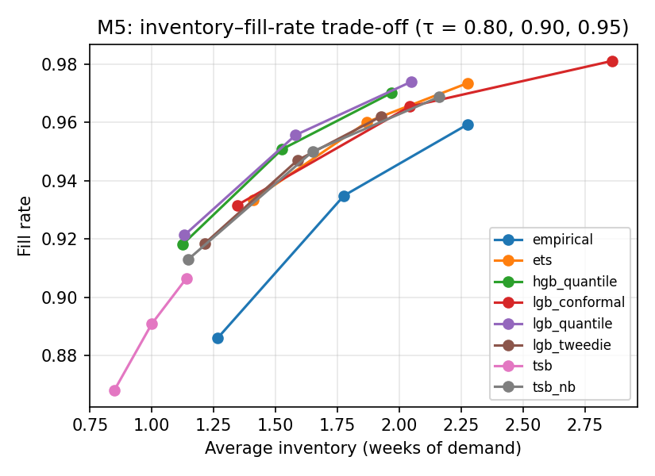
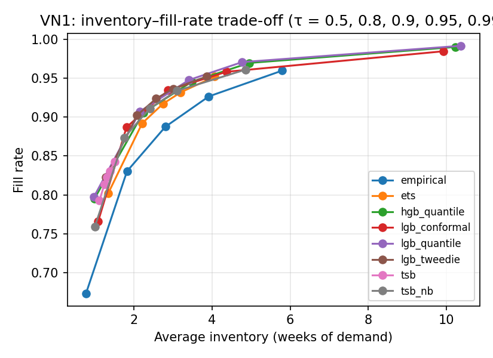
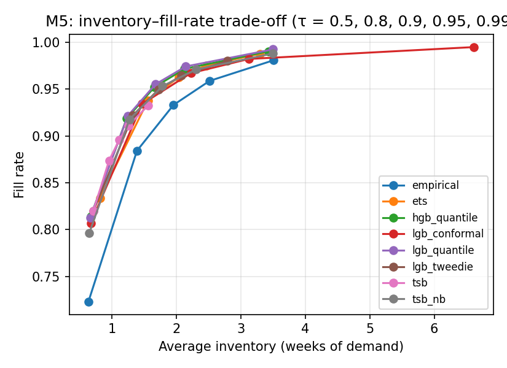
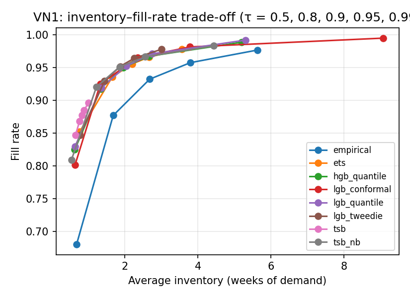
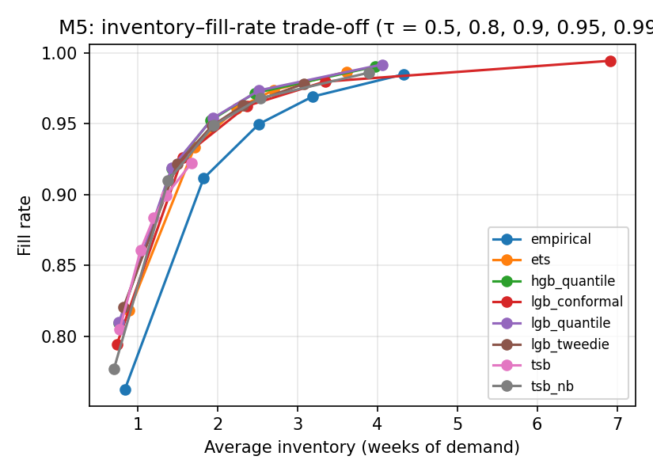
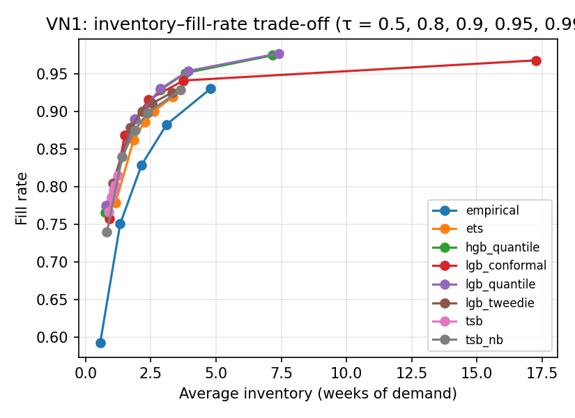

# 5. Results

> Draft v0.2, English. Every number comes from `06_experiment_results/results.md` [R], `06_experiment_results/tables/` or `code/outputs/` (comparison*.md, stat_tests*.md, equal_fill_ci*.csv, per_quantile_loss.csv, VNF/). Percentages marked "computed" are simple ratios of values in those tables. Tag conventions: `paper_outline.md`. Method labels: Table 2 (EMP, TSB-P, TSB-NB, ETS, LGB-T, LGB-C, HGB-Q, LGB-Q; Chronos-2 in Section 5.8 only).

Unless stated otherwise, results refer to the main test window and the default scenario (τ = 0.9, L = 2, R = 1, H = 13, q_L = 0.95, k = 26), with the eight methods of the main benchmark. Inventory is expressed in weeks of demand. Section 5.7 summarises which findings hold in all three test windows; only those are used in the conclusions.

## 5.1 Forecast accuracy (RQ1)

**Table 3.** Mean scaled quantile loss (SQL), RMSSE of the median and coverage of the 0.9 quantile, all evaluated series, main window. Lower is better, except coverage (ideal 0.9). Bold = best per column. Source: [R §1 T1].

| Method | M5 SQL h=3 | M5 SQL h=13 | M5 RMSSE h=3 | M5 cov₀.₉ h=3 | VN1 SQL h=3 | VN1 SQL h=13 | VN1 RMSSE h=3 | VN1 cov₀.₉ h=3 |
|---|---|---|---|---|---|---|---|---|
| EMP | 0.340 | 0.347 | 0.765 | 0.855 | 0.522 | 0.557 | 0.799 | 0.909 |
| TSB-P | 0.283 | 0.361 | 0.596 | 0.793 | 0.454 | 0.506 | 0.645 | 0.849 |
| TSB-NB | 0.251 | 0.317 | 0.610 | 0.881 | 0.411 | 0.458 | 0.650 | 0.903 |
| ETS | 0.246 | 0.254 | 0.601 | 0.890 | 0.431 | 0.445 | 0.654 | 0.912 |
| LGB-T | 0.229 | 0.223 | **0.565** | 0.858 | 0.439 | 0.575 | 0.651 | 0.913 |
| LGB-C | 0.232 | 0.241 | 0.572 | 0.901 | 0.405 | 0.507 | 0.633 | 0.906 |
| HGB-Q | 0.211 | 0.201 | 0.572 | 0.872 | 0.338 | 0.423 | **0.593** | 0.917 |
| **LGB-Q** | **0.208** | **0.198** | 0.570 | 0.883 | **0.336** | **0.410** | 0.594 | 0.921 |

LGB-Q has the lowest mean SQL in all four SQL columns, and also in the second and third windows (M5 h = 3: 0.208 / 0.215 / 0.222; VN1: 0.336 / 0.539 / 2.008) [R §10, §10.1]. HGB-Q is within 0.002–0.013 in the main window even though it is trained on at most 300,000 rows, so the result does not depend on the LightGBM library alone. The ranking by mean SQL also holds in every demand class of both datasets [R §5 T6]. For point accuracy (RMSSE), the four ML models are close on M5 (0.565–0.572), with LGB-T best.

**Mean SQL is unstable on VN1.** The mean SQL of LGB-Q on VN1 ranges from 0.336 to 2.008 across the three windows, whereas its median per-series SQL stays between 0.140 and 0.184. In the third window the ten worst series account for 29% of the summed SQL (maximum 895), and dropping the worst 1% of series lowers the mean to 0.550 [R §10.1]. A few series with a very small naive scale and occasional bulk orders dominate the mean [Nhận định nhóm]. On M5 the median per-series SQL of LGB-Q is stable (0.142–0.145) (`data/cache/series_metrics_M5*.parquet`). We therefore base accuracy comparisons on per-series ranks (Section 5.2).

Calibration of the 0.9 quantile differs between methods and datasets:

- On M5, most methods under-cover (0.79–0.89); only LGB-C reaches 0.901.
- On VN1, most methods cover 0.90–0.92, but TSB-P covers only 0.849 because Poisson intervals are too narrow.

These calibration differences are why inventory efficiency is compared at equal fill rate (Section 5.3) rather than at equal τ.

## 5.2 Per-series comparison

The Friedman test rejects equal performance (p < 0.001) for every dataset, window, class and metric [R §2], `stat_tests*.md`. Conclusions therefore rest on effect sizes: mean ranks relative to the Nemenyi critical difference (CD) and win shares.

**Table 4.** Mean rank by per-series SQL (1 = best among 8 methods) in the three test windows (main / second / third). Sources: `code/outputs/<D>[_wN]/stat_tests.csv`.

| | M5 h = 3 | M5 h = 13 | VN1 h = 3 | VN1 h = 13 |
|---|---|---|---|---|
| CD (α = 0.05) | 0.060 / 0.061 / 0.062 | 0.060 / 0.061 / 0.062 | 0.089 / 0.098 / 0.108 | 0.089 / 0.098 / 0.108 |
| LGB-Q | **3.40 / 3.50 / 3.48** | 3.81 / **3.80** / 3.89 | 3.68 / **3.62 / 3.60** | 4.67 / 4.06 / 4.39 |
| HGB-Q | 3.66 / 3.72 / 3.62 | **3.72** / 3.82 / **3.88** | 3.73 / 3.68 / 3.66 | 4.50 / 4.04 / 4.10 |
| TSB-NB | 4.54 / 4.33 / 4.47 | 4.48 / 4.39 / 4.42 | **3.62** / 3.72 / 3.65 | **3.36 / 3.45 / 3.75** |
| LGB-T | 4.23 / 4.30 / 4.28 | 3.99 / 4.14 / 4.05 | — | — |

Median per-series SQL, VN1, h = 3, LGB-Q / TSB-NB: 0.152 / 0.152 (main), 0.140 / 0.150 (second), 0.184 / 0.186 (third) [R §10.1].

On **M5**, the per-series results agree with the means in all windows:

- At h = 3, LGB-Q has the best mean rank, ahead of HGB-Q by more than the CD; it beats HGB-Q on 57.3% of the series in the main window.
- At h = 13, LGB-Q and HGB-Q are within 0.1 rank of each other in every window. In the main window the Wilcoxon test gives p = 0.055 and HGB-Q wins on 53% of the series, so the two are practically tied.

On **VN1**, the picture differs:

- At h = 3, LGB-Q and TSB-NB differ by 0.06, 0.10 and 0.05 mean ranks in the three windows (CD 0.089, 0.098, 0.108). They are practically tied; the gap exceeds the CD only marginally in the second window, where LGB-Q is ahead. HGB-Q is within 0.06 rank of LGB-Q in every window.
- At h = 13, TSB-NB ranks first in all three windows and is better than LGB-Q on 59–69% of the series (`stat_tests*.csv`).
- In the main window, by class (h = 3), LGB-Q ranks best on erratic and lumpy series, TSB-NB on intermittent series (3.11 vs. 4.02), and HGB-Q on smooth series [R §2].

Thus, on VN1 the global ML models are **not** more accurate than TSB for a typical series. Their lower mean SQL comes from robustness: they rarely make very large errors (Section 5.4) [Nhận định nhóm]. This agrees with the observation of Damato et al. (2026) that no global architecture is established for intermittent series [P12 p. 2].

## 5.3 Inventory efficiency at equal fill rate (RQ1)

At τ = 0.9 the methods do not reach the same fill rate. For example, on M5 the fill rate ranges from 0.891 (TSB-P) to 0.967 (LGB-C) [R §3 T3]. Per-series KPI tests at τ = 0.9 are significant but mostly reflect these different service levels; for instance, TSB-P holds less inventory than LGB-Q on 97% of the series but has the lowest fill rate [R §2]. The default-scenario KPIs are therefore given in Appendix A1, and the comparison below uses the trade-off curves.

**Figure 2.** Inventory (weeks of demand) vs. fill rate as τ varies from 0.5 to 0.99, main test window. (a) M5, (b) VN1. Curves further up and to the left are better.

**Table 5.** Inventory needed to reach a fill rate of 0.94 (all series, units), with 95% bootstrap confidence intervals over series (200 resamples). Column 3: inventory needed by LGB-Q (weeks of demand). Columns 4–5: frontier rank of LGB-Q over fill targets 0.90–0.98 and the share of resamples in which LGB-Q has the best frontier rank, P(best). Columns 6–10: Δ = I_method / I_LGB-Q − 1 in % (positive = LGB-Q needs less); "—" = the method does not reach 0.94; no CI when the target is reached in fewer than 95% of resamples. Source: [R §10.2], `equal_fill_ci*.csv`. Full interpolated tables: Appendix A4.

| Dataset | Window | LGB-Q inventory | Frontier rank | P(best) | HGB-Q | LGB-T | LGB-C | TSB-NB | ETS |
|---|---|---|---|---|---|---|---|---|---|
| M5 | Main | 1.38 [1.34, 1.41] | 1.0 | 1.00 | +1.2 [+0.9, +1.6] | +5.1 [+4.4, +5.9] | +4.5 [+3.2, +5.8] | +10.0 [+9.1, +11.0] | +10.6 [+9.8, +11.5] |
| M5 | Second | 1.49 [1.45, 1.53] | 1.2 | 1.00 | +1.4 [+1.2, +1.7] | +6.8 [+6.2, +7.6] | +8.2 [+6.8, +9.3] | +7.5 [+6.7, +8.3] | +8.0 [+7.1, +8.9] |
| M5 | Third | 1.74 [1.69, 1.78] | 1.0 | 1.00 | +0.2 [−0.2, +0.5] | +3.3 [+2.7, +4.0] | +7.5 [+6.3, +8.4] | +4.9 [+4.2, +5.7] | +5.9 [+5.0, +6.6] |
| VN1 | Main | 3.17 [2.78, 3.57] | 1.4 | 0.93 | +4.5 [+2.9, +6.7] | +0.9 [−7.5, +9.9] | +1.7 [−6.3, +8.7] | +10.5 [−0.5, +19.8] | +12.0 [+3.8, +19.7] |
| VN1 | Second | 1.79 [1.52, 2.05] | 3.8 | 0.00 | −1.2 [−2.5, +0.2] | −7.7 [−11.8, −3.8] | −4.1 [−7.3, −0.9] | −8.8 [−12.8, −4.9] | −0.4 [−5.7, +4.2] |
| VN1 | Third | 3.31 [2.72, 3.85] | 1.2 | 0.95 | +1.3 [−0.7, +3.5] | — | +11.5 [+1.6, +116.5] | — | — |

**M5.** LGB-Q has the best frontier rank in every resample of every window (P(best) = 1.00). At fill rate 0.94 it needs 3.3–10.6% less inventory than LGB-T, LGB-C, TSB-NB and ETS across the three windows, and every confidence interval excludes zero. HGB-Q is close: within 0–1.5%, and not significantly different in the third window. The direct-quantile model therefore dominates the point-forecast-plus-safety-stock ablation (LGB-T) on M5, which supports hypothesis H2 for this dataset [R §9].

**VN1.** The results depend on the test window.

- *Main window:* LGB-Q has the best frontier rank (1.4, P(best) = 0.93). Its advantage over LGB-T, LGB-C and TSB-NB at fill rate 0.94 is not statistically significant (the intervals contain zero), but it is significant against HGB-Q and ETS. LGB-T needs slightly less inventory at fill rates 0.90–0.92 (2.05 vs. 2.07; 2.48 vs. 2.54) and cannot exceed a fill rate of 0.952 even at τ = 0.99 [R §4]. We attribute this to the thin tail of the normal safety-stock distribution on intermittent data [Nhận định nhóm].
- *Second window:* TSB-NB has the best frontier rank (1.8); TSB-NB, LGB-T and LGB-C need 4–9% less inventory than LGB-Q at fill rate 0.94, with intervals excluding zero.
- *Third window:* LGB-Q again has the best frontier rank (1.25, P(best) = 0.95); TSB-NB, ETS and LGB-T do not reach a fill rate of 0.94 [R §10.1].

Hence, on VN1 LGB-Q is the most inventory-efficient method in two of three windows, but not in all, and the lowest mean SQL (LGB-Q in every window) does not reliably translate into the lowest inventory [Nhận định nhóm].

**Value-weighted KPIs.** Weighting units by the weekly selling price gives the same conclusions [R §10.3]: on M5, LGB-Q has P(best) = 1.00 in all three windows; on VN1, LGB-Q leads in the main (P(best) = 0.98) and third windows (0.59) and TSB-NB in the second.

## 5.4 Results by demand class (RQ2)

**Table 6.** Frontier rank (mean rank of required inventory over fill targets 0.90–0.98; 1 = least inventory) in the main / second / third window. "n/a" = no method reaches fill rate 0.90 in that class and window. Source: `equal_fill_ci*.csv` (point estimates; identical to `comparison*.md`).

| Method | M5 all | VN1 all | VN1 smooth | VN1 erratic | VN1 intermittent | VN1 lumpy |
|---|---|---|---|---|---|---|
| EMP | 7.2 / 7.2 / 7.2 | 6.7 / 6.9 / 6.2 | 6.8 / 7.2 / 6.9 | 6.1 / 6.9 / 5.0 | 6.7 / 6.6 / n/a | 5.9 / 6.9 / 6.0 |
| TSB-P | 6.7 / 6.5 / 7.1 | 7.3 / 7.7 / 6.9 | 7.6 / 6.6 / 7.5 | 6.9 / 7.7 / 6.8 | 7.1 / 7.2 / n/a | 6.3 / 7.7 / 6.0 |
| TSB-NB | 5.0 / 4.0 / 4.4 | 4.8 / **1.8** / 5.5 | **2.4 / 2.0** / 2.6 | 5.3 / 2.8 / 5.4 | 3.2 / 4.4 / n/a | 5.2 / 2.4 / 6.0 |
| ETS | 5.4 / 5.2 / 4.8 | 6.1 / 5.9 / 6.4 | 4.0 / 2.6 / 4.2 | 5.9 / 5.7 / 5.9 | 5.2 / 5.2 / n/a | 6.3 / 6.1 / 6.0 |
| LGB-T | 4.1 / 4.5 / 4.3 | 3.3 / 3.5 / 5.0 | 3.4 / 3.6 / 4.6 | 4.3 / 2.5 / 6.8 | 4.4 / 3.6 / n/a | 6.3 / 3.3 / 6.0 |
| LGB-C | 4.6 / 5.6 / 5.2 | 3.0 / 2.0 / 2.25 | 3.0 / 4.0 / **1.8** | 3.7 / **2.2** / 3.0 | 4.8 / 4.8 / n/a | 2.8 / 4.4 / 3.0 |
| HGB-Q | 2.0 / 1.8 / 2.0 | 3.4 / 4.4 / 2.5 | 5.4 / 4.8 / 4.8 | 2.6 / 4.2 / 2.25 | 3.2 / 2.2 / n/a | 2.2 / 3.2 / 1.67 |
| LGB-Q | **1.0 / 1.2 / 1.0** | **1.4** / 3.8 / **1.25** | 3.4 / 5.2 / 3.6 | **1.2** / 4.0 / **1.0** | **1.4 / 2.0** / n/a | **1.0 / 2.0 / 1.33** |

**M5.** The direct quantile models have the lowest SQL in all four classes [R §5 T6] and the best frontier ranks in all classes of the main window, except erratic, where LGB-C ranks first (1.6) [R §4 T5].

**VN1.** Only some class-level results hold across windows:

- *Lumpy:* LGB-Q ranks first in all three windows (1.0 / 2.0 / 1.33). In the main window only five methods reach fill rate 0.90 on lumpy series, and LGB-Q needs 6.06 weeks against 8.99 for TSB-NB and 12.8 for EMP [R §5].
- *Intermittent:* LGB-Q ranks first in the two windows where the class can be ranked (1.4 / 2.0). In the third window no method reaches fill rate 0.90 on this class (LGB-Q reaches 0.84 at τ = 0.9) [R §10.1].
- *Smooth:* TSB-NB ranks first in the main and second windows, but LGB-C ranks first in the third (1.8, TSB-NB 2.6). The finding "TSB-NB is best on smooth series" is therefore not robust.
- *Erratic:* the leader changes between windows (LGB-Q, LGB-C, LGB-Q).

This contradicts our initial hypothesis H3, which expected ML to help most on smooth and erratic series and TSB to suffice for intermittent ones [R §9]. On VN1, LGB-Q is most inventory-efficient on lumpy and intermittent series, although per-series SQL favours TSB-NB on intermittent series (Section 5.2).

**Where does the advantage of LGB-Q on intermittent series come from?** We computed the scaled pinball loss separately for each quantile (h = 3) [R §2.1, §10.1], `per_quantile_loss.csv`. On VN1 intermittent series:

- LGB-Q beats TSB-NB on only 24–33% (main), 29–34% (second) and 30–34% (third window) of the series, at every quantile.
- TSB-NB's per-series advantage is **largest** at the highest quantile. At q = 0.99 the median loss of TSB-NB vs. LGB-Q is 0.025 vs. 0.064 (main), 0.027 vs. 0.052 (second) and 0.028 vs. 0.055 (third).
- By the mean, LGB-Q is better at every quantile (q = 0.99: 0.206 vs. 0.321 main; 0.678 vs. 1.241 second; 3.068 vs. 6.899 third), because TSB-NB occasionally makes very large errors.

The frontier advantage of LGB-Q on intermittent series therefore does not come from a better upper tail on a typical series. It matches the pattern of a smaller *mean* loss, i.e. fewer very large errors [Nhận định nhóm]. One possible mechanism is that unit-weighted KPIs are dominated by the series on which TSB-NB fails badly; this link was not tested **[Chưa kiểm chứng]**.

**Cross-dataset consistency.** The Spearman correlation between the rankings of the 8 methods on M5 and on VN1 is unstable across windows:

- by frontier rank (all series) it is 0.88, 0.50 and 0.67;
- by fill rate at τ = 0.9 (all series) it is 0.69, 0.93 and 0.60 [R §6 T7, §10 T11], `comparison_w52.md`;
- only the **intermittent** class is consistent in every window by fill rate (ρ = 0.83, 0.93, 0.83).

Whether a method ranking transfers from M5 to VN1 thus depends on the class and the period.

## 5.5 Liquidation (RQ3)

**Table 7.** Liquidation policies with LGB-Q forecasts, default scenario, all series, main window. Inventory in weeks of demand; % liq. = liquidated units / demand; stockout = stockout weeks / weeks with demand. s\* = break-even salvage ratio (upper bound), range over holding cost 10–40%/year × margin 30–100%, four ML models. Sources: [CF], [R §7 T8, §7.1, §7.2].

| Dataset | Policy | Inventory | % liq. | Fill rate | Stockout rate | s\* range |
|---|---|---|---|---|---|---|
| M5 | none | 1.581 | 0 | 0.956 | 0.072 | — |
| M5 | quantile | 1.579 | 0.02 | 0.956 | 0.072 | unstable (\*) |
| M5 | fixed (k = 26) | 1.545 | 0.79 | 0.953 | 0.077 | 1.06–1.32 |
| M5 | dead13 | 1.542 | 0.67 | 0.949 | 0.081 | 1.35–2.08 |
| VN1 | none | 3.405 | 0 | 0.948 | 0.066 | — |
| VN1 | quantile | 3.261 | 1.18 | 0.948 | 0.066 | 0.91–1.04 |
| VN1 | fixed (k = 26) | 3.198 | 2.76 | 0.941 | 0.079 | 1.00–1.22 |
| VN1 | dead13 | 3.269 | 1.21 | 0.947 | 0.081 | 1.03–1.37 |

(\*) Fewer than 1,200 units are liquidated on the whole of M5, so s\* is not stable.

**Quantile rule.**

- On M5 it almost never triggers for the ML models, ETS and EMP (≤ 0.02% of demand). It triggers only for TSB-P and TSB-NB (about 1.1% of demand) and then costs about 0.5 percentage points (pp) of fill rate [R §7].
- On VN1, with the ML models, it reduces inventory by 0.6–12%, costs at most 0.1 pp of fill rate and touches 2–12% of the series [R §7].
- With LGB-Q on VN1 it reduces inventory by 4.3%, 1.7% and 7.4% in the three windows, each time at a cost of 0.02 pp of fill rate [R §10.1].

**Fixed rule.** On VN1, with the four ML forecasts, the fixed rule costs 0.2–0.7 pp of fill rate and touches 42–51% of the series [R §7]. On lumpy VN1 series (LGB-Q) it cuts inventory more than the quantile rule (−14.9% vs. −10.5%) but lowers the fill rate from 0.928 to 0.877, whereas the quantile rule keeps it at 0.926 [R §7].

**Dead-stock rule.** We added the dead-stock rule because 28.2% of VN1 series have no demand in the 22 KPI weeks, while the quantile rule touches only 5.4% of the series [R §7.1].

- On VN1 intermittent series, dead13 cuts inventory more than the quantile rule in the main window (−19.4% vs. −5.9%), but raises the stockout rate in every window: by 68%, 61% and 43% [R §7.1, §10.1].
- On M5, products that have not sold for 13 weeks usually sell again, so dead13 costs fill rate in every window (−0.66, −0.46 and −0.54 pp) [R §10.1].

**Break-even salvage ratio.** For every rule and both datasets, s\* is close to or above 1, in all three windows (the lowest value over all rules, windows and cost settings is 0.89; Table 8) [R §10.1].

- *Fixed rule:* 0.35–0.63 (VN1) and 0.57–0.63 (M5) of each liquidated unit is ordered again later, and 0.12–0.32 becomes lost sales.
- *Dead13 on VN1* targets truly unsold stock: 0.93–1.05 of each liquidated unit would still be on hand at the end. Yet 8–13 units of sales are lost per 100 liquidated, and within 26 weeks the holding cost saved does not cover this loss.
- *Dead13 on M5* is wrong most of the time: 0.86–0.97 of each liquidated unit becomes a lost sale.
- *Quantile rule:* has the lowest s\*, but still needs a salvage price close to cost.

The case study with actual unit costs (Section 5.9) confirms this. Benefits such as avoiding obsolescence or freeing space would require a horizon longer than 26 weeks, or data on discontinued products, to be assessed [Nhận định nhóm].

## 5.6 Sensitivity (RQ4)

**Target service level** (LGB-Q, fill rate / inventory, main window) [R §8]:

| τ | 0.5 | 0.8 | 0.9 | 0.95 | 0.99 |
|---|---|---|---|---|---|
| M5 | 0.816 / 0.59 | 0.921 / 1.13 | 0.956 / 1.58 | 0.974 / 2.05 | 0.992 / 3.32 |
| VN1 | 0.797 / 0.97 | 0.907 / 2.16 | 0.948 / 3.41 | 0.971 / 4.77 | 0.992 / 10.37 |

On VN1, raising the fill rate from 0.971 to 0.992 more than doubles inventory (4.77 → 10.37 weeks). TSB-P hardly reacts to τ on VN1 (fill rate 0.793 → 0.843 for τ from 0.5 to 0.99) [R §8].

**Lead time** (VN1; M5 below) [R §8]:

- Fill-rate rankings are stable across L: the Spearman correlation between L = 2 and L = 1 is 0.96, and between L = 2 and L = 4 it is 1.00 (7 methods).
- Inventory grows roughly in proportion to L + R; for LGB-Q it is 2.07, 3.41 and 6.01 weeks at L = 1, 2 and 4.
- TSB-NB loses fill rate fastest as L grows (−2.2 pp from L = 2 to L = 4).

**Liquidation parameters** (VN1, LGB-Q) [R §8]:

- H = 8 / 13 / 26 gives a liquidated share of 3.1 / 1.2 / 0.2% with fill rate 0.946 / 0.948 / 0.948.
- q_L = 0.9 / 0.95 / 0.99 gives 2.8 / 1.2 / 0.2%.
- The fixed rule with k = 13 / 26 / 52 liquidates 7.1 / 2.8 / 1.2% with fill rate 0.929 / 0.941 / 0.946.
- At L = 4, the quantile rule liquidates 5.0% and loses 0.1 pp of fill rate, whereas the fixed rule liquidates 8.6% and loses 1.9 pp.

**M5** (same grid, main window) [R §8]:

- Fill-rate rankings are again stable across L: Spearman ρ = 1.00 between L = 2 and L = 1, and 0.96 between L = 2 and L = 4 (7 methods).
- Inventory for LGB-Q is 1.13, 1.58 and 2.43 weeks at L = 1, 2 and 4; TSB-NB and TSB-P lose the most fill rate from L = 2 to L = 4 (−1.9 pp each).
- The quantile rule hardly triggers at any H or q_L (≤ 0.04% of demand). The fixed rule with k = 13 / 26 / 52 liquidates 1.8 / 0.8 / 0.5% with fill rate 0.948 / 0.953 / 0.954 (0.956 without liquidation).
- At L = 4, the quantile rule liquidates 0.1% and loses 0.01 pp of fill rate, whereas the fixed rule liquidates 2.1% and loses 0.85 pp.

Across both grids, the quantile rule is the safer liquidation rule in terms of fill rate [Nhận định nhóm].

## 5.7 Robustness across three test windows

The whole benchmark was rerun from scratch on two earlier 26-week windows (Section 4.3). Figure 3 shows the trade-off curves of the second and third windows.

**Figure 3.** Inventory–fill-rate trade-off curves in the second (a: M5, b: VN1) and third (c: M5, d: VN1) test windows.

**Table 8.** Findings across the three windows. Sources: [R §10 T11, §10.1 T12, §10.2].

| Finding | Main | Second | Third | Robust? |
|---|---|---|---|---|
| M5: lowest mean SQL (h = 3) | LGB-Q | LGB-Q | LGB-Q | ✓ |
| M5: best per-series rank (h = 3) | LGB-Q | LGB-Q | LGB-Q | ✓ |
| M5: best frontier rank, P(best) | LGB-Q, 1.00 | LGB-Q, 1.00 | LGB-Q, 1.00 | ✓ |
| VN1: lowest mean SQL (h = 3) | LGB-Q | LGB-Q | LGB-Q | ✓ (but mean unstable) |
| VN1: per-series rank gap LGB-Q vs TSB-NB, h = 3 (CD) | 0.06 (0.089) | 0.10 (0.098) | 0.05 (0.108) | ✓ practically tied |
| VN1: best per-series rank (h = 13) | TSB-NB | TSB-NB | TSB-NB | ✓ |
| VN1: best frontier rank (all series) | LGB-Q (1.4) | TSB-NB (1.8) | LGB-Q (1.25) | ✗ (2 of 3) |
| VN1: best frontier rank, lumpy | LGB-Q | LGB-Q | LGB-Q | ✓ |
| VN1: best frontier rank, intermittent | LGB-Q | LGB-Q | n/a | ✓ where defined |
| VN1: best frontier rank, smooth | TSB-NB | TSB-NB | LGB-C | ✗ |
| VN1 intermittent: LGB-Q lower pinball loss than TSB-NB | 24–33% of series | 29–34% | 30–34% | ✓ |
| Quantile rule, VN1, LGB-Q: inventory / Δfill | −4.3% / −0.02 pp | −1.7% / −0.02 pp | −7.4% / −0.02 pp | ✓ |
| dead13, VN1 intermittent: stockout rate | +68% | +61% | +43% | ✓ (always up) |
| dead13, M5, LGB-Q: Δfill | −0.66 pp | −0.46 pp | −0.54 pp | ✓ |
| Break-even s\*, quantile rule, VN1 (upper bound, 4 ML models) | 0.91–1.04 | 0.92–1.21 | 0.91–1.04 | ✓ (≈ unit cost) |
| Break-even s\*, dead13, VN1 / M5 | 1.03–1.37 / 1.35–2.08 | 1.06–1.32 / 1.21–1.66 | 1.16–1.60 / 1.19–1.70 | ✓ (> 1) |
| M5–VN1 rank consistency, intermittent (fill rate) | ρ = 0.83 | 0.93 | 0.83 | ✓ |
| M5–VN1 rank consistency, all series (frontier) | ρ = 0.88 | 0.50 | 0.67 | ✗ |

The cause of the VN1 reversal in the second window has not been identified. Candidate explanations are seasonal differences between the windows and missing prices in Phase 2, where the main window uses carried-forward prices [R §10] — **[Chưa kiểm chứng]**. We therefore report VN1 aggregate inventory efficiency as period-dependent and base our conclusions on the robust findings in Table 8.

## 5.8 Does a time-series foundation model help?

To check whether a pretrained foundation model changes the picture, we added Chronos-2 (zero-shot, CPU) as a ninth method (Section 3.4). It was run on the main M5 window, all three VN1 windows and the case study. Because M5 is part of the Chronos-2 training corpora, the M5 result is not a clean zero-shot test (Section 3.4).

**Table 9.** Chronos-2 vs. LGB-Q (h = 3). Per-series rank among 9 methods; "LGB-Q better" = share of series on which LGB-Q has a lower SQL than Chronos-2; frontier rank among 9 methods; Δ = I_Chronos-2 / I_LGB-Q − 1 at equal fill rate with 95% bootstrap CI. Source: [R §10.5 T14].

| Data, window | Mean SQL Chronos-2 / LGB-Q | Per-series rank (CD) | LGB-Q better | Frontier rank | Δ at fill 0.90 | Δ at fill 0.94 |
|---|---|---|---|---|---|---|
| M5, main (\*) | 0.242 / 0.208 | 5.56 (0.069) | 72.8% | 5.6 | +14.3% [+13.5, +14.9] | +12.8% [+12.0, +13.6] |
| VN1, main | 0.620 / 0.336 | 5.45 (0.102) | 68.8% | 6.2 | +41.5% [+29.0, +55.2] | +56.4% [+29.4, +97.8] |
| VN1, second | 0.653 / 0.539 | 5.61 (0.112) | 72.6% | 4.0 | −0.6% [−3.8, +3.0] | −3.2% [−7.5, +1.7] |
| VN1, third | 2.404 / 2.008 | 5.37 (0.124) | 69.4% | 5.25 | +46.5% [+32.7, +63.9] | +73.9% [+51.2, +101.0] |
| Case study (VNF) | 0.170 / 0.154 | — | — | 5.8 | +12.9% [+1.3, +21.8] | +26.0% [+17.6, +30.3] |

(\*) M5 is part of the Chronos-2 training data.

- **Accuracy.** Chronos-2 is less accurate than LGB-Q in every dataset and window. LGB-Q has a lower per-series SQL on 64–79% of the series at h = 3 and 13 [R §10.5]. On M5, despite the possible overlap with its training data, Chronos-2 is only on par with ETS (mean SQL 0.242 vs. 0.246).
- **Inventory.** Chronos-2 is never the most inventory-efficient method overall (P(best) = 0 everywhere). It needs 13–74% more inventory than LGB-Q at fill rate 0.94, except in the second VN1 window, where the two are statistically tied.
- **Cost.** On the same CPU, Chronos-2 was about 8–42 times slower than LGB-Q per horizon (e.g. VN1 main window: 2,692 s vs. 146 s at h = 3) [R §10.5].

Adding Chronos-2 changes the ranks of the other methods only slightly and does not change which method leads in Table 8, except that in the second VN1 window TSB-NB and LGB-C become tied (2.0) [R §10.5].

## 5.9 Case study: Vietnamese footwear retail data

We applied the same benchmark, with the nine methods, to the weekly retail sales of 1,001 style–colour series from Vietnamese footwear retail data (four anonymised brands, 221 stores; Section 3.2). Unlike M5 and VN1, the data contain actual unit costs and selling prices, so liquidation can be valued in money. The case study has one 26-week test window (2023-01-30 to 2023-07-24) and 909 evaluated series. Because of the data caveats in Section 3.2, we use it as an illustration, not for general rankings.

**Table 10.** Case study (VNF): accuracy (h = 3), frontier rank and inventory at fill rate 0.94 (Δ vs. LGB-Q with 95% CI). Sources: [R §10.4], `comparison_VNF.md`, `equal_fill_ci_VNF.csv`.

| Method | SQL | RMSSE | Coverage q = 0.8 | Frontier rank | Δ inventory at fill 0.94 |
|---|---|---|---|---|---|
| TSB-P | **0.150** | 0.325 | 0.882 | 4.2 | −7.2% [−12.7, −0.4] |
| LGB-Q | 0.154 | **0.292** | 0.890 | **2.6** (P(best) = 0.91) | 1.62 weeks (reference) |
| HGB-Q | 0.154 | 0.299 | 0.880 | 4.2 | +10.6% [+4.1, +14.5] |
| TSB-NB | 0.158 | 0.321 | 0.882 | 4.0 | +8.9% [−0.5, +15.9] |
| Chronos-2 | 0.170 | 0.324 | 0.940 | 5.8 | +26.0% [+17.6, +30.3] |
| ETS | 0.171 | 0.319 | 0.961 | 3.0 | +11.9% [+6.1, +14.8] |
| LGB-C | 0.175 | 0.359 | 0.855 | 7.6 | +51.4% [+42.2, +60.7] |
| LGB-T | 0.187 | 0.358 | 0.960 | 5.4 | +23.2% [+16.0, +27.6] |
| EMP | 0.268 | 0.466 | 0.972 | 8.2 | +71.1% [+40.6, +90.1] |

- **Over-forecasting.** Coverage of the 0.8 quantile is 0.86–0.97 and the fill rate at τ = 0.9 is 0.93–0.99 for most methods. This is consistent with the drop in chain-level sales right before the test window (Section 3.2) [Nhận định nhóm].
- **Accuracy vs. inventory.** TSB-P has the lowest mean SQL, yet LGB-Q is the most inventory-efficient method (frontier rank 2.6, P(best) = 0.91). TSB-P needs less inventory at fill rates up to 0.94 but cannot reach 0.96 (Table 10; `comparison_VNF.md`). The case study thus repeats the M5/VN1 pattern that accuracy rankings and inventory rankings can differ.
- **Intermittent style–colours** reach only 0.58–0.75 fill rate at τ = 0.9, so no method can be ranked on the frontier for this class.
- **Liquidation valued at actual costs and prices** (holding cost 10–40%/year, upper bound): with the four ML forecasts, the break-even salvage ratio is 0.90–1.01 of unit cost for the quantile and fixed rules, 1.26–1.43 for dead13 and 1.15–1.33 for dead26. With Chronos-2 forecasts it is 1.04–1.09 for the quantile rule. Less than 3% of demand is liquidated [R §10.4]. As in M5 and VN1, liquidation pays off within 26 weeks only if stock is sold at about unit cost.
