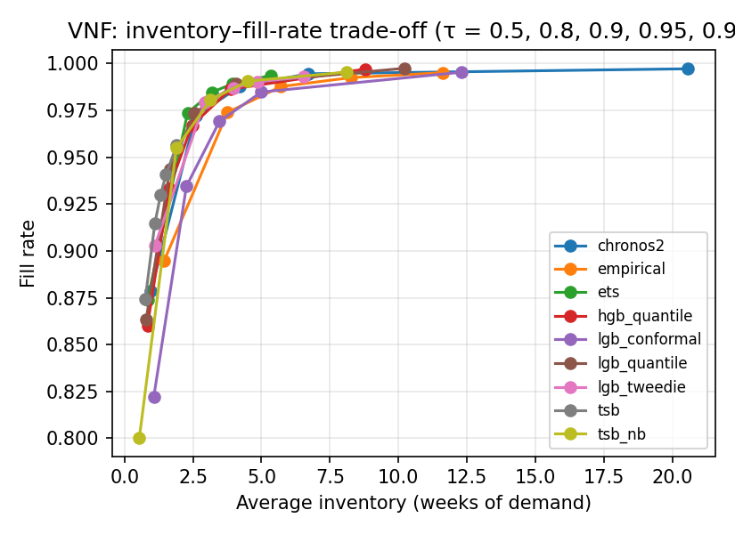

# Cross-dataset results (generated by code/analyze_results.py)

## VNF

### Forecast accuracy (all series)

| model         |   horizon |   SQL |   RMSSE |   cov_0.8 |   cov_0.9 |   cov_0.95 |
|:--------------|----------:|------:|--------:|----------:|----------:|-----------:|
| empirical     |         3 | 0.268 |   0.466 |     0.972 |     0.989 |      0.994 |
| empirical     |        13 | 0.278 |   0.501 |     0.971 |     0.984 |      0.988 |
| tsb           |         3 | 0.15  |   0.325 |     0.882 |     0.912 |      0.931 |
| tsb           |        13 | 0.19  |   0.327 |     0.846 |     0.871 |      0.885 |
| tsb_nb        |         3 | 0.158 |   0.321 |     0.882 |     0.948 |      0.976 |
| tsb_nb        |        13 | 0.184 |   0.319 |     0.881 |     0.935 |      0.957 |
| ets           |         3 | 0.171 |   0.319 |     0.961 |     0.98  |      0.988 |
| ets           |        13 | 0.212 |   0.314 |     0.975 |     0.985 |      0.989 |
| lgb_tweedie   |         3 | 0.187 |   0.358 |     0.96  |     0.976 |      0.983 |
| lgb_tweedie   |        13 | 0.265 |   0.409 |     0.965 |     0.977 |      0.982 |
| lgb_conformal |         3 | 0.175 |   0.359 |     0.855 |     0.916 |      0.956 |
| lgb_conformal |        13 | 0.211 |   0.335 |     0.898 |     0.965 |      0.987 |
| hgb_quantile  |         3 | 0.154 |   0.299 |     0.88  |     0.942 |      0.976 |
| hgb_quantile  |        13 | 0.228 |   0.272 |     0.9   |     0.945 |      0.971 |
| lgb_quantile  |         3 | 0.154 |   0.292 |     0.89  |     0.945 |      0.976 |
| lgb_quantile  |        13 | 0.243 |   0.25  |     0.945 |     0.984 |      0.994 |
| chronos2      |         3 | 0.17  |   0.324 |     0.94  |     0.979 |      0.992 |
| chronos2      |        13 | 0.824 |   0.382 |     0.968 |     0.984 |      0.992 |

### SQL by demand class (h = 3)

| model         |   all |   smooth |   erratic |   intermittent |   lumpy |
|:--------------|------:|---------:|----------:|---------------:|--------:|
| chronos2      | 0.17  |    0.153 |     0.15  |          0.235 |   0.118 |
| empirical     | 0.268 |    0.252 |     0.248 |          0.331 |   0.214 |
| ets           | 0.171 |    0.143 |     0.128 |          0.271 |   0.11  |
| hgb_quantile  | 0.154 |    0.129 |     0.114 |          0.25  |   0.094 |
| lgb_conformal | 0.175 |    0.172 |     0.148 |          0.249 |   0.103 |
| lgb_quantile  | 0.154 |    0.13  |     0.115 |          0.25  |   0.092 |
| lgb_tweedie   | 0.187 |    0.156 |     0.146 |          0.292 |   0.117 |
| tsb           | 0.15  |    0.131 |     0.117 |          0.235 |   0.086 |
| tsb_nb        | 0.158 |    0.14  |     0.132 |          0.236 |   0.094 |

### Inventory KPIs, default scenario, no liquidation (all series)

| model         |   fill_rate |   stockout_rate_demand_weeks |   inventory_weeks |   excess_weeks_of_demand |   fill_rate_lo |   fill_rate_hi |   inventory_weeks_lo |   inventory_weeks_hi |
|:--------------|------------:|-----------------------------:|------------------:|-------------------------:|---------------:|---------------:|---------------------:|---------------------:|
| empirical     |       0.988 |                        0.018 |             5.714 |                    1.299 |          0.981 |          0.993 |                5.102 |                6.484 |
| tsb           |       0.93  |                        0.111 |             1.321 |                    0.138 |          0.92  |          0.938 |                1.141 |                1.568 |
| tsb_nb        |       0.981 |                        0.036 |             3.142 |                    0.339 |          0.971 |          0.987 |                2.892 |                3.492 |
| ets           |       0.985 |                        0.023 |             3.191 |                    0.404 |          0.978 |          0.989 |                2.846 |                3.642 |
| lgb_tweedie   |       0.987 |                        0.02  |             3.979 |                    0.416 |          0.981 |          0.991 |                3.63  |                4.401 |
| lgb_conformal |       0.969 |                        0.052 |             3.467 |                    0.538 |          0.96  |          0.976 |                3.132 |                3.894 |
| hgb_quantile  |       0.967 |                        0.042 |             2.465 |                    0.379 |          0.96  |          0.973 |                2.147 |                2.89  |
| lgb_quantile  |       0.974 |                        0.039 |             2.557 |                    0.382 |          0.965 |          0.979 |                2.24  |                2.978 |
| chronos2      |       0.988 |                        0.017 |             4.217 |                    0.714 |          0.983 |          0.992 |                3.802 |                4.755 |

### fill_rate by demand class (default, no liquidation)

| model         |   all |   smooth |   erratic |   intermittent |   lumpy |
|:--------------|------:|---------:|----------:|---------------:|--------:|
| chronos2      | 0.988 |    0.994 |     0.988 |          0.729 |   0.957 |
| empirical     | 0.988 |    0.995 |     0.99  |          0.576 |   0.951 |
| ets           | 0.985 |    0.991 |     0.984 |          0.674 |   0.958 |
| hgb_quantile  | 0.967 |    0.973 |     0.964 |          0.747 |   0.949 |
| lgb_conformal | 0.969 |    0.98  |     0.962 |          0.663 |   0.908 |
| lgb_quantile  | 0.974 |    0.981 |     0.968 |          0.744 |   0.945 |
| lgb_tweedie   | 0.987 |    0.993 |     0.986 |          0.728 |   0.961 |
| tsb           | 0.93  |    0.943 |     0.918 |          0.622 |   0.897 |
| tsb_nb        | 0.981 |    0.991 |     0.975 |          0.642 |   0.934 |

### inventory_weeks by demand class (default, no liquidation)

| model         |   all |   smooth |   erratic |   intermittent |   lumpy |
|:--------------|------:|---------:|----------:|---------------:|--------:|
| chronos2      | 4.217 |    2.905 |     5.75  |         13.625 |  13.981 |
| empirical     | 5.714 |    3.967 |     7.991 |         11.73  |  18.523 |
| ets           | 3.191 |    2.197 |     4.353 |         10.864 |  10.315 |
| hgb_quantile  | 2.465 |    1.577 |     3.231 |         15.116 |   9.833 |
| lgb_conformal | 3.467 |    2.511 |     4.968 |          7.863 |   6.442 |
| lgb_quantile  | 2.557 |    1.715 |     3.349 |         13.196 |   9.262 |
| lgb_tweedie   | 3.979 |    2.962 |     5.232 |         11.111 |  10.725 |
| tsb           | 1.321 |    0.89  |     1.742 |          5.618 |   5.082 |
| tsb_nb        | 3.142 |    2.337 |     4.251 |          6.534 |   7.929 |

### Trade-off: fill rate and inventory (weeks) across target service level τ

| model         |   ('fill_rate', 0.5) |   ('fill_rate', 0.8) |   ('fill_rate', 0.9) |   ('fill_rate', 0.95) |   ('fill_rate', 0.99) |   ('inventory_weeks', 0.5) |   ('inventory_weeks', 0.8) |   ('inventory_weeks', 0.9) |   ('inventory_weeks', 0.95) |   ('inventory_weeks', 0.99) |
|:--------------|---------------------:|---------------------:|---------------------:|----------------------:|----------------------:|---------------------------:|---------------------------:|---------------------------:|----------------------------:|----------------------------:|
| chronos2      |                0.879 |                0.972 |                0.988 |                 0.995 |                 0.997 |                      0.966 |                      2.601 |                      4.217 |                       6.717 |                      20.549 |
| empirical     |                0.895 |                0.974 |                0.988 |                 0.993 |                 0.995 |                      1.448 |                      3.761 |                      5.714 |                       8.257 |                      11.63  |
| ets           |                0.874 |                0.974 |                0.985 |                 0.989 |                 0.994 |                      0.843 |                      2.302 |                      3.191 |                       3.941 |                       5.357 |
| hgb_quantile  |                0.86  |                0.933 |                0.967 |                 0.986 |                 0.997 |                      0.839 |                      1.621 |                      2.465 |                       3.87  |                       8.785 |
| lgb_conformal |                0.822 |                0.935 |                0.969 |                 0.985 |                 0.995 |                      1.067 |                      2.26  |                      3.467 |                       4.996 |                      12.292 |
| lgb_quantile  |                0.863 |                0.944 |                0.974 |                 0.989 |                 0.997 |                      0.793 |                      1.657 |                      2.557 |                       4.08  |                      10.208 |
| lgb_tweedie   |                0.903 |                0.979 |                0.987 |                 0.99  |                 0.993 |                      1.113 |                      2.927 |                      3.979 |                       4.866 |                       6.545 |
| tsb           |                0.875 |                0.915 |                0.93  |                 0.941 |                 0.956 |                      0.761 |                      1.109 |                      1.321 |                       1.515 |                       1.906 |
| tsb_nb        |                0.8   |                0.955 |                0.981 |                 0.991 |                 0.995 |                      0.543 |                      1.893 |                      3.142 |                       4.506 |                       8.104 |

### Inventory (weeks of demand) needed to reach a fill rate — all (— = outside the fill range reached for τ ∈ [0.5, 0.99])

|               |   fill 0.90 |   fill 0.92 |   fill 0.94 |   fill 0.96 |   fill 0.98 |
|:--------------|------------:|------------:|------------:|------------:|------------:|
| chronos2      |        1.34 |        1.69 |        2.04 |        2.39 |        3.41 |
| empirical     |        1.6  |        2.18 |        2.77 |        3.35 |        4.62 |
| ets           |        1.23 |        1.52 |        1.81 |        2.1  |        2.82 |
| hgb_quantile  |        1.27 |        1.48 |        1.79 |        2.29 |        3.41 |
| lgb_conformal |        1.89 |        2.11 |        2.45 |        3.15 |        4.52 |
| lgb_quantile  |        1.19 |        1.4  |        1.62 |        2.15 |        3.18 |
| lgb_tweedie   |      —    |        1.52 |        1.99 |        2.47 |        3.02 |
| tsb           |        0.98 |        1.18 |        1.5  |      —    |      —    |
| tsb_nb        |        1.41 |        1.59 |        1.76 |        2.14 |        3.11 |

### Inventory (weeks of demand) needed to reach a fill rate — smooth (— = outside the fill range reached for τ ∈ [0.5, 0.99])

|               |   fill 0.90 |   fill 0.92 |   fill 0.94 |   fill 0.96 |   fill 0.98 |
|:--------------|------------:|------------:|------------:|------------:|------------:|
| chronos2      |        0.61 |        0.9  |        1.19 |        1.49 |        1.78 |
| empirical     |      —    |      —    |      —    |        1.6  |        2.4  |
| ets           |        0.68 |        0.9  |        1.12 |        1.34 |        1.56 |
| hgb_quantile  |        0.74 |        0.91 |        1.08 |        1.37 |        1.93 |
| lgb_conformal |        1.41 |        1.57 |        1.74 |        2.07 |        2.5  |
| lgb_quantile  |        0.69 |        0.86 |        1.03 |        1.26 |        1.69 |
| lgb_tweedie   |      —    |        0.84 |        1.23 |        1.62 |        2.02 |
| tsb           |        0.56 |        0.69 |        0.86 |        1.15 |      —    |
| tsb_nb        |        0.83 |        1    |        1.17 |        1.34 |        1.68 |

### Inventory (weeks of demand) needed to reach a fill rate — erratic (— = outside the fill range reached for τ ∈ [0.5, 0.99])

|               |   fill 0.90 |   fill 0.92 |   fill 0.94 |   fill 0.96 |   fill 0.98 |
|:--------------|------------:|------------:|------------:|------------:|------------:|
| chronos2      |        2.18 |        2.58 |        2.99 |        3.39 |        4.92 |
| empirical     |        3.29 |        3.8  |        4.31 |        4.83 |        6.54 |
| ets           |        1.88 |        2.23 |        2.58 |        2.93 |        3.97 |
| hgb_quantile  |        1.81 |        2.05 |        2.53 |        3.11 |        4.66 |
| lgb_conformal |        2.5  |        2.8  |        3.69 |        4.84 |        7.19 |
| lgb_quantile  |        1.72 |        1.96 |        2.35 |        3.06 |        4.6  |
| lgb_tweedie   |        1.7  |        2.26 |        2.82 |        3.39 |        4.42 |
| tsb           |        1.5  |        1.78 |        2.2  |      —    |      —    |
| tsb_nb        |        2.17 |        2.34 |        2.84 |        3.65 |        4.89 |

### Inventory (weeks of demand) needed to reach a fill rate — intermittent (— = outside the fill range reached for τ ∈ [0.5, 0.99])

|               |   fill 0.90 |   fill 0.92 |   fill 0.94 |   fill 0.96 |   fill 0.98 |
|:--------------|------------:|------------:|------------:|------------:|------------:|
| chronos2      |         — |         — |         — |         — |         — |
| empirical     |         — |         — |         — |         — |         — |
| ets           |         — |         — |         — |         — |         — |
| hgb_quantile  |         — |         — |         — |         — |         — |
| lgb_conformal |         — |         — |         — |         — |         — |
| lgb_quantile  |         — |         — |         — |         — |         — |
| lgb_tweedie   |         — |         — |         — |         — |         — |
| tsb           |         — |         — |         — |         — |         — |
| tsb_nb        |         — |         — |         — |         — |         — |

### Inventory (weeks of demand) needed to reach a fill rate — lumpy (— = outside the fill range reached for τ ∈ [0.5, 0.99])

|               |   fill 0.90 |   fill 0.92 |   fill 0.94 |   fill 0.96 |   fill 0.98 |
|:--------------|------------:|------------:|------------:|------------:|------------:|
| chronos2      |        7.58 |        8.17 |       11.25 |       16    |       53.31 |
| empirical     |       14.1  |       15.84 |       17.58 |       22.9  |       41.88 |
| ets           |        6.2  |        6.94 |        7.83 |       10.81 |      —    |
| hgb_quantile  |        5.47 |        6.83 |        8.88 |       12.39 |       25.39 |
| lgb_conformal |        6.09 |        8.33 |       11.37 |       19.45 |       80.32 |
| lgb_quantile  |        5.38 |        6.59 |        8.74 |       12.55 |       26.85 |
| lgb_tweedie   |        5.9  |        6.85 |        7.81 |       10.54 |      —    |
| tsb           |        5.27 |        6.55 |      —    |      —    |      —    |
| tsb_nb        |        5.66 |        7.01 |        9.23 |       16.5  |      —    |

### Frontier rank (mean rank of inventory needed over the fill targets; 1 = least inventory; a model that cannot reach a target shares the last ranks)

|               |   all |   smooth |   erratic |   intermittent |   lumpy |
|:--------------|------:|---------:|----------:|---------------:|--------:|
| chronos2      |   5.8 |      4.6 |       6.4 |            nan |     6   |
| empirical     |   8.2 |      8.1 |       8.2 |            nan |     7.4 |
| ets           |   3   |      3   |       3   |            nan |     4.7 |
| hgb_quantile  |   4.2 |      4.8 |       3.4 |            nan |     2.8 |
| lgb_conformal |   7.6 |      8   |       8   |            nan |     6.6 |
| lgb_quantile  |   2.6 |      2.8 |       2.4 |            nan |     2.6 |
| lgb_tweedie   |   5.4 |      6.3 |       3.6 |            nan |     3.7 |
| tsb           |   4.2 |      2.6 |       4.2 |            nan |     5.5 |
| tsb_nb        |   4   |      4.8 |       5.8 |            nan |     5.7 |

### Liquidation policies, default scenario (all series)

| model         | policy   |   fill_rate |   stockout_rate_demand_weeks |   inventory_weeks |   excess_weeks_of_demand |   liquidated_share |   liq_series_share |
|:--------------|:---------|------------:|-----------------------------:|------------------:|-------------------------:|-------------------:|-------------------:|
| empirical     | none     |      0.9878 |                       0.0176 |            5.7144 |                   1.2988 |             0      |             0      |
| empirical     | quantile |      0.9878 |                       0.0176 |            5.7144 |                   1.2988 |             0      |             0      |
| empirical     | fixed    |      0.986  |                       0.0286 |            5.2267 |                   0.9558 |             0.1203 |             0.473  |
| empirical     | dead13   |      0.9864 |                       0.0292 |            5.5272 |                   1.1548 |             0.013  |             0.1716 |
| empirical     | dead26   |      0.9874 |                       0.0211 |            5.6473 |                   1.2662 |             0.0059 |             0.143  |
| tsb           | none     |      0.9301 |                       0.1111 |            1.321  |                   0.1383 |             0      |             0      |
| tsb           | quantile |      0.9297 |                       0.1138 |            1.2875 |                   0.1309 |             0.0045 |             0.1826 |
| tsb           | fixed    |      0.9298 |                       0.1133 |            1.3014 |                   0.1306 |             0.0033 |             0.2013 |
| tsb           | dead13   |      0.9292 |                       0.1194 |            1.2842 |                   0.1194 |             0.0034 |             0.1694 |
| tsb           | dead26   |      0.9299 |                       0.1129 |            1.3111 |                   0.1346 |             0.0012 |             0.1045 |
| tsb_nb        | none     |      0.9806 |                       0.0355 |            3.142  |                   0.339  |             0      |             0      |
| tsb_nb        | quantile |      0.9803 |                       0.0386 |            3.1108 |                   0.332  |             0.0046 |             0.1386 |
| tsb_nb        | fixed    |      0.9804 |                       0.0377 |            3.1159 |                   0.329  |             0.0043 |             0.2134 |
| tsb_nb        | dead13   |      0.9798 |                       0.0428 |            3.1023 |                   0.32   |             0.0039 |             0.1551 |
| tsb_nb        | dead26   |      0.9804 |                       0.0372 |            3.1327 |                   0.3357 |             0.0013 |             0.0924 |
| ets           | none     |      0.9847 |                       0.0232 |            3.1913 |                   0.4043 |             0      |             0      |
| ets           | quantile |      0.9847 |                       0.0232 |            3.1911 |                   0.4042 |             0      |             0.0011 |
| ets           | fixed    |      0.9838 |                       0.0298 |            3.0775 |                   0.3323 |             0.032  |             0.4268 |
| ets           | dead13   |      0.9834 |                       0.0346 |            3.0895 |                   0.3282 |             0.0061 |             0.1727 |
| ets           | dead26   |      0.9843 |                       0.0268 |            3.1435 |                   0.3732 |             0.003  |             0.1507 |
| lgb_tweedie   | none     |      0.987  |                       0.0198 |            3.9791 |                   0.4156 |             0      |             0      |
| lgb_tweedie   | quantile |      0.987  |                       0.0198 |            3.9775 |                   0.4146 |             0.0001 |             0.0044 |
| lgb_tweedie   | fixed    |      0.9863 |                       0.0243 |            3.8947 |                   0.3632 |             0.0189 |             0.418  |
| lgb_tweedie   | dead13   |      0.9858 |                       0.0306 |            3.8797 |                   0.3429 |             0.0058 |             0.1727 |
| lgb_tweedie   | dead26   |      0.9867 |                       0.0231 |            3.9337 |                   0.3864 |             0.0028 |             0.1507 |
| lgb_conformal | none     |      0.9692 |                       0.0516 |            3.4673 |                   0.5378 |             0      |             0      |
| lgb_conformal | quantile |      0.9692 |                       0.0517 |            3.4607 |                   0.5377 |             0.0012 |             0.0924 |
| lgb_conformal | fixed    |      0.9685 |                       0.0556 |            3.3779 |                   0.4849 |             0.0181 |             0.4125 |
| lgb_conformal | dead13   |      0.968  |                       0.062  |            3.3763 |                   0.474  |             0.0054 |             0.1727 |
| lgb_conformal | dead26   |      0.9689 |                       0.0548 |            3.4257 |                   0.5104 |             0.0024 |             0.1507 |
| hgb_quantile  | none     |      0.9671 |                       0.0425 |            2.4647 |                   0.379  |             0      |             0      |
| hgb_quantile  | quantile |      0.967  |                       0.0427 |            2.4505 |                   0.377  |             0.0028 |             0.1529 |
| hgb_quantile  | fixed    |      0.9661 |                       0.0479 |            2.3288 |                   0.2835 |             0.0247 |             0.4301 |
| hgb_quantile  | dead13   |      0.9657 |                       0.0537 |            2.3315 |                   0.278  |             0.007  |             0.1727 |
| hgb_quantile  | dead26   |      0.9666 |                       0.0461 |            2.3983 |                   0.333  |             0.0037 |             0.1518 |
| lgb_quantile  | none     |      0.9735 |                       0.0392 |            2.5566 |                   0.3824 |             0      |             0      |
| lgb_quantile  | quantile |      0.9735 |                       0.0392 |            2.5547 |                   0.3824 |             0.0005 |             0.0297 |
| lgb_quantile  | fixed    |      0.9725 |                       0.0448 |            2.4385 |                   0.3033 |             0.0229 |             0.4389 |
| lgb_quantile  | dead13   |      0.9722 |                       0.0503 |            2.4381 |                   0.2949 |             0.0068 |             0.1727 |
| lgb_quantile  | dead26   |      0.9731 |                       0.0426 |            2.5023 |                   0.3475 |             0.0034 |             0.1507 |
| chronos2      | none     |      0.9879 |                       0.0174 |            4.2175 |                   0.7137 |             0      |             0      |
| chronos2      | quantile |      0.9878 |                       0.0175 |            4.2139 |                   0.7127 |             0.0004 |             0.0132 |
| chronos2      | fixed    |      0.9866 |                       0.024  |            4.0672 |                   0.6269 |             0.0305 |             0.473  |
| chronos2      | dead13   |      0.9865 |                       0.0287 |            4.0986 |                   0.6274 |             0.0075 |             0.1727 |
| chronos2      | dead26   |      0.9875 |                       0.0209 |            4.1653 |                   0.6811 |             0.0035 |             0.1518 |
