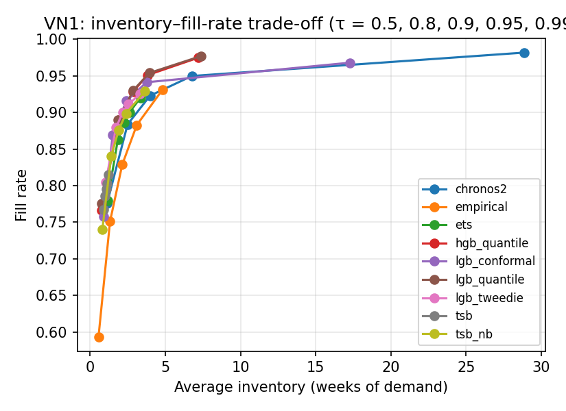

# Cross-dataset results — test window w52_c2 (generated by code/analyze_results.py)

## VN1

### Forecast accuracy (all series)

| model         |   horizon |   SQL |   RMSSE |   cov_0.8 |   cov_0.9 |   cov_0.95 |
|:--------------|----------:|------:|--------:|----------:|----------:|-----------:|
| empirical     |         3 | 4.201 |   3.868 |     0.823 |     0.885 |      0.921 |
| empirical     |        13 | 6.265 |   3.497 |     0.76  |     0.818 |      0.842 |
| tsb           |         3 | 3.811 |   2.852 |     0.786 |     0.82  |      0.843 |
| tsb           |        13 | 5.959 |   3.106 |     0.679 |     0.706 |      0.726 |
| tsb_nb        |         3 | 3.496 |   2.878 |     0.817 |     0.88  |      0.916 |
| tsb_nb        |        13 | 5.742 |   3.112 |     0.711 |     0.762 |      0.799 |
| ets           |         3 | 3.241 |   2.699 |     0.845 |     0.888 |      0.912 |
| ets           |        13 | 5.339 |   3.082 |     0.809 |     0.855 |      0.88  |
| lgb_tweedie   |         3 | 2.657 |   2.255 |     0.851 |     0.888 |      0.91  |
| lgb_tweedie   |        13 | 5.111 |   2.866 |     0.815 |     0.853 |      0.875 |
| lgb_conformal |         3 | 2.597 |   2.287 |     0.79  |     0.89  |      0.941 |
| lgb_conformal |        13 | 4.678 |   2.89  |     0.764 |     0.868 |      0.922 |
| hgb_quantile  |         3 | 2.07  |   2.591 |     0.827 |     0.898 |      0.939 |
| hgb_quantile  |        13 | 3.984 |   2.984 |     0.786 |     0.869 |      0.92  |
| lgb_quantile  |         3 | 2.008 |   2.386 |     0.828 |     0.903 |      0.946 |
| lgb_quantile  |        13 | 3.98  |   2.959 |     0.794 |     0.881 |      0.932 |
| chronos2      |         3 | 2.404 |   2.89  |     0.84  |     0.909 |      0.952 |
| chronos2      |        13 | 4.648 |   2.886 |     0.803 |     0.877 |      0.935 |

### SQL by demand class (h = 3)

| model         |   all |   smooth |   erratic |   intermittent |   lumpy |
|:--------------|------:|---------:|----------:|---------------:|--------:|
| chronos2      | 2.404 |    0.426 |     0.475 |          4.634 |   0.703 |
| empirical     | 4.201 |    0.705 |     0.658 |          8.189 |   1.173 |
| ets           | 3.241 |    0.447 |     0.492 |          6.41  |   0.806 |
| hgb_quantile  | 2.07  |    0.385 |     0.381 |          4.002 |   0.576 |
| lgb_conformal | 2.597 |    0.42  |     0.439 |          5.021 |   0.817 |
| lgb_quantile  | 2.008 |    0.382 |     0.377 |          3.873 |   0.562 |
| lgb_tweedie   | 2.657 |    0.446 |     0.474 |          5.165 |   0.734 |
| tsb           | 3.811 |    0.514 |     0.625 |          7.541 |   0.925 |
| tsb_nb        | 3.496 |    0.438 |     0.514 |          6.98  |   0.78  |

### Inventory KPIs, default scenario, no liquidation (all series)

| model         |   fill_rate |   stockout_rate_demand_weeks |   inventory_weeks |   excess_weeks_of_demand |   fill_rate_lo |   fill_rate_hi |   inventory_weeks_lo |   inventory_weeks_hi |
|:--------------|------------:|-----------------------------:|------------------:|-------------------------:|---------------:|---------------:|---------------------:|---------------------:|
| empirical     |       0.829 |                        0.163 |             2.14  |                    0.406 |          0.808 |          0.843 |                1.974 |                2.343 |
| tsb           |       0.795 |                        0.234 |             1.058 |                    0.145 |          0.78  |          0.809 |                0.959 |                1.2   |
| tsb_nb        |       0.876 |                        0.148 |             1.888 |                    0.232 |          0.86  |          0.888 |                1.748 |                2.05  |
| ets           |       0.886 |                        0.121 |             2.262 |                    0.391 |          0.873 |          0.897 |                2.05  |                2.492 |
| lgb_tweedie   |       0.9   |                        0.11  |             2.161 |                    0.288 |          0.885 |          0.911 |                1.993 |                2.368 |
| lgb_conformal |       0.916 |                        0.097 |             2.415 |                    0.27  |          0.902 |          0.927 |                2.265 |                2.594 |
| hgb_quantile  |       0.928 |                        0.08  |             2.851 |                    0.6   |          0.92  |          0.936 |                2.588 |                3.196 |
| lgb_quantile  |       0.93  |                        0.078 |             2.874 |                    0.586 |          0.922 |          0.938 |                2.618 |                3.198 |
| chronos2      |       0.923 |                        0.085 |             3.989 |                    0.965 |          0.914 |          0.93  |                3.493 |                4.808 |

### fill_rate by demand class (default, no liquidation)

| model         |   all |   smooth |   erratic |   intermittent |   lumpy |
|:--------------|------:|---------:|----------:|---------------:|--------:|
| chronos2      | 0.923 |    0.951 |     0.872 |          0.879 |   0.876 |
| empirical     | 0.829 |    0.89  |     0.811 |          0.564 |   0.665 |
| ets           | 0.886 |    0.933 |     0.864 |          0.662 |   0.804 |
| hgb_quantile  | 0.928 |    0.954 |     0.905 |          0.838 |   0.882 |
| lgb_conformal | 0.916 |    0.951 |     0.88  |          0.792 |   0.859 |
| lgb_quantile  | 0.93  |    0.957 |     0.903 |          0.841 |   0.885 |
| lgb_tweedie   | 0.9   |    0.938 |     0.864 |          0.764 |   0.83  |
| tsb           | 0.795 |    0.859 |     0.724 |          0.605 |   0.674 |
| tsb_nb        | 0.876 |    0.927 |     0.836 |          0.669 |   0.788 |

### inventory_weeks by demand class (default, no liquidation)

| model         |   all |   smooth |   erratic |   intermittent |   lumpy |
|:--------------|------:|---------:|----------:|---------------:|--------:|
| chronos2      | 3.989 |    2.188 |     5.497 |          8.625 |   9.837 |
| empirical     | 2.14  |    1.72  |     3.267 |          1.355 |   3.513 |
| ets           | 2.262 |    1.491 |     4.028 |          1.548 |   4.785 |
| hgb_quantile  | 2.851 |    1.985 |     4.768 |          2.157 |   5.743 |
| lgb_conformal | 2.415 |    1.733 |     3.756 |          2.262 |   4.701 |
| lgb_quantile  | 2.874 |    2.043 |     4.639 |          2.216 |   5.851 |
| lgb_tweedie   | 2.161 |    1.587 |     3.413 |          1.881 |   3.914 |
| tsb           | 1.058 |    0.718 |     1.775 |          0.822 |   2.257 |
| tsb_nb        | 1.888 |    1.29  |     3.264 |          1.394 |   3.754 |

### Trade-off: fill rate and inventory (weeks) across target service level τ

| model         |   ('fill_rate', 0.5) |   ('fill_rate', 0.8) |   ('fill_rate', 0.9) |   ('fill_rate', 0.95) |   ('fill_rate', 0.99) |   ('inventory_weeks', 0.5) |   ('inventory_weeks', 0.8) |   ('inventory_weeks', 0.9) |   ('inventory_weeks', 0.95) |   ('inventory_weeks', 0.99) |
|:--------------|---------------------:|---------------------:|---------------------:|----------------------:|----------------------:|---------------------------:|---------------------------:|---------------------------:|----------------------------:|----------------------------:|
| chronos2      |                0.776 |                0.884 |                0.923 |                 0.95  |                 0.982 |                      1.126 |                      2.493 |                      3.989 |                       6.764 |                      28.877 |
| empirical     |                0.593 |                0.751 |                0.829 |                 0.883 |                 0.931 |                      0.558 |                      1.323 |                      2.14  |                       3.103 |                       4.798 |
| ets           |                0.779 |                0.862 |                0.886 |                 0.901 |                 0.92  |                      1.153 |                      1.839 |                      2.262 |                       2.629 |                       3.341 |
| hgb_quantile  |                0.766 |                0.89  |                0.928 |                 0.951 |                 0.975 |                      0.747 |                      1.9   |                      2.851 |                       3.829 |                       7.175 |
| lgb_conformal |                0.758 |                0.869 |                0.916 |                 0.941 |                 0.968 |                      0.9   |                      1.499 |                      2.415 |                       3.753 |                      17.257 |
| lgb_quantile  |                0.775 |                0.89  |                0.93  |                 0.954 |                 0.977 |                      0.781 |                      1.87  |                      2.874 |                       3.938 |                       7.395 |
| lgb_tweedie   |                0.804 |                0.879 |                0.9   |                 0.911 |                 0.925 |                      1.034 |                      1.721 |                      2.161 |                       2.552 |                       3.323 |
| tsb           |                0.767 |                0.786 |                0.795 |                 0.803 |                 0.815 |                      0.892 |                      0.997 |                      1.058 |                       1.112 |                       1.221 |
| tsb_nb        |                0.74  |                0.84  |                0.876 |                 0.899 |                 0.929 |                      0.816 |                      1.404 |                      1.888 |                       2.388 |                       3.642 |

### Inventory (weeks of demand) needed to reach a fill rate — all (— = outside the fill range reached for τ ∈ [0.5, 0.99])

|               |   fill 0.90 |   fill 0.92 |   fill 0.94 |   fill 0.96 |   fill 0.98 |
|:--------------|------------:|------------:|------------:|------------:|------------:|
| chronos2      |        3.11 |        3.88 |        5.75 |       13.78 |       27.59 |
| empirical     |        3.71 |        4.42 |      —    |      —    |      —    |
| ets           |        2.62 |      —    |      —    |      —    |      —    |
| hgb_quantile  |        2.15 |        2.64 |        3.35 |        5.09 |      —    |
| lgb_conformal |        2.1  |        2.63 |        3.69 |       13.22 |      —    |
| lgb_quantile  |        2.12 |        2.62 |        3.31 |        4.83 |      —    |
| lgb_tweedie   |        2.17 |        3.03 |      —    |      —    |      —    |
| tsb           |      —    |      —    |      —    |      —    |      —    |
| tsb_nb        |        2.44 |        3.27 |      —    |      —    |      —    |

### Inventory (weeks of demand) needed to reach a fill rate — smooth (— = outside the fill range reached for τ ∈ [0.5, 0.99])

|               |   fill 0.90 |   fill 0.92 |   fill 0.94 |   fill 0.96 |   fill 0.98 |
|:--------------|------------:|------------:|------------:|------------:|------------:|
| chronos2      |        1.27 |        1.44 |        1.91 |        2.73 |        5.89 |
| empirical     |        1.87 |        2.18 |        2.7  |      —    |      —    |
| ets           |        1.11 |        1.29 |        1.63 |        2.25 |      —    |
| hgb_quantile  |        1.16 |        1.32 |        1.71 |        2.21 |        3.58 |
| lgb_conformal |        1.06 |        1.22 |        1.55 |        2.11 |        4.02 |
| lgb_quantile  |        1.16 |        1.32 |        1.69 |        2.16 |        3.36 |
| lgb_tweedie   |        1.12 |        1.29 |        1.64 |        2.38 |      —    |
| tsb           |      —    |      —    |      —    |      —    |      —    |
| tsb_nb        |        0.97 |        1.21 |        1.55 |        2.21 |      —    |

### Inventory (weeks of demand) needed to reach a fill rate — erratic (— = outside the fill range reached for τ ∈ [0.5, 0.99])

|               |   fill 0.90 |   fill 0.92 |   fill 0.94 |   fill 0.96 |   fill 0.98 |
|:--------------|------------:|------------:|------------:|------------:|------------:|
| chronos2      |        7.05 |        8.15 |       12.52 |       16.88 |         — |
| empirical     |        6.39 |        7.59 |        8.79 |      —    |         — |
| ets           |        5.18 |      —    |      —    |      —    |         — |
| hgb_quantile  |        4.61 |        5.61 |        7.55 |       10.52 |         — |
| lgb_conformal |        4.66 |        5.59 |        9.06 |       12.56 |         — |
| lgb_quantile  |        4.54 |        5.53 |        7.05 |       10.06 |         — |
| lgb_tweedie   |      —    |      —    |      —    |      —    |         — |
| tsb           |      —    |      —    |      —    |      —    |         — |
| tsb_nb        |        5.53 |        6.54 |      —    |      —    |         — |

### Inventory (weeks of demand) needed to reach a fill rate — intermittent (— = outside the fill range reached for τ ∈ [0.5, 0.99])

|               |   fill 0.90 |   fill 0.92 |   fill 0.94 |   fill 0.96 |   fill 0.98 |
|:--------------|------------:|------------:|------------:|------------:|------------:|
| chronos2      |       49.98 |         — |         — |         — |         — |
| empirical     |      —    |         — |         — |         — |         — |
| ets           |      —    |         — |         — |         — |         — |
| hgb_quantile  |      —    |         — |         — |         — |         — |
| lgb_conformal |      —    |         — |         — |         — |         — |
| lgb_quantile  |      —    |         — |         — |         — |         — |
| lgb_tweedie   |      —    |         — |         — |         — |         — |
| tsb           |      —    |         — |         — |         — |         — |
| tsb_nb        |      —    |         — |         — |         — |         — |

### Inventory (weeks of demand) needed to reach a fill rate — lumpy (— = outside the fill range reached for τ ∈ [0.5, 0.99])

|               |   fill 0.90 |   fill 0.92 |   fill 0.94 |   fill 0.96 |   fill 0.98 |
|:--------------|------------:|------------:|------------:|------------:|------------:|
| chronos2      |       13.71 |       16.88 |       38.85 |       63.65 |         — |
| empirical     |      —    |      —    |      —    |      —    |         — |
| ets           |      —    |      —    |      —    |      —    |         — |
| hgb_quantile  |        6.75 |        8.17 |       11.58 |      —    |         — |
| lgb_conformal |        8.42 |       38.46 |       73.1  |      107.73 |         — |
| lgb_quantile  |        6.75 |        8.05 |       11.53 |      —    |         — |
| lgb_tweedie   |      —    |      —    |      —    |      —    |         — |
| tsb           |      —    |      —    |      —    |      —    |         — |
| tsb_nb        |      —    |      —    |      —    |      —    |         — |

### Frontier rank (mean rank of inventory needed over the fill targets; 1 = least inventory; a model that cannot reach a target shares the last ranks)

|               |   all |   smooth |   erratic |   intermittent |   lumpy |
|:--------------|------:|---------:|----------:|---------------:|--------:|
| chronos2      |  5.25 |      6.4 |      5.5  |            nan |    2.75 |
| empirical     |  7.25 |      7.9 |      5.25 |            nan |    6.75 |
| ets           |  7.12 |      4.4 |      6.62 |            nan |    6.75 |
| hgb_quantile  |  2.5  |      4.8 |      2.25 |            nan |    2.75 |
| lgb_conformal |  2.25 |      1.8 |      3    |            nan |    3.25 |
| lgb_quantile  |  1.25 |      3.6 |      1    |            nan |    2.5  |
| lgb_tweedie   |  5.5  |      4.8 |      7.75 |            nan |    6.75 |
| tsb           |  7.88 |      8.5 |      7.75 |            nan |    6.75 |
| tsb_nb        |  6    |      2.8 |      5.88 |            nan |    6.75 |

### Liquidation policies, default scenario (all series)

| model         | policy   |   fill_rate |   stockout_rate_demand_weeks |   inventory_weeks |   excess_weeks_of_demand |   liquidated_share |   liq_series_share |
|:--------------|:---------|------------:|-----------------------------:|------------------:|-------------------------:|-------------------:|-------------------:|
| empirical     | none     |      0.829  |                       0.1628 |            2.1399 |                   0.4061 |             0      |             0      |
| empirical     | quantile |      0.8289 |                       0.163  |            2.1363 |                   0.405  |             0.0005 |             0.013  |
| empirical     | fixed    |      0.8274 |                       0.1739 |            1.9136 |                   0.2214 |             0.0513 |             0.2547 |
| empirical     | dead13   |      0.828  |                       0.1771 |            1.9523 |                   0.2396 |             0.0052 |             0.1381 |
| empirical     | dead26   |      0.8286 |                       0.1682 |            2.0243 |                   0.3313 |             0.0049 |             0.0773 |
| tsb           | none     |      0.7954 |                       0.2344 |            1.0585 |                   0.1449 |             0      |             0      |
| tsb           | quantile |      0.7946 |                       0.2394 |            0.9412 |                   0.1342 |             0.016  |             0.1901 |
| tsb           | fixed    |      0.7952 |                       0.2375 |            1.0519 |                   0.1424 |             0.0013 |             0.1276 |
| tsb           | dead13   |      0.7951 |                       0.2422 |            1.045  |                   0.1409 |             0.0019 |             0.1438 |
| tsb           | dead26   |      0.7954 |                       0.2356 |            1.0564 |                   0.1442 |             0.0002 |             0.055  |
| tsb_nb        | none     |      0.8756 |                       0.1479 |            1.8881 |                   0.2318 |             0      |             0      |
| tsb_nb        | quantile |      0.8752 |                       0.1518 |            1.8245 |                   0.2242 |             0.0106 |             0.1469 |
| tsb_nb        | fixed    |      0.8749 |                       0.152  |            1.8743 |                   0.2266 |             0.0028 |             0.1361 |
| tsb_nb        | dead13   |      0.8752 |                       0.1556 |            1.8716 |                   0.2277 |             0.0025 |             0.14   |
| tsb_nb        | dead26   |      0.8756 |                       0.1489 |            1.8865 |                   0.2313 |             0.0002 |             0.0469 |
| ets           | none     |      0.8861 |                       0.1205 |            2.2623 |                   0.3912 |             0      |             0      |
| ets           | quantile |      0.886  |                       0.1208 |            2.2542 |                   0.3868 |             0.0006 |             0.0181 |
| ets           | fixed    |      0.8844 |                       0.1317 |            2.162  |                   0.3162 |             0.0273 |             0.3564 |
| ets           | dead13   |      0.8853 |                       0.1355 |            2.1741 |                   0.3203 |             0.0037 |             0.1449 |
| ets           | dead26   |      0.8858 |                       0.1267 |            2.2073 |                   0.3492 |             0.0018 |             0.0895 |
| lgb_tweedie   | none     |      0.8997 |                       0.1096 |            2.1607 |                   0.2877 |             0      |             0      |
| lgb_tweedie   | quantile |      0.8995 |                       0.1099 |            2.1231 |                   0.2609 |             0.004  |             0.027  |
| lgb_tweedie   | fixed    |      0.8974 |                       0.1182 |            2.1092 |                   0.2591 |             0.0119 |             0.3579 |
| lgb_tweedie   | dead13   |      0.899  |                       0.1237 |            2.1003 |                   0.2465 |             0.0037 |             0.1449 |
| lgb_tweedie   | dead26   |      0.8996 |                       0.1148 |            2.1342 |                   0.2734 |             0.0015 |             0.0896 |
| lgb_conformal | none     |      0.916  |                       0.097  |            2.4152 |                   0.2699 |             0      |             0      |
| lgb_conformal | quantile |      0.9159 |                       0.0971 |            2.4035 |                   0.2646 |             0.0009 |             0.0189 |
| lgb_conformal | fixed    |      0.9127 |                       0.107  |            2.3474 |                   0.2276 |             0.0153 |             0.3554 |
| lgb_conformal | dead13   |      0.9152 |                       0.1109 |            2.345  |                   0.2201 |             0.0036 |             0.1449 |
| lgb_conformal | dead26   |      0.9158 |                       0.1025 |            2.3789 |                   0.2491 |             0.0017 |             0.0896 |
| hgb_quantile  | none     |      0.9284 |                       0.0803 |            2.851  |                   0.6004 |             0      |             0      |
| hgb_quantile  | quantile |      0.9272 |                       0.0815 |            2.4251 |                   0.4268 |             0.0335 |             0.1055 |
| hgb_quantile  | fixed    |      0.9217 |                       0.0943 |            2.7054 |                   0.515  |             0.0206 |             0.4574 |
| hgb_quantile  | dead13   |      0.9277 |                       0.0946 |            2.7855 |                   0.5579 |             0.0046 |             0.1453 |
| hgb_quantile  | dead26   |      0.9283 |                       0.0856 |            2.8212 |                   0.5832 |             0.0016 |             0.0901 |
| lgb_quantile  | none     |      0.9305 |                       0.0779 |            2.8743 |                   0.5864 |             0      |             0      |
| lgb_quantile  | quantile |      0.9303 |                       0.0783 |            2.6608 |                   0.5152 |             0.0174 |             0.0682 |
| lgb_quantile  | fixed    |      0.9242 |                       0.0915 |            2.7469 |                   0.5105 |             0.0191 |             0.4499 |
| lgb_quantile  | dead13   |      0.9298 |                       0.092  |            2.8085 |                   0.5428 |             0.0047 |             0.1452 |
| lgb_quantile  | dead26   |      0.9303 |                       0.0831 |            2.8451 |                   0.5699 |             0.0016 |             0.0903 |
| chronos2      | none     |      0.923  |                       0.0848 |            3.9891 |                   0.9652 |             0      |             0      |
| chronos2      | quantile |      0.9221 |                       0.0855 |            3.8656 |                   0.9504 |             0.019  |             0.055  |
| chronos2      | fixed    |      0.9102 |                       0.1019 |            2.9453 |                   0.506  |             0.0885 |             0.449  |
| chronos2      | dead13   |      0.9222 |                       0.0997 |            3.9126 |                   0.9178 |             0.0059 |             0.146  |
| chronos2      | dead26   |      0.9228 |                       0.0906 |            3.9544 |                   0.943  |             0.0015 |             0.0902 |
